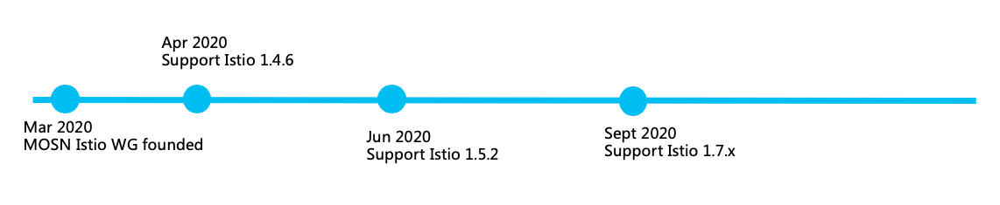

MOSN is an open source project that anyone in the community can use, improve, and enjoy. It was open-sourced by Ant Financial on July, 2018. We'd love you to join us! Here's a few ways to find out what's happening and get involved.

## Community materials

For more materials about MOSN community, please go to the [community repo](https://github.com/mosn/community).

## Working groups

MOSN including the following working groups now.

- [Istio Working Group](https://github.com/mosn/community/blob/master/wg-istio.md)
- [Dubbo Working Group](https://github.com/mosn/community/blob/master/wg-dubbo.md)

Choose to join a working group that interests you and start your MOSN journey!

## Community meeting

MOSN community holds regular meetings.

- [Wednesday 8:00 PM CST(Beijing)](https://ebay.zoom.com.cn/j/96285622161)  every other week

- [Meeting notes](https://docs.google.com/document/d/12lgyCW-GmlErr_ihvAO7tMmRe87i70bv2xqe4h2LUz4/edit?usp=sharing)

## Partners

Partners participate in MOSN co-development to make MOSN better.

<table>
  <tbody>
  <tr></tr>
    <tr>
      <td align="center"  valign="middle">
        
      </td>
      <td align="center"  valign="middle">
        
      </td>
      <td align="center" valign="middle">
        
      </td>
      <td align="center" valign="middle">
        
      </td>
      </tr><tr></tr>
      <tr>
      <td align="center" valign="middle">
        
      </td>
    </tr>
    <tr></tr>
  </tbody>
</table>

## End Users

The MOSN users.

<table>
  <tbody>
  <tr></tr>
    <tr>
      <td align="center"  valign="middle">
        
      </td>
      <td align="center" valign="middle">
        
      </td>
      <td align="center" valign="middle">
        
      </td>
      <td align="center" valign="middle">
        
      </td>
    </tr>
    <tr></tr>
    <tr>
      <td align="center" valign="middle">
        
      </td>
      <td align="center" valign="middle">
        
      </td>
      <td align="center" valign="middle">
        
      </td>
      <td align="center" valign="middle">
        
      </td>
    </tr>
    <tr>
      <td align="center" valign="middle">
        
      </td>
    </tr>
  </tbody>
</table>

Please [leave a comment here](https://github.com/mosn/community/issues/8) to tell us your scenario to make MOSN better!

## Ecosystem

The MOSN community actively embraces the open source ecosystem and has established good relationships with the following open source communities.

<table>
  <tbody>
  <tr></tr>
    <tr>
      <td align="center" valign="middle">
        
      </td>
      <td align="center"  valign="middle">
        
      </td>
      <td align="center" valign="middle">
        
      </td>
      <td align="center" valign="middle">
        
      </td>
    </tr>
    <tr></tr>
    <tr>
      <td align="center" valign="middle">
        
      </td>
      </tr>
    </tbody>
  </table>

## Roadmap

MOSN with Istio roadmap.

More information about MOSN roadmap, see the [Google Sheet](https://docs.google.com/spreadsheets/d/1fALompY9nKZNImOuxQw23xtMD-5rCBrXWziJZkj76bo/edit#gid=0).

## Tutorials

See MOSN [tutorials](/docs/tutorial/).

## Communication

Communicate with MOSN developers on [Slack](https://join.slack.com/t/istio/shared_invite/zt-dhww29on-SvP1~DBvtrk3UdjjbO0SGQ) workspace.
