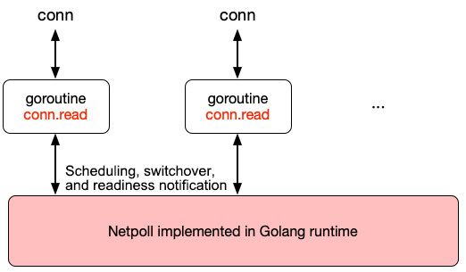
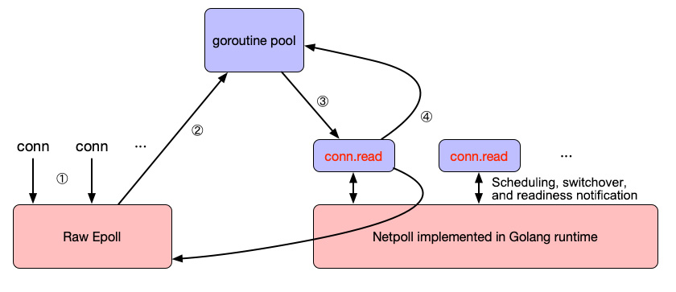
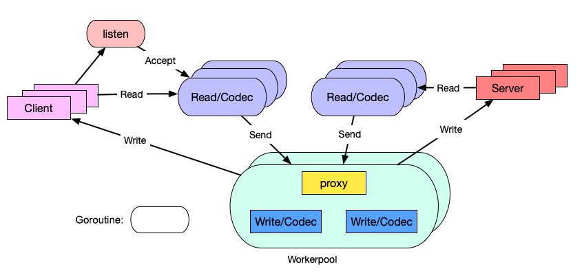
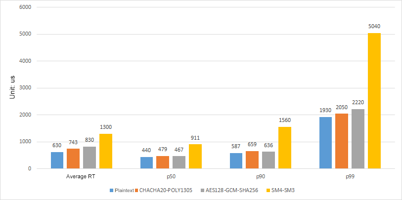

Modular Open Smart Network (MOSN) mainly comprises the following modules. It provides basic network proxy features, and cloud-native services such as [xDS](https://www.servicemesher.com/blog/envoy-xds-protocol/).

## xDS (UDPA) support

MOSN supports cloud-native [Universal Data Plane APIs (UDPAs)](https://github.com/cncf/udpa) and fully dynamic configuration updates.

xDS is a key concept proposed by [Envoy](https://www.envoyproxy.io/). It represents a set of discovery services:

- CDS: Cluster Discovery Service
- EDS: Endpoint Discovery Service
- SDS: Secret Discovery Service
- RDS: Route Discovery Service
- LDS: Listener Discovery Service

Envoy configurations are dynamically updated through xDS requests. The Aggregated Discovery Service (ADS) determines the xDS update order through aggregation.

## Business support

As an underlying high-performance security network proxy, MOSN supports a variety of business scenarios, such as remote procedure calls (RPCs), messaging, gateways.

## I/O model

MOSN supports the following two I/O models:

- **Golang's classic netpoll model**: a goroutine-per-connection model applicable when the number of connections is not a bottleneck.

- **RawEpoll model**: also known as the Reactor model, is an I/O multiplexing + non-blocking I/O model. The RawEpoll model is more suitable for scenarios with a large number of persistent connections at the access layer and gateways.

### netpoll model

The MOSN netpoll model is shown in the above figure. The number of goroutines is proportional to that of connections. A large number of connections indicates a large number of goroutines and high overheads, including:

- Stack memory overhead
- Read buffer overhead
- Runtime scheduling overhead

### RawEpoll model

The RawEpoll model is shown in the above figure. After a readable event is detected by epoll, a goroutine is allocated from the goroutine pool to process the event. The procedure is as follows:

1. After a connection is established, MOSN registers a oneshot readable event listener with epoll. To avoid conflict with the runtime netpoll, no goroutine is allowed to call conn.read at this time.
1. After a readable event is detected, MOSN selects a goroutine from the goroutine pool to handle the event. No subsequent readable event will be triggered for the file descriptor (FD) again because the oneshot mode is used.
1. During request handling, the goroutine scheduling process is consistent with that of the classic netpool model.
1. After the request handling is complete, the goroutine is returned to the goroutine pool, and the FD is added back to RawEpoll.

## Goroutine model

The MOSN goroutine model is shown in the following figure.

- One TCP connection corresponds to one read goroutine, for receiving packets and parsing protocols.
- One request corresponds to one worker goroutine, for handling business and executing the proxy and write logic.

In the conventional model, one TCP connection corresponds to two goroutines: read and write. We have replaced the separate write goroutine with a workerpool goroutine, to reduce scheduling latency and memory usage.

## Capability extension

### Protocol extension

MOSN implements a protocol plugin mechanism by using a unified codec engine and core codec APIs, providing support for:

- SOFARPC
- HTTP1.x/HTTP2.0
- Dubbo

### NetworkFilter extension

MOSN implements a NetworkFilter extension mechanism by using a NetworkFilter registration mechanism and unified packet read/write filter APIs, providing support for:

- TCP proxy
- Fault injection

### StreamFilter extension

MOSN implements a StreamFilter extension mechanism by using a StreamFilter registration mechanism and unified stream send/receive filter APIs, providing support for:

- Traffic mirroring
- RBAC authentication

## TLS connections

Based on tests, the Go-native TLS, after a lot of assembly optimization, has improved its performance to 80% of that of NGINX (OpenSSL). go-boring (which calls BoringSSL by using CGO) shows no advantage, because it is restricted by the performance of CGO. Therefore, we chose the Go-native TLS at last. We believe that the Go Runtime team will continue the optimization. We have some optimization plans, too.

The following figure shows the comparison between the test results of Go and NGINX.

- Go is not optimized much for RSA encryption, and go-boring (CGO) performs twice as good as Go in this regard.
- Go has been assembly-optimized for ECDSA P256, and it performs better than go-boring in this respect.
- Go performs 20 times as good as go-boring in terms of AES-GCM symmetric encryption.
- Go has also been assembly-optimized for hashing algorithms such as SHA and MD.

To ensure security compliance in financial scenarios, we also support development based on Chinese encryption algorithms, which is not supported by Go Runtime. Currently, the performance of Chinese encryption algorithms is only 50% of that of the international standard AES-GCM encryption algorithms. We have some plans to improve their performance. Please stay tuned.

Performance test results for Chinese encryption algorithms are shown in the following figure.

