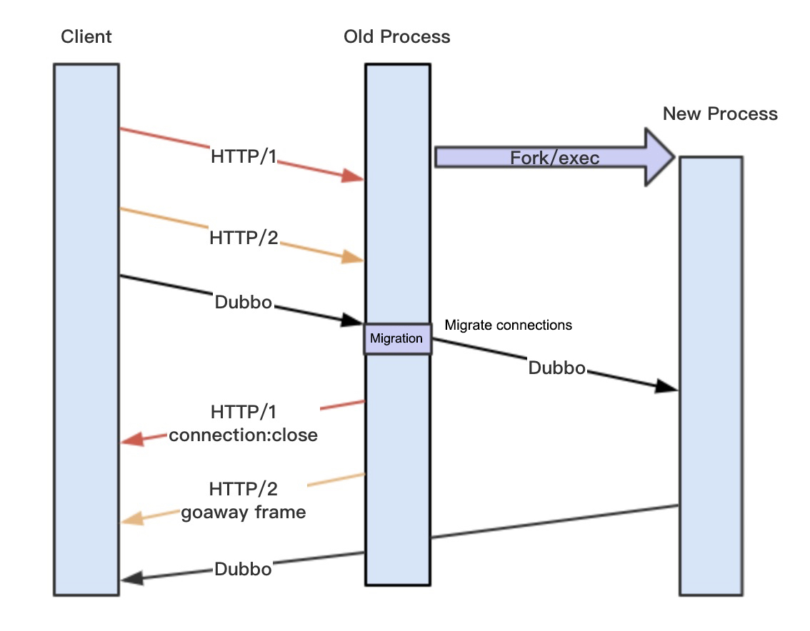
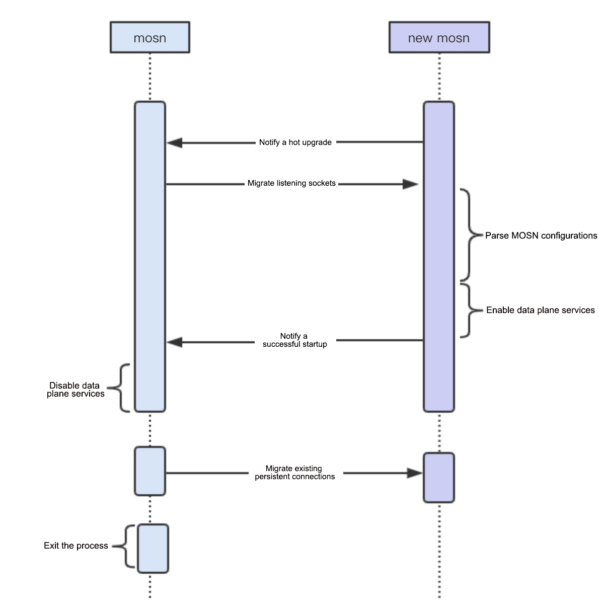

Sidecar O&M is always challenging for a service mesh, while sidecar upgrades are common at the data plane. This topic describes how to upgrade the sidecar (MOSN) without affecting the business and how to migrate existing persistent connections.

## Background

This topic describes why and how MOSN supports hot upgrade. For details about the basic concepts of hot upgrade, see the [NGINX vs Envoy vs MOSN hot upgrade](/zh/blog/2019/nginx-envoy-mosn-hot-upgrade/).

First, why don't NGINX and Envoy require a connection-lossless migration solution like MOSN does? This depends on their business scenarios. NGINX and Envoy mainly support the HTTP1 and HTTP2 protocols. The `connection: Close` request/response header in HTTP1 and GOAWAY frame in HTTP2 allow a client to actively close a connection and establish a new one to a new process. However, common multiplexing protocols such as Dubbo and SOFARPC do not provide control frames, and a request will fail if the connection to the old process is closed.

A common upgrade approach is to: cut off the application's traffic, for example, by unpublishing the service; upgrade MOSN when no new request is received; and then publish the service again. This process takes a rather long time, and the service is unavailable during this period of time. In addition, the application usage also needs to be considered. Achieving a balance between service availability and the upgrade in a large-scale scenario is difficult. To adapt to business scenarios of MOSN, a persistent-connection migration solution is developed to migrate persistent connections to new processes. The entire procedure is transparent to the client, and no connection needs to be re-established, implementing a request-lossless hot upgrade.



## Normal procedure


1. A client sends a request to MOSN.
1. MOSN forwards the request to a server.
1. The server returns a response to MOSN.
1. MOSN returns the response to the client.

The preceding figure briefly shows a normal request procedure. Next, we need to migrate TCP1 connections between the client and MOSN. TCP2 connections between MOSN and the server do not need to be migrated, because the server accessed by MOSN is selected through load balancing. The connection/disconnection with the server is not our concern.

## Hot upgrade procedure

### Trigger conditions

We can trigger a hot upgrade through either of the following methods:

1. Register a SIGHUP event listener with MOSN, and send a SIGHUP signal to the MOSN process to call ForkExec to generate a new MOSN process.
1. Directly start a new MOSN process.

Why do we provide two methods? In the beginning, only the first method was supported, which is used by NGINX and Envoy. In this method, we can replace the old MOSN binary file in a virtual machine or container for an upgrade. However, our scenarios require cross-container upgrades. We need to start a new container (a new MOSN process) to implement a hot upgrade. That is why the second method is provided. Cross-container upgrades also require support from operators, but this will not be discussed in detail here.

### Interaction procedure




The old MOSN process will start a goroutine to run the `ReconfigureHandler()` function to listen to a domain socket (`reconfig.sock`) in the last stage. This operation enables the new MOSN process to detect whether an old MOSN process exists.

```go
func ReconfigureHandler() {
    l, err := net.Listen("unix", types.ReconfigureDomainSocket)

    for {
        uc, err := ul.AcceptUnix()
        _, err = uc.Write([]byte{0})
        reconfigure(false)
    }
}
```

Both hot upgrade triggering methods start a new MOSN process at last. The new MOSN process will then successively call the `GetInheritListeners()` and `isReconfigure()` functions to verify whether an old MOSN process exists (whether the `reconfig.sock` listener exists). If yes, MOSN starts the migration procedure; otherwise, MOSN starts a normal startup procedure.

```go
// The core procedure is kept.
func GetInheritListeners() ([]net.Listener, net.Conn, error) {
    if !isReconfigure() {
        return nil, nil, nil
    }

    l, err := net.Listen("unix", types.TransferListenDomainSocket)
    uc, err := ul.AcceptUnix()
    _, oobn, _, _, err := uc.ReadMsgUnix(buf, oob)
    file := os.NewFile(fd, "")
    fileListener, err := net.FileListener(file)
    return listeners, uc, nil
}
```

If the migration procedure starts, the new MOSN process will listen to a new domain socket (`listen.sock`). This ensures that the old MOSN process can transfer the listen FD to the new MOSN process. sendMsg and recvMsg are used to transfer the listen FD. After receiving the listen FD, the new MOSN process calls the `net.FileListener()` function to generate a listener. In this case, the new and old MOSN processes have the same listen socket.

```go
// FileListener returns a copy of the network listener corresponding
// to the open file f.
// It is the caller's responsibility to close ln when finished.
// Closing ln does not affect f, and closing f does not affect ln.
func FileListener(f *os.File) (ln Listener, err error) {
    ln, err = fileListener(f)
    if err != nil {
        err = &OpError{Op: "file", Net: "file+net", Source: nil, Addr: fileAddr(f.Name()), Err: err}
    }
    return
}
```

The migration procedure of MOSN is different from that of NGINX. In NGINX, after the forking is done, the child process automatically inherits the listen FD. However, MOSN starts a new process that is independent from the old one, without a parent-child relationship. Therefore, sendMsg is required for transferring the listen FD.

A total of two domain sockets are used to start the migration and transfer the listen FD.

- `reconfig.sock` is the old MOSN listener used by the new MOSN process to verify whether an old MOSN process exists.
- `listen.sock` is the new MOSN listener used by the old MOSN process to transfer the listen FD.

These two sockets are actually interchangeable. For example, `reconfig.sock` can also be used for transferring the listen FD. These two sockets are used for some historical reasons. They can be merged into one later on, to make the code simpler and easier to read.

Let us take a look at the handling procedure of the old MOSN process. After receiving the notification from the new MOSN process, the old MOSN process starts the `reconfigure(false)` procedure. It first calls `sendInheritListeners()` to transfer the listen FD to the new MOSN process as described above, and then calls `WaitConnectionsDone()` to migrate existing persistent connections.

```go
// The core procedure is kept.
func reconfigure(start bool) {
    if start {
        startNewMosn()
        return
    }
    // transfer listen fd
    if notify, err = sendInheritListeners(); err != nil {
        return
    }
    // Wait for all connections to be finished
    WaitConnectionsDone(GracefulTimeout)

    os.Exit(0)
}
```

After receiving the listen FD, the new MOSN process starts the migration process based on the configurations. Then the new MOSN process starts a goroutine to run `TransferServer()` to listen to a new `domain socket (conn.sock)`, for receiving persistent connections from the old MOSN process subsequently. The migration function is `transferHandler().`

```go
func TransferServer(handler types.ConnectionHandler) {
    l, err := net.Listen("unix", types.TransferConnDomainSocket)

    utils.GoWithRecover(func() {
        for {
            c, err := l.Accept()
            go transferHandler(c, handler, &transferMap)

        }
    }, nil)
}
```

The old MOSN process starts persistent-connection migration through `transferRead()` and `transferWrite()`. This is analyzed as follows.

### Persistent-connection migration procedure


First, let us take a look at the migration procedure of a new request.

1. A client sends a request to MOSN.
1. MOSN (the old MOSN process) sends the FD and connection status data of TCP1 to New MOSN (the new MOSN process).
1. New MOSN receives the FD and request data, creates a new connection structure, and sends the connection ID to the MOSN. At this time, New MOSN has a copy of the TCP1 connection.
1. New MOSN selects a new server by using the load balancer, establishes a TCP3 connection, and forwards the request to the server.
1. The server returns a response to New MOSN.
1. New MOSN returns a response to the client based on the copy of TCP1 connection transferred from MOSN.

In the original `WaitConnectionsDone()` function, `s.stopChan` has been disabled. In ReadLoop of the connection, a `[TransferTimeout, 2 * TransferTimeout]` random time interval will be set for the migration procedure. The random interval is intended to discretize the migration time for TCP connections of each client, to ensure smooth migration.

```go
func (c *connection) startReadLoop() {
    var transferTime time.Time
    for {
        select {
        case <-c.stopChan:
            if transferTime.IsZero() {
                if c.transferCallbacks != nil && c.transferCallbacks() {
                    randTime := time.Duration(rand.Intn(int(TransferTimeout.Nanoseconds())))
                    transferTime = time.Now().Add(TransferTimeout).Add(randTime)
                    log.DefaultLogger.Infof("[network] [read loop] transferTime: Wait %d Second", (TransferTimeout+randTime)/1e9)
                } else {
                    // set a long time, not transfer connection, wait mosn exit.
                    transferTime = time.Now().Add(10 * TransferTimeout)
                    log.DefaultLogger.Infof("[network] [read loop] not support transfer connection, Connection = %d, Local Address = %+v, Remote Address = %+v",
                        c.id, c.rawConnection.LocalAddr(), c.RemoteAddr())
                }
            } else {
                if transferTime.Before(time.Now()) {
                    c.transfer()
                    return
                }
            }
```

After one random interval elapses, the `c.transfer()` function is called. `c.notifyTransfer()` is used for suspending write operations. No write operation is allowed during migration of read operations, because data confusion will occur if write operations are performed simultaneously in the old and new MOSN processes.

```go
func (c *connection) transfer() {
    c.notifyTransfer()
    id, _ := transferRead(c)
    c.transferWrite(id)
}
```

Then the `transferRead()` function is called to transfer the FD and status data of a connection to New MOSN through `conn.sock`. Similar to migrating the listen FD, New MOSN returns an ID after successful processing. This ID identifies the new connection established by New MOSN and will be used later.

```go
// old mosn transfer readloop
func transferRead(c *connection) (uint64, error) {
    unixConn, err := net.Dial("unix", types.TransferConnDomainSocket)

    file, tlsConn, err := transferGetFile(c)

    uc := unixConn.(*net.UnixConn)
    
    // send type and TCP FD
    err = transferSendType(uc, file)
    
    // send header + buffer + TLS
    err = transferReadSendData(uc, tlsConn, c.readBuffer, log.DefaultLogger)
    
    // recv ID
    id := transferRecvID(uc)
    return id, nil
}
```

We constructed a simple read transfer protocol, which mainly involves the length of the TCP raw data, the length of the TLS data, the TCP raw data, and the TLS data.

```go
/**
 *  transfer read protocol
 *  header (8 bytes) + (readBuffer data) + TLS
 *
 * 0                       4                       8
 * +-----+-----+-----+-----+-----+-----+-----+-----+
 * |      data length      |     TLS length        |
 * +-----+-----+-----+-----+-----+-----+-----+-----+
 * |                     data                      |
 * +-----+-----+-----+-----+-----+-----+-----+-----+
 * |                     TLS                       |
 * +-----+-----+-----+-----+-----+-----+-----+-----+
 *
```

Now, let us take a look at the handling procedure of the new MOSN process. After receiving migration requests, the new MOSN process starts a goroutine for each migration request to run the `transferHandler()` function. The function distinguishes read and write transfer requests based on the protocol read. Read transfer is described first. The new MOSN process calls transferNewConn to generate a new connection structure based on the FD and packets transferred from the old MOSN process. Then the new MOSN process transfers the new connection ID to the old MOSN process.

The new MOSN process starts to read data from the new TCP connection, and proceeds with a normal business request procedure.

```go
func transferHandler(c net.Conn, handler types.ConnectionHandler, transferMap *sync.Map) {
    // recv type
    conn, err := transferRecvType(uc)
    if err != nil {
        log.DefaultLogger.Errorf("[network] [transfer] [handler] transferRecvType error :%v", err)
        return
    }

    if conn != nil {
        // transfer read
        // recv header + buffer
        dataBuf, tlsBuf, err := transferReadRecvData(uc)
        if err != nil {
            log.DefaultLogger.Errorf("[network] [transfer] [handler] transferRecvData error :%v", err)
            return
        }
        connection := transferNewConn(conn, dataBuf, tlsBuf, handler, transferMap)
        if connection != nil {
            transferSendID(uc, connection.id)
        } else {
            transferSendID(uc, transferErr)
        }
    } else {
        // transfer write
        // recv header + buffer
        id, buf, err := transferWriteRecvData(uc)
        if err != nil {
            log.DefaultLogger.Errorf("[network] [transfer] [handler] transferRecvData error :%v", err)
        }
        connection := transferFindConnection(transferMap, uint64(id))
        if connection == nil {
            log.DefaultLogger.Errorf("[network] [transfer] [handler] transferFindConnection failed, id = %d", id)
            return
        }
        err = transferWriteBuffer(connection, buf)
        if err != nil {
            log.DefaultLogger.Errorf("[network] [transfer] [handler] transferWriteBuffer error :%v", err)
            return
        }
    }
}
```

Then the new MOSN process replaces the old MOSN process, to read data from the TCP1 connection and process the data. For the new request, the entire migration procedure is completed.

### Residual-response migration procedure


Why is a residual-response migration procedure required? Because of the multiplexing protocol, during the previous migration of read connections, residual responses for TCP2 connections are waiting to be returned to the client. The data may go out of order if both the old and new MOSN processes simultaneously write data to TCP1 connections. Therefore, we want the new MOSN process to uniformly handle the residual responses for TCP2 connections.

1. The server returns a residual response to MOSN.
1. MOSN transfers the connection ID and response data previously obtained from New MOSN back to New MOSN through domain socket (conn.sock).
1. New MOSN queries the TCP1 connection based on the ID and returns the response to the client.

After the `transferRead()` (the read transfer) ends, the `transferWrite()` (the write transfer) starts. In this stage, packets to be written and the connection ID previously obtained from New MOSN are sent to New MOSN.

```go
// old mosn transfer writeloop
func transferWrite(c *connection, id uint64) error {

    unixConn, err := net.Dial("unix", types.TransferConnDomainSocket)

    uc := unixConn.(*net.UnixConn)
    err = transferSendType(uc, nil)

    // build net.Buffers to IoBuffer
    buf := transferBuildIoBuffer(c)
    // send header + buffer
    err = transferWriteSendData(uc, int(id), buf)
    if err != nil {
        log.DefaultLogger.Errorf("[network] [transfer] [write] transferWrite failed: %v", err)
        return err
    }
    return nil
}
```

We constructed a simple write transfer protocol, which mainly involves the length of the TCP raw data, the connection ID, and the TCP raw data.

```go
/*
 *  transfer write protocol
 *  header (8 bytes) + (writeBuffer data)
 *
 * 0                       4                       8
 * +-----+-----+-----+-----+-----+-----+-----+-----+
 * |      data length      |    connection  ID     |
 * +-----+-----+-----+-----+-----+-----+-----+-----+
 * |                     data                      |
 * +-----+-----+-----+-----+-----+-----+-----+-----+
 *
**/
```

The new MOSN process calls the transferHandler() function to identify the write transfer protocol. Then the new MOSN process calls the `transferFindConnection()` function to locate the TCP1 connection based on the connection ID, and directly write the data.

Note that new requests are now forwarded to the server through TCP3 connections, and only responses to previous requests will be returned through TCP2 connections. If no response is returned within 2 * TransferTimeout during the entire migration, the requests will time out and fail.

### Connection status data

During the connection migration, both the TCP FD and the connection status are migrated so that the new MOSN process knows how to initialize the new connection.

The following status data is involved:

**Read buffer**

The data that has been read from TCP but has not been processed at the application layer during migration.

**Write data**

The response data received by MOSN after migration.

**TLS status data migration**

In case of a TLS encrypted request, the following TLS status data must to be migrated:

1. Encryption key
1. Sequence
1. Read buffer data (encrypted/unencrypted)
1. Cipher type
1. TLS version

```go
type TransferTLSInfo struct {
    Vers         uint16
    CipherSuite  uint16
    MasterSecret []byte
    ClientRandom []byte
    ServerRandom []byte
    InSeq        [8]byte
    OutSeq       [8]byte
    RawInput     []byte
    Input        []byte
}
```

## Summary

FD migration is a common operation for persistent connection migration, and can be performed through either sendMsg or connection repair.

The most challenging part in the entire procedure is the migration of the application layer data. The general idea is to migrate all data structures of the application layer to the new process, for example, structures such as protocol headers that have been read. However, this increases the migration complexity, because each protocol needs to be handled separately.

To address this problem, MOSN moves migration to the I/O layer, regardless of the protocols used at the application layer. The original TCP packets are migrated, and then the new MOSN process encodes/decodes the packets to assemble the header and other structures. This is a standard procedure that enables migration without parsing protocols. This migration framework can automatically support any stateless protocols.

You may doubt about the residual-response migration procedure. Why don't we start migration after all responses are returned? This procedure seems to be unnecessary. The reason is that when we use a multiplexing protocol, requests are being sent all the time. You cannot always find a time point when all responses are returned.

## Feedback

For more information about discussions on this issue, go to Github Issue at [MOSN smooth upgrade problem #866](https://github.com/mosn/mosn/issues/866).

