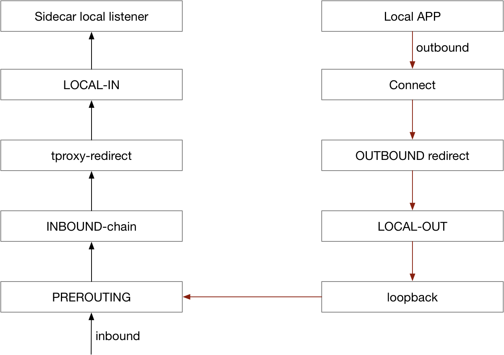

This topic describes the traffic hijacking solution when MOSN is used as a sidecar.

When MOSN is deployed as a sidecar in the same pod as that of the business application container, both inbound and outbound service requests of the business application must be handled by the sidecar. UUnlike the Istio community that uses iptables for transparent traffic hijacking, MOSN currently uses a traffic takeover solution and is actively exploring a transparent hijacking solution for large amounts of traffic.

## Traffic takeover

MOSN uses the following traffic takeover solution, instead of the [iptables-based traffic hijacking solution](https://jimmysong.io/istio-handbook/concepts/sidecar-injection-deep-dive.html) used by the Istio community:

1. Assume that the server runs on a machine with an IP address of 1.2.3.4 and listens on port 20880. The server will first send a service registration request to its sidecar, to notify it of the service to be registered, as well as the IP address and port number (1.2.3.4:20880).
1. The server's sidecar will send a service registration request to the service registry (for example, SOFA Registry), to notify it of the service to be registered as well as the IP address and port number. Note that the port to be registered is not the port (20880) of the business application. Instead, it should be the port (for example, 20881) on which the sidecar listens.
1. The caller sends a service subscription request to its own sidecar, to notify it of the service to be subscribed to.
1. The caller's sidecar then pushes the service endpoint to the caller. Note that the service endpoint here is the local IP address of the caller and the port (for example, 20882) on which the caller's sidecar listens.
1. The caller's sidecar sends a service subscription request to the service registry (for example, SOFA Registry), to notify it of the service to be subscribed to.
1. The service registry (for example, SOFA Registry) pushes the service endpoint (1.2.3.4:20881) to the caller's sidecar.

### Service call procedure

After going through the above service discovery procedure, the traffic forwarding procedure is quite easy to understand:

1. The caller receives the so called "service endpoint" `127.0.0.1:20882`, and then sends a service call to this endpoint.
1. After receiving the request from the caller, the caller's sidecar parses the request header to identify the service to be called. Then the sidecar retrieves the endpoint previously returned by the service registry, and then sends a real call to this endpoint: `1.2.3.4:20881`.
1. After receiving the request from the caller's sidecar, the server's sidecar processes the request and then sends the request to the server:`127.0.0.1:20880`.

## Transparent hijacking

In the above service registration procedure, the server endpoint is replaced with the local sidecar endpoint to implement lightweight "traffic hijacking". This mode works well in scenarios where a service registry is available and both the caller and the server use the same SDK. Traffic hijacking is not possible unless both conditions are met. To solve this problem, we introduced transparent hijacking.

### iptables-based traffic hijacking

iptables redirect traffic by using the REDIRECT action of the NAT table. A new connection will be triggered at the netfilter layer through the SYN packet. When subsequent packets arrive at the netfilter layer, netfilter looks for the corresponding connections, and modifies the destination addresses and ports. The original destination address is recorded when the new connection is being established, and the application can obtain the real destination addresses of the packets through `SOL_IP` and `SO_ORIGINAL_DST`.

The following figure shows the principle of iptables-based traffic hijacking.

### Drawbacks of iptables-based traffic hijacking

Currently, iptables-based traffic hijacking used by Istio has the following drawbacks:

1. Connections need to be tracked by the conntrack module. When there are a large number of connections, the resource consumption will be high, and the track table may become full. To address this problem, some industry practitioners, such as Alibaba, have disabled the conntrack module.
1. iptables is a common module that takes effect globally, and related modifications cannot be explicitly prohibited, resulting in poor controllability.
1. iptables-based traffic redirection is essentially data exchange through loopback. The outbound traffic progresses through the stack twice, degrading the forwarding performance in high-concurrency scenarios.

The above drawbacks do not exist in every scenario. For example, iptables is a simple and desirable solution for scenarios where the number of connections is small and no NAT table is used. To adapt to more scenarios, transparent hijacking needs to be optimized to eliminate the above drawbacks.

### Optimization for transparent hijacking

**Use TProxy to handle inbound traffic**

TProxy can be used to redirect inbound traffic without modifying the destination IP address/port number in messages. No connection needs to be tracked, and the conntrack module does not need to create large numbers of connections. TProxy is not suitable for handling outbound traffic due to the limit of the kernel version. Currently, Istio supports using TProxy to handle inbound traffic.

**Use hook connect to handle outbound traffic**

To adapt to more application scenarios, hook connect is used to handle outbound traffic. The implementation principle is as follows:

Regardless of which transparent hijacking solution is adopted, the real destination IP address/port number needs to be identified. In the iptables solution, the destination address is identified by calling the getsockopt function. TProxy can directly read the address. In the hook connect solution, the sidecar can also read the original IP/port number by calling the getsockopt function.

After implementing transparent hijacking, if the kernel version meets the requirement (4.16 or later), we can use sockmap to shorten the message processing path, and improve the forwarding performance in the outbound direction.

## Summary

An application can hijack traffic in combination with the registry when publishing/subscribing to services through the registry. In transparent hijacking scenarios, we can use iptables to redirect traffic under low performance pressure. TProxy and hook connect can be used under high concurrency pressure.

