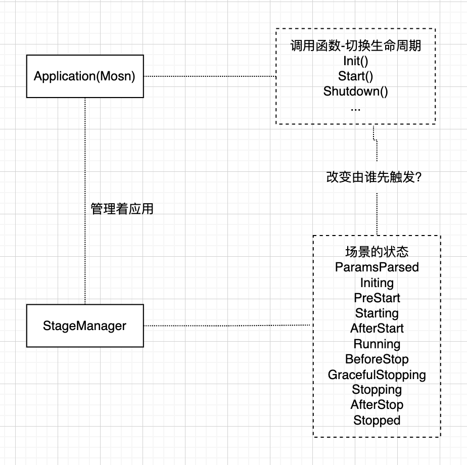
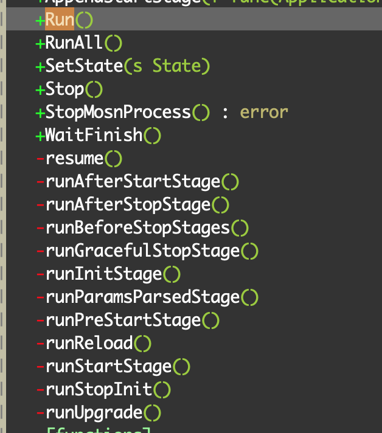

本文基于 MOSN V1.6.0版本的源码基础上进行整理。该版本对比之前 V0.4.0 版本启动逻辑有比较大的变化。其中比较明显的差异是该版本新增了 StageManager 结构，该结构对 MOSN 的生命周期进行封装并加以维护，使得 MOSN 从启动到停止过程中每个逻辑更易于维护和扩展。

## MOSN 启动入口

MOSN 利用 cli 组件 （github.com/urfave/cli）来实现命令行的控制。制动之后默认执行 cmdStart 命令，之后就进入下面的启动逻辑。

在 control.go 文件中 _cmdStart.Action_ 方法是整个 MOSN 启动的入口方法。首先调用 _NewMosn()_ 这个方法只是返回了一个空的 _Mosn_ 对象，该对象代表着 _Mosn_ 应用，该对象定义如下：

```go
type Mosn struct {
	isFromUpgrade  bool // hot upgrade from old MOSN
	Upgrade        UpgradeData
	Clustermanager types.ClusterManager
	RouterManager  types.RouterManager
	Config         *v2.MOSNConfig
	// internal data
	servers   []server.Server
	xdsClient *istio.ADSClient
}
```
## 场景管理器

下面的逻辑中创建了一个叫 StageManager（场景管理器）的对象，这个对象是用来管理 MOSN 的生命周期，后面的逻辑都是围绕着这个对象来编码的，定义如下：

```go
// stagemanagr/stage_manager.go
// StageManager is used to controls service life stages.
type StageManager struct {
	lock                    sync.Mutex
	state                   State
	exitCode                int
	stopAction              StopAction
	data                    Data  //保存了app不同生命周期阶段所使用的数据
	app                     Application // Application interface app其实就是MOSN
	wg                      sync.WaitGroup
    //以下是不同生命周期对应的处理函数 -- start
	paramsStages            []func(*cli.Context)  //参数准备阶段
	initStages              []func(*v2.MOSNConfig) //初始化场景
	preStartStages          []func(Application)  //启动之前
	startupStages           []func(Application)  //启动
	afterStartStages        []func(Application)  //启动之后
	beforeStopStages        []func(StopAction, Application) error //停止之前
	gracefulStopStages      []func(Application) error  //优雅停止
	afterStopStages         []func(Application) //停止之后处理
    //生命周期阶段 --- end  
	onStateChangedCallbacks []func(State)
	upgradeHandler          func() error // old server: send listener/config/old connections to new server
	newServerC              chan bool
}

// Data contains objects used in stages
type Data struct {
	// ctx contains the start parameters
	ctx *cli.Context
	// config path represents the config file path,
	// will create basic config from it and if auto config dump is set,
	// new config data will write into this path
	configPath string
	// basic config, created after parameters parsed stage
	config *v2.MOSNConfig
}


```

上面代码增加了注释，可以看到 stageManager 的生命周期包含 参数准备、初始化、启动之前处理、启动、启动之后处理、停止之前处理、优雅停止、停止之后处理等几个阶段。每个阶段对应的是一个函数的数组，也就是说每个阶段的处理可以有多个处理函数。

这里可以好好的看一下 stage_manager.go 的源码，里面定义了11种场景的状态和2种额外的场景 （stage_manager.go 原文件头部有大块的注释里把场景的含义描述的比较清楚），那么当状态发生变化的时候，就会调用上文提到的场景管理器维护的回调函数。

### Application

同时还定义了一个 Application 的接口，是对一个应用进行抽象，其中之前说的 _Mosn_ 对象就是 Application 的一个实现。 Application 被 stageManager 所管理，Application 本身定义了生命周期 （ application 不同的生命周期，会触发 stage 场景的切换），周期包括：初始化，启动，停止。那么 stageManager 根据这些周期的变化，同时回调切换场景的函数。

### 阶段小结

到这里先不着急往下看启动逻辑，我们先总结一下目前掌握的内容及背后的设计思路，这样后面梳理逻辑会变得很轻松。
<br />
如上图所示，Application 应用（其实就是 _Mosn_ 本身）包含若干方法：初始化、启动、停止。这些方法调用后让应用进入不同的生命周期，同时场景管理器 （StageManager）维护的场景状态也对应发生改变，应用生命周期与场景二者是有关联关系的。

那么先不看源码只凭借猜测，到底是应用的生命周期发生变化后触发场景改变状态；还是先触发场景改变状态进而触发应用改变生命周期呢？我的猜测是这样，因为上文提到场景管理器（StageManager）用来管理应用的生命周期，StageManager 结构体中也包含 Application 对象。那么很大的可能是先由场景管理来触发状态改变，再触发应用对应的方法来改变生命周期。

其实因为场景的状态有11个粒度要比应用的生命周期粒度更细，从这点上来看也只可能场景状态（细粒度）切换同时调用应用的方法切换生命周期（粗粒度），而反之行不通（粗粒度的一方无法识别什么时候调用细粒度一方）。

既然我猜测是 StageManager 场景来控制切换，那么肯定有对应的方法提供场景切换。这个时候我们再来看代码，发现确实存在这样的方法来证明我的猜测。下面是切换场景的方法：<br />

## 详细分析

### 场景管理器的启动

我们继续看一下 stage_manager.go 的 _Run()_ 方法，可以清楚的看到场景管理器的启动逻辑，就是调用了不同子阶段，每个阶段都会有切换状态的逻辑，在方法的最后逻辑可以看到，启动之后设置场景状态为 Running。

```go
// Run until the application is started
func (stm *StageManager) Run() {
	// 1: parser params
	stm.runParamsParsedStage()
	// 2: init
	stm.runInitStage()
	// 3: pre start
	stm.runPreStartStage()
	// 4: run
	stm.runStartStage()
	// 5: after start
	stm.runAfterStartStage()

	stm.SetState(Running)
}
```

可以看到这个 _Run()_ 方法执行了参数解析、初始化、启动前处理、启动、启动后处理等方法。我猜测每个方法一定是执行前文说的每个阶段对应的回调函数数组。找其中一个方法看一下逻辑，果然如我猜测一样。

```go
func (stm *StageManager) runParamsParsedStage() {
	st := time.Now()
    //设置场景状态
	stm.SetState(ParamsParsed) 
    //果然和猜测一样，遍历回调函数的数组并调用
	for _, f := range stm.paramsStages {
		f(stm.data.ctx)
	}
	// after all registered stages are completed
	stm.data.config = configmanager.Load(stm.data.configPath)

	log.StartLogger.Infof("parameters parsed stage cost: %v", time.Since(st))
}
```

可以说 _Run()_ 方法作用就是场景管理器 stageManager 来启动应用 Application，那这个 _Run()_ 方法在什么地方被调用呢？梳理一下代码，调用链路是：`control.go cmdStart.Action(就是前面提到的程序启动的入口)->stm.RunAll()->stm.Run()`。这样从上文提到 MOSN 命令行启动到这个 Run() 方法就串起来了。

其中还有一个比较重要的方法是 _stm.RunAll()_ ，该方法是场景管理器中完整的场景都会执行一遍： _Run_ 是启动，之后 _WaitFinish_ 就等待 server 停止，最后是 _Stop_ 场景。每个过程都会调用若干场景切换。

```go
// run all stages
func (stm *StageManager) RunAll() {
	// start to work
	stm.Run()
	// wait server finished
	stm.WaitFinish()
	// stop working
	stm.Stop()
}
```

### 启动逻辑详解

好了现在我们回到最开始的 control.go _cmdStart.Action_ 逻辑。

```go
159         Action: func(c *cli.Context) error {
	            // 创建Application
160             app := mosn.NewMosn()
                // 创建stagemanager场景管理器
161             stm := stagemanager.InitStageManager(c, c.String("config"), app)
162             // if needs featuregate init in parameter stage or init stage
163             // append a new stage and called featuregate.ExecuteInitFunc(keys...)
164             // parameter parsed registered
165             stm.AppendParamsParsedStage(ExtensionsRegister)
166             stm.AppendParamsParsedStage(DefaultParamsParsed)
167             // initial registered
168             stm.AppendInitStage(func(cfg *v2.MOSNConfig) {
169                 drainTime := c.Int("drain-time-s")
170                 server.SetDrainTime(time.Duration(drainTime) * time.Second)
171                 // istio parameters
172                 serviceCluster := c.String("service-cluster")
173                 serviceNode := c.String("service-node")
174                 serviceType := c.String("service-type")
175                 serviceMeta := c.StringSlice("service-meta")
176                 metaLabels := c.StringSlice("service-lables")
177                 clusterDomain := c.String("cluster-domain")
178                 podName := c.String("pod-name")
179                 podNamespace := c.String("pod-namespace")
180                 podIp := c.String("pod-ip")
181
182                 if serviceNode != "" {
183                     istio1106.InitXdsInfo(cfg, serviceCluster, serviceNode, serviceMeta, metaLabels)
184                 } else {
185                     if istio1106.IsApplicationNodeType(serviceType) {
186                         sn := podName + "." + podNamespace
187                         serviceNode = serviceType + "~" + podIp + "~" + sn + "~" + clusterDomain
188                         istio1106.InitXdsInfo(cfg, serviceCluster, serviceNode, serviceMeta, metaLabels)
189                     } else {
190                         log.StartLogger.Infof("[mosn] [start] xds service type is not router/sidecar, use config only")
191                         istio1106.InitXdsInfo(cfg, "", "", nil, nil)
192                     }
193                 }
194             })
195             stm.AppendInitStage(mosn.DefaultInitStage)
196             stm.AppendInitStage(func(_ *v2.MOSNConfig) {
197                 // set version and go version
198                 metrics.SetVersion(Version)
199                 metrics.SetGoVersion(runtime.Version())
200                 admin.SetVersion(Version)
201             })
202             stm.AppendInitStage(holmes.Register)
203             // pre-startup
204             stm.AppendPreStartStage(mosn.DefaultPreStartStage) // called finally stage by default
205             // startup
206             stm.AppendStartStage(mosn.DefaultStartStage)
207             // after-stop
208             stm.AppendAfterStopStage(holmes.Stop)
209             // execute all stages
                //执行所有场景
210             stm.RunAll()
211             return nil
212  },
```

*  （line160）创建应用 _mosn.NewMosn_ ,
*  （line161）创建场景管理器 _stagemanager.InitStageManager(c, c.String("config"), app)_ 
* （line210）启动场景管理器 _stm.RunAll()_ ，触发执行启动、等待停止、停止。
* 而中间（第165行到第208行）的一堆逻辑其实就是在设置 StageManager（场景管理器），为每个状态设置了对应的回调函数，后面启动过程中调用场景切换的时候其实就是调用这里设置的回调函数。

### ParamsParsed 阶段

__(stm *StageManager) AppendParamsParsedStage(f func(*cli.Context))__

这个阶段是整个生命周期的第一个阶段，如果需要有需要通过命令行参数来初始化的工作，可以在这个阶段完成。这个阶段注册了两个函数 _ExtensionsRegister_ 和 _DefaultParamsParsed_ 这两个函数作用如下：

* _ExtensionsRegister_ ：主要用来初始化一些扩展的组件。这块我理解 MOSN 在落地的时候会根据具体场景来接入一些特定的组件。这些组件如果需要初始化，可以在这个方法里初始化。为什么要在这个函数里初始化呢？一个是函数的参数是 cli.Context 命令行的封装，可以方便获取命令行参数来初始化组件，另外这个函数执行也是整个生命周期最开始执行，如果需要 MOSN 启动首先初始化的组件可以在这里来实现。而 v1.6.0 版本里该函数主要用来初始化一些链路追踪的配置，以及网络协议编解码的设置。这里就不展开分析了。
* _DefaultParamsParsed_ ：这里就是 MOSN 默认的在命令解析阶段进行初始化的内容一般不用修改。目前作用是用来设置日志级别及从命令行里解析各种开关。

### InitStage阶段

__(stm *StageManager) AppendInitStage(f func(*v2.MOSNConfig)) *StageManager__

这个是第二个阶段，这个阶段也是用来初始化，只不过初始化的来源是通过 MOSN 的配置文件。

* （line168-194）这部分主要是从 Config 配置文件中获取运行环境的相关元数据，用这些数据来初始化 xds 客户端。xds 客户端使用xds协议与控制面组件进行交互。（ xds 是 Istio 标准的协议）
* （line195）调用了 MOSN 的默认初始化，这部分逻辑非常的多。里面又细分很多步骤。这里我对每个方法都加上了注释，见下面代码段。

```go
func DefaultInitStage(c *v2.MOSNConfig) {
	InitDefaultPath(c) //初始化mosn需要的相关运行时的目录,比如：日志，存储mosn进程ID的文件等
	InitDebugServe(c)   //启动mosn的debug信息查看服务，可以查看pprof信息
	InitializePidFile(c)  //初始化mosn pid持久化的文件
	InitializeTracing(c)   //初始化mosn 链路追踪的组件，根据配置文件中链路相关的配置。在之前的分析ParamParsed阶段会维护一些mosn支持的链路追踪的驱动列表，然后在这个阶段里会选择一个具体的组件作为链路追踪的实现。
	InitializePlugin(c) //这个阶段是初始化一下插件，不过看了实现其实就是初始化log配置
	InitializeWasm(c) //初始化web assembly 环境
	InitializeThirdPartCodec(c)  //初始化第三方的编解码的配置，这块我也不太理解，需要后面继续研究一下。个人感觉是加载动态代码，目前支持wasm和goPlugin
}
```

* （line196-201）这部分比较简单，AppendInitStage 这部分就是初始化 metrics 初始化统计的组件
* 接下来（line202）stm.AppendInitStage(holmes.Register) 这句初始化一个蚂蚁开源的可观测性组件 holmes。[参考：holmes](https://github.com/mosn/holmes)

### PreStartStage阶段

__func (stm *StageManager) AppendPreStartStage(f func(Application)) *StageManager__

这个阶段逻辑并不复杂，主要是启动 xds 客户端。

```go
// Default Pre-start Stage wrappers
func DefaultPreStartStage(mosn stagemanager.Application) {
	m := mosn.(*Mosn)

	// start xds client
	_ = m.StartXdsClient()
	featuregate.FinallyInitFunc()  //初始化配置中指定的Feature
	m.HandleExtendConfig()  //将配置中扩展配置信息转换成对象
}
```

### StartStage阶段

__func (stm *StageManager) AppendStartStage(f func(Application)) *StageManager__

* （line206） _stm.AppendStartStage(mosn.DefaultStartStage)_ 这个阶段启动了 MOSN 的管理服务，通过配置文件进行启动。

```go
// Default Start Stage wrappers
func DefaultStartStage(mosn stagemanager.Application) {
	m := mosn.(*Mosn)
	// register admin server
	// admin server should register after all prepares action ready
	srv := admin.Server{}
	srv.Start(m.Config)
}
```

### AfterStopStage阶段

__func (stm *StageManager) AppendAfterStopStage(f func(Application)) *StageManager__

* （line208） _stm.AppendAfterStopStage(holmes.Stop)_ 这个阶段是在 MOSN 服务关闭后调用，这里就直接调用 holmes.Stop 关闭 holmes 组件。
