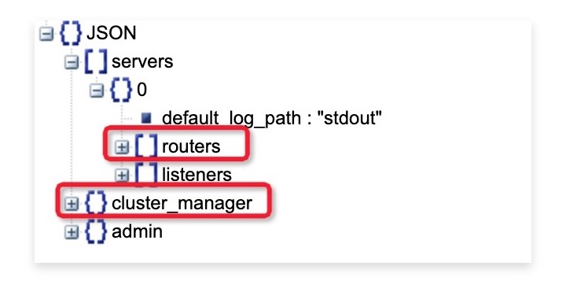
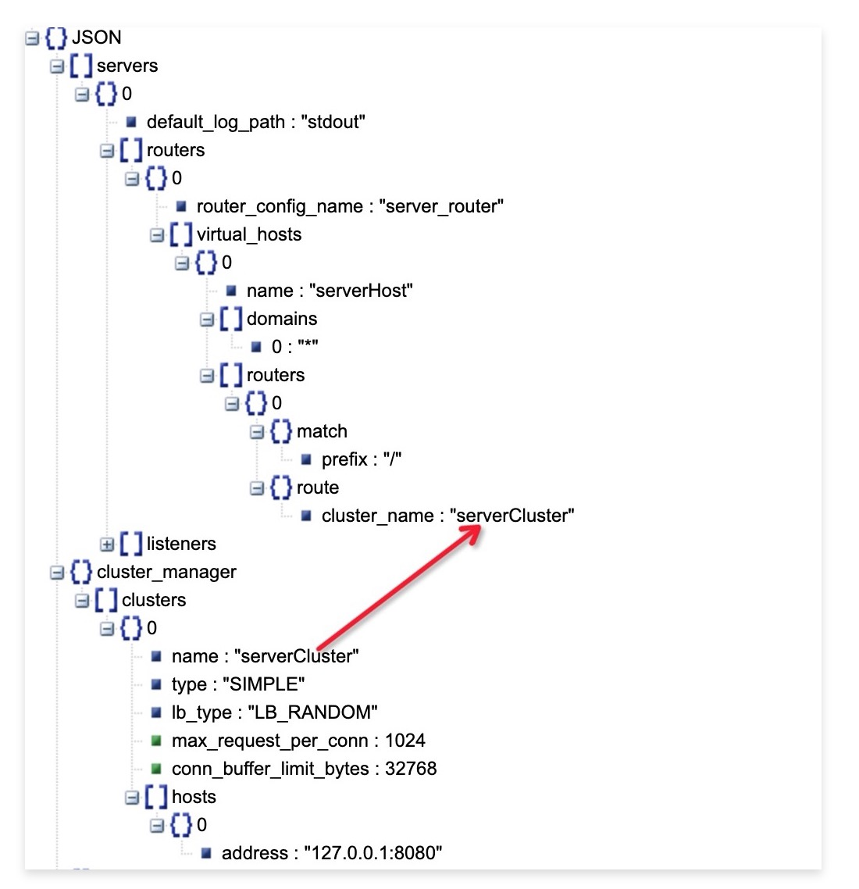
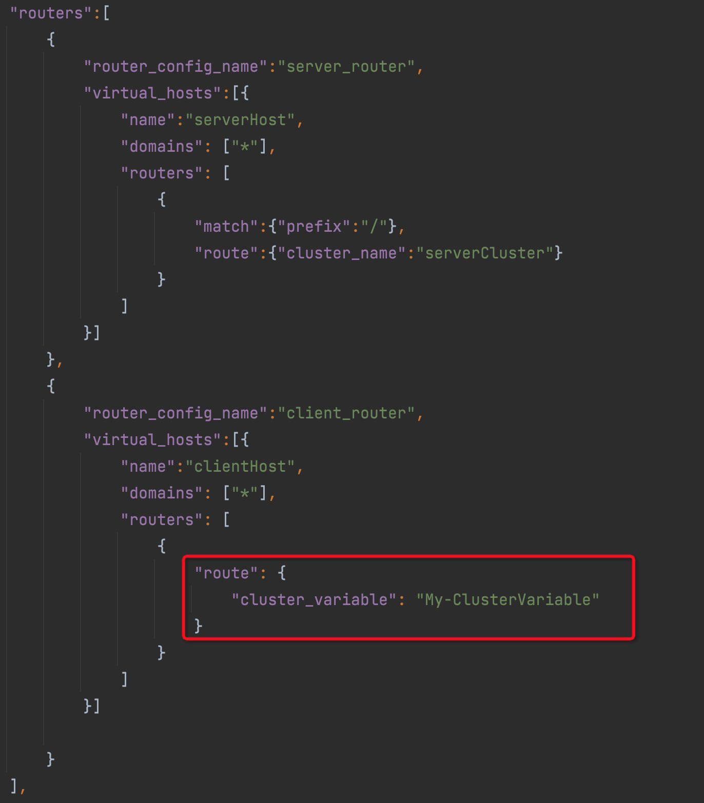
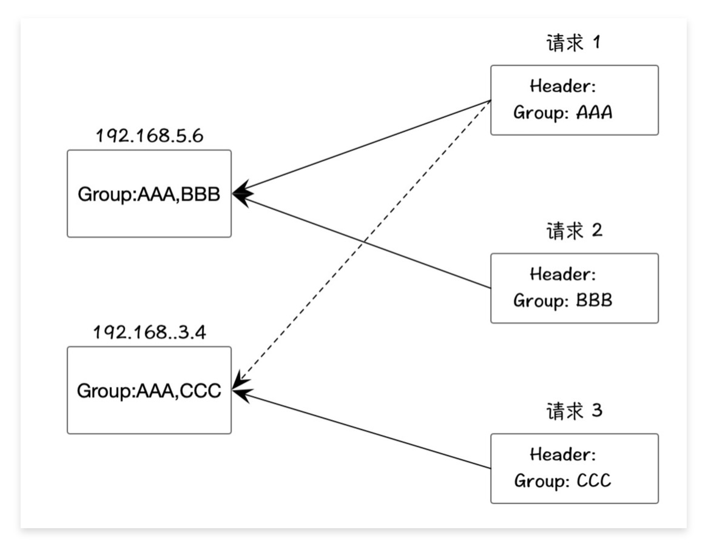
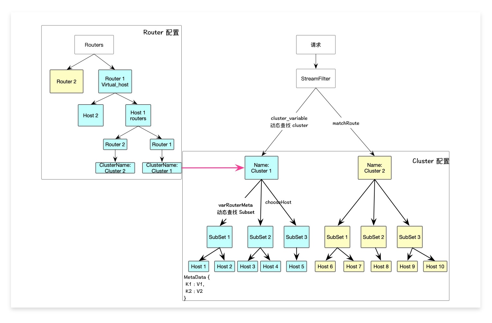

## 前言
MOSN 作为网络边缘代理组件，路由功能是核心功能，本文将介绍 MOSN 路由如何使用，以及 MOSN 路由的一些高级使用技巧，MOSN 官网介绍了路由功能的基本使用配置:
[点击链接](https://mosn.io/docs/configuration/server/router/)

## 路由基本设计
在 MOSN 的路由设计中，cluster 和 route 是高度关联的，说白了，route 的配置，就是为了表达如何准确的找到你想找到的 cluster，另外，一个 cluster 可以有多个 host 机器，例如一个 cluster 有 100 台机器，其中有50台是 v1 版本，50台是 v2 版本，如何根据一些特定的规则，准确地把请求路由到 v1 版本或者 v2 版本呢？

再例如，我想根据 header 里的某个值，再将这个值和“配置中心”里的某个值进行计算，才能找到 cluster，那么我该如何配置呢？

首先，我们看最简单的路由设置。



上图是一个简单的 json 配置，其中，cluster manager 和 routers 的配置，是路由的关键。我们可以 cluster manager 中配置多个 cluster，每个 cluster 配置多个 host。

然后在 routers 配置中，根据一些规则，告诉 MOSN，如何将请求路由到 cluster 中。如下图：



此配置表示，现在有一个 rouer 配置，名为 server_router，有一个虚拟主机，可配置多个域名，这里匹配所有域名，同时，这个域名有多个路由配置，这里暂且配置了一个路由配置：前缀匹配，只要是 / 开头的，就转发到 serverCluster 里的 host 中，也就是下面的 cluster manager 配置里的 serverCluster。


这样，就实现了一个简单的 mosn 路由的配置。


## 动态路由 cluster

大部分情况下，如果我们的路由逻辑很简单，例如根据 header 里的某个名字，找到对应的 cluster，代码或者配置就是这么写的：
```go
router := v2.Router{
    // header 匹配
    RouterConfig: v2.RouterConfig{
        Match: v2.RouterMatch{
            Headers: []v2.HeaderMatcher{
                // 这个 header 匹配, 就转发到 app.Name cluster.
                {
                    Name:  "X-service-id",
                    Value: app.Name,
                },
            },
        },
        // cluster 名称匹配.
        Route: v2.RouteAction{
            RouterActionConfig: v2.RouterActionConfig{
                ClusterName: app.Name,
            },
        },
    },
}
r.VirtualHosts[0].Routers = append(r.VirtualHosts[0].Routers, router)

```

上面代码的意思是如果 header 里有 `X-service-id` 这个 kv，那么就能找到下面 RouteAction 对应的 Cluster 了。

那如果是更复杂的逻辑呢？比如利用请求里的 header 和“配置中心”的某个值进行计算，才能找到 cluster？

此时，通过配置已经无法解决这个需求，因为这其中涉及到了计算逻辑。

MOSN 通过动态配置可以支持该需求。如下图配置：



我们设置了一个 `"cluster_variable": "My-ClusterVariable"` 的 KV 配置。

同时，我们还需要在 StreamFilter 中，利用变量机制，设置 key 为 “My-ClusterVariable” 的 value，这个 value 就是计算出来的 Cluster 名称。

代码如下
```go
// 先注册这个 key 到变量表中。
func init() {
	variable.Register(variable.NewStringVariable("My-ClusterVariable", nil, nil, variable.DefaultStringSetter, 0))
}


var clusterMap = make(map[int]string, 0)

func (f *MyFilter) OnReceive(ctx context.Context, headers api.HeaderMap, buf buffer.IoBuffer, trailers api.HeaderMap) api.StreamFilterStatus {
	l := len(clusterMap)
    // 找 Cluster
	cluster := // 执行一些计算
    // 设置到上下文变量中。这个 key 必须和配置文件中保持一致。
	variable.SetString(ctx, "My-ClusterVariable", cluster)
	return api.StreamFilterContinue
}
```

上面的代码展示了如何基于变量机制动态的找到 Cluster，这种机制在面对复杂路由逻辑的场景时，能够解决你的问题。

## MOSN subset 
如上面所述，我们经常有在一个集群里，有多个版本，如何根据某些标签，将请求路由到指定的版本呢？通常，我们会使用 subset 方案，即，子集合，可在一个 cluster 里面，为每个应用打标，同时我们的路由也配置相关的配置（MOSN 称为 metadata），实现较为复杂的路由。

MOSN 官方文档中，简单介绍了 metadata 的使用：[metadata](https://mosn.io/docs/configuration/custom/#metadata)

下面让我们更详细的介绍 subset 的使用。


上图中,左边是 cluster host 配置,右边是 router 配置.

这个路由配置的 match 意思是,当请求者的 header 里指定了 name 和 value, 且其值匹配这个路由值 service 和 service.green, 那么该请求就被路由到了这个 `cluster_subset` 集群中。

然后, 这个集群可能有多个机器, 那么需要这个机器的元数据和路由配置的元数据相同，
必须都是 `subset:green`, 才能匹配上这个 Host，否则提示找不到（`fall_back_policy 策略是 0 为前提`）。

由此，我们解决了一个 cluster 里面有多个版本的 host 的路由问题。

再进一步，一个 cluster 会有多个 host，每个 host 可能有不同的 subset，这可能就需要很多的路由，如果都使用配置文件的方式写死，就比较麻烦。

MOSN 支持基于 stream filter 的方式，设置动态路由。如下：


基于 MOSN 的变量机制，在请求级别的 `VarRouterMeta` 中设置 kv metadata 组合，效果和上面配置文件的方式类似。

另外, 如果路由配置中配置 MetaData, 请求级别也配置了 MetaData, 那么, MOSN 会将 2 个元数据进行合并, 来和 Host 进行匹配. 这个逻辑在 `pkg/proxy/downstream.go:1497` 代码中有体现.

来个简单的例子：

例如分组里指定机器调用；

1 请求时, 可在 header 里，指定 ip，并在 `varRouterMeta` 里设置这个 ip。

2 host 配置，可在 metadata 里，配置 ip kv，例如 ip：192.168.2.3；
如下图:


这样，就能匹配到指定机器了。

ps: 关于这个例子，我们其实也可以使用 MOSN 的 `ORIGINAL_DST` 机制，将 cluster 的 type
设置为 `ORIGINAL_DST`（MOSN 还支持 DNS 集群类型），然后配置 `cluster.original_dst_lb_config.use_header = true`，
这样，我们请求的时候，在 header 里加入 `host = {目标地址}`，
MOSN 就会根据这个指定的 host header 进行转发。当然，MOSN 也可以自定义名字，不一定要叫 host。

来个复杂的例子。
假设一个场景：单个 host 存在于多个分组，而请求时，只能指定一个分组。如下图：



我们现在有 2 台机器，共 3 个分组，AAA，BBB，CCC。每个机器都包含 AAA 分组。
现在有 3 个请求，每个请求都是不同的分组，此时，我们该如何配置 元数据呢？
首先，本质上，给机器加分组，其实就是打标。我们将元数据想象成 tag 列表即可。


上面的代码，展示了：我们将多个分组标签，转换成 MOSN 可以认识的元数据 kv，每个标签对应一个固定的 value true（`
为什么设置为 true 呢？value 自身其实在 MOSN 的 subsetLB 中是有含义的，即最终根据请中携带的 metadata 的值去匹配 cluster 中满足条件的 subset host entry。但由于 metadata 是个 map，
而因为我们这个例子的特殊性，只能使用 key 自身做分组，所有的 value 都保持一样，本质上任何值都是可以的`）。同时注意，这些 key，都要保存到 `SubsetSelectors` 中，否则，MOSN 无法识别。
每次调用时，我们在 filter 里，从 header 里面取出分组标签，然后设置进“上下文变量”中。例如：


这样，我们就能够完成更加复杂的分组路由。


那 MOSN 是如何寻找 subset 的呢？代码如下:


当执行 choose host 时，`subsetLoadBalancer.findSubset` 函数会根据当前请求的元数据，从 `subSetLoadbalancer` 里找出匹配的 host List。

## 总结


总结一下，我们先讲了基于简单的配置，来实现简单的 router 和 cluster 的配置文件路由。再讲了可以基于 stream filter 的方式实现动态寻找 cluster。同时 MOSN 支持 subset，可以基于 route 配置文件来进行路由和 cluster host 进行匹配，如果逻辑复杂，也可以基于 stream filter + varRouterMeta 变量的方式来 动态寻找 subset。

其实大部分情况下，我们用 json 配置就能解决我们的路由问题。如果复杂的话，我们就用  stream filter + varRouterMeta / stream filter + cluster_variable 这两种动态机制解决我们的需求。下面尝试用一张图来结束本文。




## 参考
[Router 配置](https://mosn.io/docs/configuration/server/router/)
[MOSN SubsetLB 开发文档](https://www.bookstack.cn/read/SOFAMesh-zh/mosn-develop-SubsetLB.md)
[Load Balancer Subsets](https://www.envoyproxy.io/docs/envoy/latest/intro/arch_overview/upstream/load_balancing/subsets)
