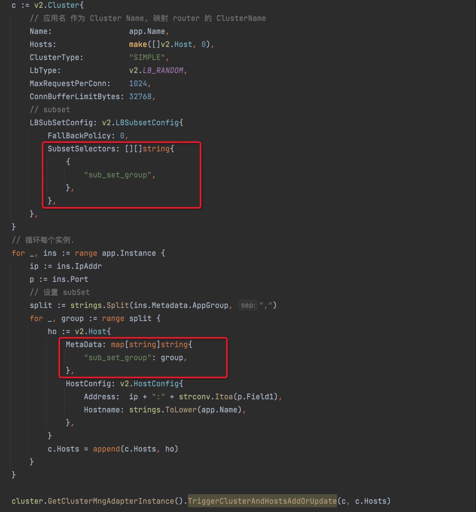

在使用 MOSN 进行路由时，默认的路由策略可能无法满足你的需求，例如，当你的服务集群里，有多个版本时，就需要更复杂的路由逻辑。通常 proxy 在处理此类问题时，都会使用 subsets 的方案。

关于此功能更详细的介绍，可参考 envoy 的 [文档](https://www.envoyproxy.io/docs/envoy/latest/intro/arch_overview/upstream/load_balancing/subsets).

下面介绍如何在 MOSN 中，使用 subset 来动态路由分组。

## 1 设置 host 的 subSet key 和  MetaData



上面的红框标记哪些 key 需要匹配。

下面的红框，标记 key 匹配的值是啥。

当 key 匹配的值存在，那么，就能够路由到这个 host 上。

ps: 上面的代码意思是基于 eureka 的数据，进行动态更新。

## 2 BeforeRoute 请求级别元数据


创建一个自己的 StreamFilter。在 StreamFilter 路由前，设置请求级别元数据。我们这里创建的是 eurekaRPCGroupFilter。

## 3 原理


当执行 choose host 时，subsetLoadBalancer.findSubset 函数会根据当前请求的元数据，从 subSetLoadbalancer 里找出匹配的 host List。

## 4 扩展

### 例子1

如果想做更复杂的路由，例如分组里指定机器调用；

1 请求时, 可在 header 里，指定 ip，并在 varRouterMeta 里设置这个 ip。

2 host 配置，可在 metadata 里，配置 ip kv，例如 ip：192.168.2.3；

如下图:


这样，就能匹配到指定机器了。

### 例子2
再例如，单个 host 存在于多个分组，而请求时，只能指定一个分组。如下图：


我们现在有 2 台机器，共 3 个分组，AAA，BBB，CCC。每个机器都包含 AAA 分组。

现在有 3 个请求，每个请求都是不同的分组，此时，我们该如何配置 元数据呢？

首先，本质上，给机器加分组，其实就是打标。我们将元数据想象成 tag 列表即可。


上面的代码，展示了：我们将多个分组标签，转换成 MOSN 可以认识的元数据 kv，每个标签对应一个固定的 value `true`（`为什么设置为 true 呢？value 自身其实在 MOSN 的 subsetLB 中是有含义的，即最终根据请中携带的 metadata 的值去匹配 cluster 中满足条件的 subset host entry。由于这个例子只使用了 key 自身做分组，所有的 value 都保持一样，所以本质上任何值都是可以的`）。同时注意，这些 key，都要保存到 SubsetSelectors 中，否则，MOSN 无法识别。

每次调用时，我们在 filter 里，从 header 里面取出分组标签，然后设置进“上下文变量”中。例如：


这样，我们就能够完成更加复杂的分组路由。


## 5 再谈 MetaData

事实上, 我们不仅可以在 请求级别(varRouterMeta)设置元数据对 host 进行匹配, 也可以在路由信息中,配置元数据. 如下图:


上图中,左边是 host 配置,右边是 router 配置. 

这个路由配置的意思是,当请求者的 header 里指定了 name 和 value, 且其值匹配这个路由值 service 和 service.green, 那么该请求就被路由到了这个 cluster_subset 集群中,然后, 这个集群可能有多个机器, 那么需要这个机器的元数据和路由配置的元数据相同.
必须都是 subset:green, 才能匹配上这个 Host;

另外, 如果路由配置中配置 MetaData, 请求级别也配置了 MetaData, 那么, MOSN 会将 2 个元数据进行合并, 来和 Host 进行匹配. 这个逻辑在 `pkg/proxy/downstream.go:1497` 代码中有体现.

## 6 如何动态选择 Cluster？
上面提到的是如何选择 cluster 里面的分组，其实动态路由，还包含如何动态选择 cluster 的场景。cluster 和 subset 的关系如下图：


正常情况下，如果我们的路由逻辑很简单，例如根据 header 里的某个名字，找到对应的 cluster，代码或者配置就是这么写的：
```go
router := v2.Router{
    // header 匹配
    RouterConfig: v2.RouterConfig{
        Match: v2.RouterMatch{
            Headers: []v2.HeaderMatcher{
                // 这个 header 匹配, 就转发到 app.Name cluster.
                {
                    Name:  "X-service-id",
                    Value: strings.ToLower(app.Name),
                },
            },
        },
        // cluster 名称匹配.
        Route: v2.RouteAction{
            RouterActionConfig: v2.RouterActionConfig{
                ClusterName: app.Name,
            },
        },
    },
}
r.VirtualHosts[0].Routers = append(r.VirtualHosts[0].Routers, router)
```
上面代码的意思是如果 header 里有 X-service-id 这个 kv，那么就能找到下面 RouteAction 对应的 Cluster 了。

那如果是更复杂的逻辑呢？比如随机找一个 Cluster？

此时，通过配置已经无法解决这个需求，因为这其中涉及到了计算逻辑。

MOSN 通过动态配置可以支持该需求。如下图配置：


我们设置了一个 "cluster_variable": "My-ClusterVariable" 的 KV 配置。

同时，我们还需要在 StreamFilter 中，利用变量机制，设置 key 为 “My-ClusterVariable” 的 value，这个 value 就是计算出来的 Cluster 名称。

代码如下：

```go
// 先注册这个 key 到变量表中。
func init() {
	variable.Register(variable.NewStringVariable("My-ClusterVariable", nil, nil, variable.DefaultStringSetter, 0))
}


var clusterMap = make(map[int]string, 0)

func (f *MyFilter) OnReceive(ctx context.Context, headers api.HeaderMap, buf buffer.IoBuffer, trailers api.HeaderMap) api.StreamFilterStatus {
	l := len(clusterMap)
    // 随机找一个 Cluster
	cluster := clusterMap[rand.Intn(l)]
    // 设置到上下文变量中。这个 key 必须和配置文件中保持一致。
	variable.SetString(ctx, "My-ClusterVariable", cluster)
	return api.StreamFilterContinue
}
```

上面的代码展示了如何基于变量机制动态的找到 Cluster，这种机制在面对复杂路由逻辑的场景时，能够解决你的问题。

## 7 总结

尝试用一张图来解释 MOSN 路由和 Cluster 的关系。大部分情况下，我们用 json 配置就能解决我们的路由问题。
如果路由逻辑较为复杂，可以使用 Stream Filter + varRouterMeta 、Stream Filter  +  cluster_variable 等方式，来进行动态路由。


EOF
