本文根据 SOFAChannel#14 直播分享整理，主题：云原生网络代理 MOSN 扩展机制解析。

大家好，我是今天的讲师永鹏，来自蚂蚁金服，目前主要负责 MOSN 的开发，也是 MOSN 的Committer。今天我为大家分享的是云原生网络代理 MOSN 的扩展机制，希望通过这次分享以后，能让大家了解 MOSN 的可编程扩展能力，可以基于 MOSN 的扩展能力，按照自己实际的业务需求进行二次开发。

### 前言

今天我们将从以下几个方面，对 MOSN 的扩展机制进行介绍：

- MOSN 扩展能力和扩展机制的详细介绍；
- 结合示例对 MOSN 的 Filter 扩展机制与插件扩展机制进行详细介绍；
- MOSN 后续扩展能力规划与展望；

欢迎大家有兴趣一起共建 MOSN。在本次演讲中涉及到的示例就在我们的 Github 的 `examples/codes/mosn-extensions` 目录下，大家有兴趣的也可以下载下来运行一下，关于这些示例我们还做了一些小活动，也希望大家可以踊跃参与。

MOSN：[https://github.com/mosn/mosn](https://github.com/mosn/mosn)

### MOSN 简介

MOSN 作为云原生的网络代理，旨在为服务提供多协议、模块化、智能化、安全的代理能力。在实际生产使用中，不同的厂商会有不同的使用场景，通用的网络代理能力面对具体的业务场景会显得有些不足，通常都需要进行二次开发以满足业务需求。MOSN 在核心框架中，提供了一系列的扩展机制和扩展点，就是为了满足需要基于业务进行二次开发的场景，同时 MOSN 提供的部分通用逻辑也是基于扩展机制和扩展点的实现。

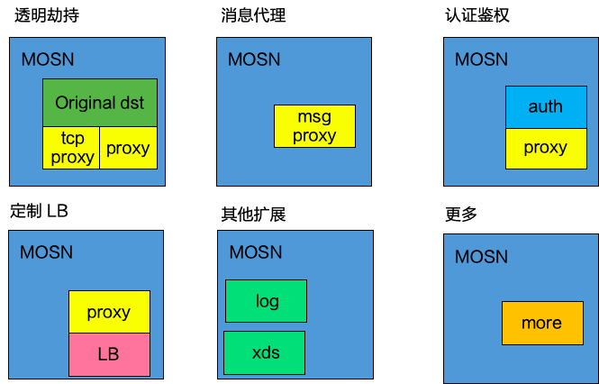

比如通过 MOSN “内置实现”的透明劫持的能力，就是通过 MOSN Filter 机制实现。而要实现消息的代理，则可以通过类似的扩展实现。在通用代理的情况下，可以通过 Filter 机制实现业务的认证鉴权，也可以实现定制的负载均衡逻辑；除了转发流程可以扩展实现以外，MOSN 还可以扩展日志的实现，用于对标已有的日志系统，也可以扩展 XDS 实现定制的配置更新；根据不同的业务场景还会有很多具体的扩展情况，就不在此展开了，有兴趣的可以关注 MOSN 社区正在建设的源代码分析系列文章与文档。

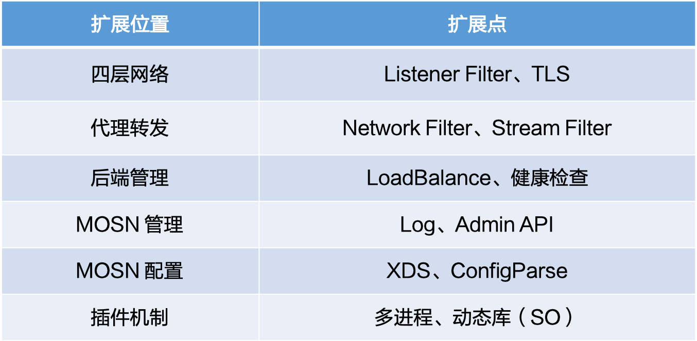

MOSN 作为一款网络代理，在转发链路上的网络层、协议层、转发层，在非转发链路上的配置、日志、Admin API 等都提供了扩展能力，对于协议扩展的部分，有兴趣的可以看一下上期直播讲的 [MOSN 多协议机制解析](https://www.sofastack.tech/blog/sofa-channel-13-retrospect/)，我们今天将重点介绍一下转发层的 Stream Filter 扩展机制与 MOSN 的插件机制。

### Stream Filter 机制

在实际业务场景中，在转发请求之前或者回写响应之前，都可能需要对请求/响应做一些处理，如判断是否需要进行转发的认证/鉴权，是否需要限流，又或者需要对请求/响应做一些具有业务语义的记录，需要对协议进行转换等。这些场景都与具体的业务高度耦合，是一个典型的需要进行二次开发的情况。MOSN 的 Stream Filter 机制就是为了满足这样的扩展场景所设计的，它也成为目前 MOSN 扩展中使用频率最高的扩展点。

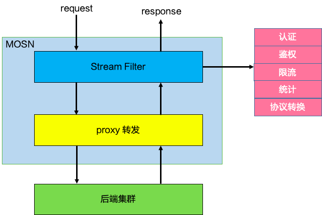

在目前的内置 MOSN 实现中，Stream Filter 机制暂时与内置的 network filter: proxy 是绑定的，后面我们也考虑将这部分能力进行抽象，让其他 network filter 也可以复用这部分能力。

关于 Stream Filter，今天会为大家讲解两个部分的内容：

1. 一个 Stream Filter 包含哪些部分以及在 MOSN 中是如何工作的；
1. 通过一个 Demo 演示来加深对 Stream Filter 的实现与应用；

#### 一个完整的 Stream Filter

一个完整的 StreamFilter，包含三个部分的内容：

- 一个 StreamFilter 对象，存在于每一个请求/响应当中，在 MOSN 收到请求的时候发挥作用，我们称为 ReceiverFilter，在 MOSN 收到响应时发挥作用，我们称为 SenderFilter。一个 StreamFilter 可以是其中任意一种，也可以是两种都是；
- 一个 StreamFilterFactory 对象，用于 MOSN 在每次收到请求时，生成 StreamFilter 对象。在 Listener 配置解析时，一个 StreamFilter 的配置会生成一个其对于的 StreamFilterFactory。同一个 StreamFilter 在不同的 Listener 下可能对应不同的 StreamFilterFactory，但是也有的特殊情况下，StreamFilterFactory 可能需要实现为单例；
- 一个 CreateStreamFilterFactory 方法，配置解析时生成 StreamFilterFactory 就是调用它；

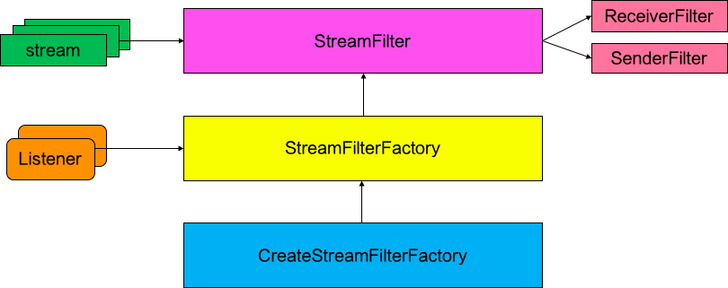

#### Stream Filter 在 MOSN 中是如何工作的

接下来，我们看下 Stream Filter 在 MOSN 中是如何工作的。

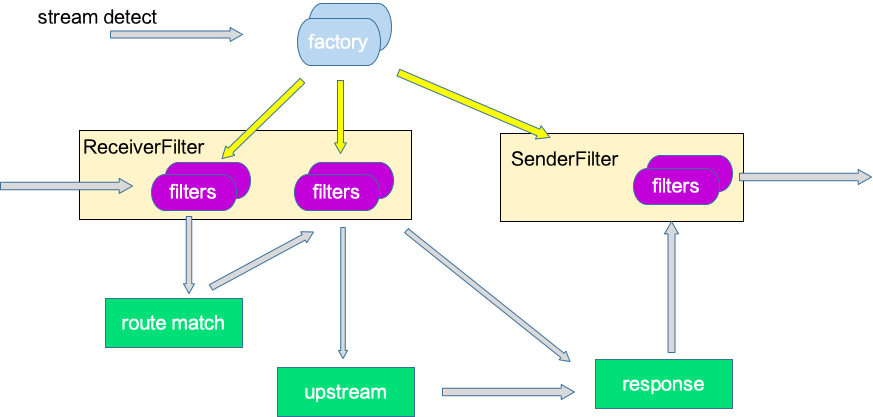

当 MOSN 经过协议解析，收到一个完整的请求时，会创建一个 Stream。此时收到请求的 Listener 中每存在 StreamFilterFactory，就会生成一个 StreamFilter 对象，随后进入到 proxy 流程。

进入 proxy 流程以后，如果存在 ReceiverFilter，那么就会执行对应的逻辑，ReceiverFilter 包括两个阶段，“路由前”和“路由后”，在每个 Filter 处理完成以后，会返回一个状态，如果是 Stop 则会中止后续尚未执行的 ReceiverFilter，通常情况下，返回 Stop 状态的 Filter 都会回写一个响应。如果是 Continue 则会执行下一个 ReceiverFilter，直到本阶段的 ReceiverFilter 都执行完成或中止；路由前阶段的 ReceiverFIlter 执行完成后，就会执行路由后阶段，其逻辑和路由前一致。如果是正常转发，那么随后 MOSN 会收到一个响应或者发现其他异常直接回写一个响应，此时就会进入到 SenderFilter 的流程中，完成 SenderFilter 的处理。SenderFilter 处理完成以后，MOSN 会写响应给 Client，并且完成最后的收尾工作，收尾工作包括一些数据的回收、日志的记录，以及 StreamFilter 的“销毁”（调用 OnDestroy）。

#### Stream Filter Demo

对 StreamFilter 有了一个基本的认识以后，我们来看一个实际的 Demo 代码来看下如何实现一个 StreamFilter 并且让它在 MOSN 中发挥作用。

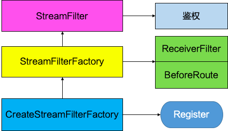

按照刚才我们的介绍，一个 Stream FIlter 要包含三部分：Filter、Factory、CreateFactory。

- 首先我们实现一个 Filter，其逻辑是模拟一个鉴权的 Filter：只有请求的 Header 中包含所配置的 Key-Value 时，MOSN 才会对请求做继续转发，否则直接返回 403 错误；
- 然后我们实现一个 Factory，它负责生成我们实现的 Filter，并且说明 Filter 应该发挥作用的阶段（在请求阶段、路由匹配之前）；
- 最后我们定义了一个生成 DemoFactory 的函数 CreateDemoFactory，并且通过 init 将其“注册”，注册完成以后，MOSN 配置解析就可以识别这个 StreamFilter；

完成实现以后，我们就可以通过具体的配置来实现对应的功能了。在示例的配置中，配置 StreamFilter 为我们刚才实现的 Filter，只转发 Header 中包含 user:admin 的请求。示例配置中监听的端口是 2046，转发的后端 server 端口是 8080。在演示之前，我已经完成了 8080 server 的启动，这个 server 会对收到的任意请求返回 200 。我们来看一下 MOSN 转发情况。Demo 操作可以在文末直播的视频回顾中查看。

- Stream Filter Demo: [https://github.com/mosn/mosn/tree/master/examples/codes/mosn-extensions/simple_streamfilter](https://github.com/mosn/mosn/tree/master/examples/codes/mosn-extensions/simple_streamfilter)
- Demo Readme：[https://github.com/mosn/mosn/tree/master/examples/cn_readme/mosn-extensions](https://github.com/mosn/mosn/tree/master/examples/cn_readme/mosn-extensions)

### MOSN Plugin 机制

下面我们来了解一下 MOSN 的 Plugin 机制。

刚才我们对 Stream Filter 有了一个了解，MOSN 中其余的扩展实现也是类似的方法，思路就是编码实现 MOSN 扩展点所需要的接口然后利用 MOSN 的框架运行扩展的实现。

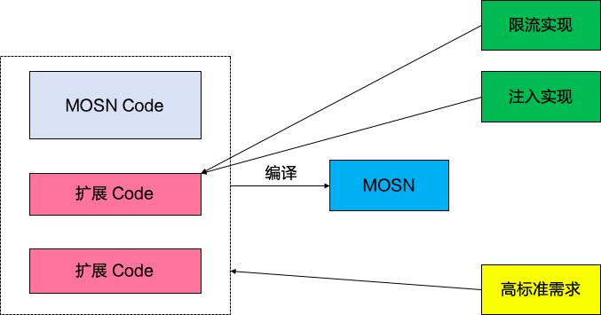

但是这里会发现一个问题，就是有时候我们需要的扩展能力已经有现成可用的实现了，那么我们是否可以做简单的改造就让 MOSN 可以获取对应的能力，哪怕目前可用的实现不是 Go 语言的实现，比如现成的限流能力的实现、注入能力的实现等；又或者对于某些特定的能力，它需要有更严格的控制，更高的标准，比如安全相关的能力。

类似这样的场景，我们引入了 MOSN 的 Plugin 机制，它支持我们可以对 MOSN 需要的能力进行独立开发或者我们对现有的程序进行适当的改造以后，就可以将它们引入到 MOSN 当中来。

MOSN 的 Plugin 机制包含了两部分内容，一是 MOSN 自定义的 Plugin 框架，它支持通过在 MOSN 中实现 agent 与一个独立的进程进行交互来完成 MOSN 扩展能力的实现。二是基于 Golang 的 Plugin 框架，通过动态库（SO）加载的方式，实现 MOSN 的扩展。其中动态库加载的方式目前还存在一些局限性，还处于 beta 阶段。

我们先来看一下多进程 Plugin 框架。

#### 多进程 Plugin 框架

MOSN 的 Plugin 框架是 MOSN 封装的一个可以让 MOSN 通过 gRPC 和独立进程进行交互的方式，它包含两部分：

1. 独立的进程通过 MOSN Plugin 框架管理，作为 MOSN 的子进程；MOSN 的 Plugin 框架可以管理它们，如启动、关闭等；
1. 通过在 MOSN 中实现的 agent，使用 gRPC 的方式和子进程进行交互，gRPC 可以是基于 tcp 的，也可以是基于 domain socket 的；

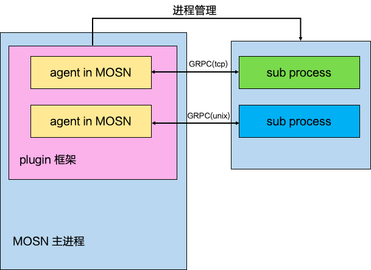

基于这个框架，我们只需要开发或者进行一些改造，让程序满足 MOSN 框架的规范，就可以作为 MOSN 多进程插件的一部分。

首先我们需要提供一个 gRPC 的服务，并且满足 MOSN 框架下的 proto 定义。当 gRPC server 启动完成以后，向标准输出（stdout）输出一段约定的字符串，作为 MOSN 和子进程之间的握手协议。MOSN 中的对应 agent 会通过握手协议完成与子进程之间的连接建立。握手协议的字符串包含5个字段，每个字段之间用"|"分割，其中带$符号的是根据实际进程情况需要填写的值，其余的是当前约定的固定字段。network 支持 tcp/unix，代表通过 tcp 方式还是 unix domain socket 的方式进行通信，addr 表示 gRPC server 监听的地址。

MOSN 提供了 go 语言的子进程 server 封装，在 go 语言场景下，作为子进程的程序只需要实现一个 MOSN 框架下的 plugin.Service 接口，并且通过 plugin.Serve 方法启动即可。

通过 Plugin 框架，让 MOSN 做到在扩展功能实现的时候，支持隔离性、支持异构语言扩展能力、支持模块化，以及具备进程管理的能力。

对于 MOSN 通过多进程方式完成扩展，今天准备了两个示例和大家进行分享。一个是基于 MOSN 的 TLS 扩展，模拟了通过一个安全等级比较高的证书管理程序来获取 TLS 配置证书、私钥等敏感信息的能力；第二个是将之前演示的 Stream Filter 修改为了“子进程”，模拟“如何将现成的能力”引入 MOSN。

**基于 MOSN 的 TLS 扩展示例**

首先来看 TLS 的扩展，示例包含两部分内容：

- 独立的子进程，用 Go 语言实现，实现了 plugin.Service 接口，并通过 plugin.Serve 方法启动；
- MOSN 扩展点实现交互 agent。在这里就不详细展开TLS扩展点的细节了，只关注交互过程：通过 Call 方法发送 gRPC 请求，获取响应，完成相关逻辑；

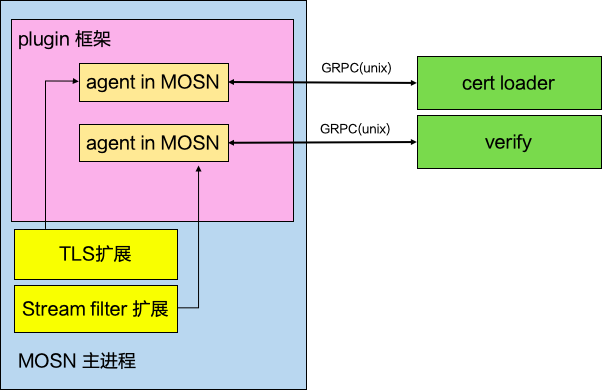

load cert demo: [https://github.com/mosn/mosn/tree/master/examples/codes/mosn-extensions/plugin/cert_loader](https://github.com/mosn/mosn/tree/master/examples/codes/mosn-extensions/plugin/cert_loader)
Demo Readme：[https://github.com/mosn/mosn/tree/master/examples/cn_readme/mosn-extensions](https://github.com/mosn/mosn/tree/master/examples/cn_readme/mosn-extensions)

下面我们来看一下效果，首先配置依然是监听 2046 的端口，配置了扩展的 TLS 配置，就需要 HTTPS 才可以访问 MOSN。

**Stream Filter 作为 agent 示例**

下面我们来看下 Stream Filter 作为 agent，与多进程之间的示例，模拟“如何将现成的能力”引入 MOSN。在示例中我们把之前的“鉴权”认为是一个“现成的”能力。

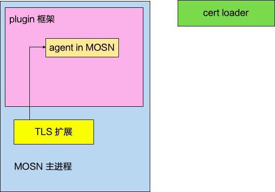

独立进程中实现和之前一样的“鉴权”能力，其配置来自进程的启动参数。Stream Filter 作为 agent 实现，其中“校验”逻辑修改为和子进程交互，在生成 Factory 时完成子进程的启动和配置设置。

这个示例运行以后和之前 Stream Filter 的效果是一样的。

- Stream Filter Plugin demo: [https://github.com/mosn/mosn/tree/master/examples/codes/mosn-extensions/plugin/filter](https://github.com/mosn/mosn/tree/master/examples/codes/mosn-extensions/plugin/filter)
- Demo Readme：[https://github.com/mosn/mosn/tree/master/examples/cn_readme/mosn-extensions](https://github.com/mosn/mosn/tree/master/examples/cn_readme/mosn-extensions)

#### 动态库(SO)扩展机制

在目前的多进程框架中，虽然扩展能力可以通过一个独立的子程序实现，但是仍然需要在 MOSN 中实现一个 agent 用于交互，依然需要在MOSN中编写一部分代码；而我们希望引入动态库（SO）加载的机制，实现在不重新编译 MOSN 的情况下，通过加载不同的 SO，做到不同的扩展能力。

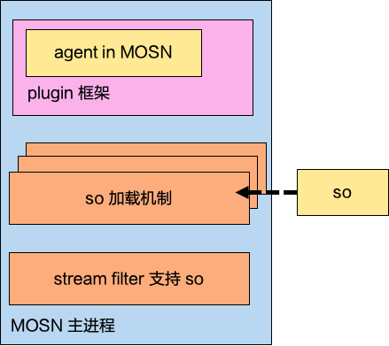

与子程序模式相比，SO 虽然也是一个独立的二进制，但是最终启动的时候，不会有额外的子进程存在，其生命周期可以和 MOSN 完全保持一致，而且动态库机制还有一个优势：它可以让扩展代码和 MOSN 完全解耦合。

但是，目前使用动态库加载的方式还存在一些限制，因此 MOSN 对于这个能力也还处于 Beta 阶段，并没有投入实际使用，需要完善。相关的原因包括：

- 部分 MOSN 扩展的实现需要用到 MOSN 中的一些定义，因此在动态库实现时不能完全做到解耦合。

为了解决这个问题，MOSN 将一些基础库（如日志、buffer 等），一些 API 定义从 MOSN 的核心仓库中独立出来，这样扩展实现和 MOSN 核心都引用这些“独立”的库，减少扩展对 MOSN 核心代码的依赖。

如果某一个扩展点要支持完全解耦合的动态库扩展，那么对应的扩展点都需要进行支持动态库加载的改造，包括配置模型与实现。

- MOSN 动态库加载的方式，其实是基于 Go 语言的 plugin 包实现的，它可以加载用 Go 语言编译的动态库。但是对于动态库的编译环境存在一些限制，编译它时必须和 MOSN 编译时的 GOPATH 保持一致；同时引用的代码路径都需要保持一致，如果存在 vendor 目录，那么意味着编译动态库时的项目路径也得和 MOSN 核心保持一致。

为了解决这个问题，我们考虑使用 Docker 编译，在编译时统一 GOPATH，强制修改代码目录结构，屏蔽掉 Vendor 目录差异的方式来解决，这种方式目前仍然在验证中。

因此理论上 MOSN 目前所有的扩展点都可以使用 Go 语言原生机制通过加载 SO 的方式来实现，而目前 MOSN 最适合实现这个能力的一个扩展点就是 Stream Filter。

我们只需要实现一个通用的、可以加载 SO 的 Filter，然后在具体的 SO 中实现真正的 StreamFilter 逻辑，由于 StreamFilter 实现所需要的接口定义都在 mosn.io/api 中，所以 SO 可以做到和 MOSN 核心框架解耦合。

关键点就是这个通用 Filter 的设计和实现，我们也通过 Demo 来看一下。

**通用 Filter 的设计和实现**

这个通用的 Filter 和普通的 StreamFilter 不同，它只包含一个要素：CreateFactory。思路是通过通用的 CreateFactory，加载 SO 中的 CreateFactory 并执行，让 SO 中的 Factory 发挥作用。

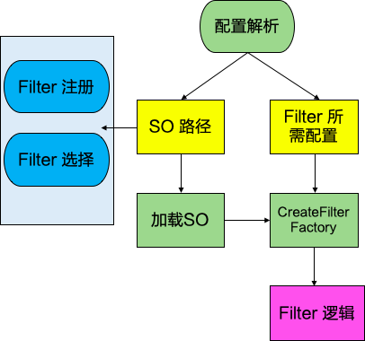

通用 CreateFactory 包括：

- 配置解析，解析出两部分内容：一是需要加载的 SO 路径，二是 SO 中对应 Filter 所需要的配置；
- SO 路径就代表了 SO 中 Filter 的“注册”，以及本次会选择这个 Filter；
- 加载 SO，基于其中约定好的函数名，获取真正的 CreateFactory 函数；
- 调用真正的 CreateFactory 函数，实现 SO 中 StreamFilter 的加载；

由此，我们可以看到，SO 中的 StreamFIlter 也和普通的 FIlter 有些区别：

- 生成 StreamFilterChainFactory 的函数必须是固定的名字；
- 不再需要 init “注册”该函数；

- Stream Filter SO Demo: [https://github.com/mosn/mosn/tree/master/examples/codes/mosn-extensions/plugin/so](https://github.com/mosn/mosn/tree/master/examples/codes/mosn-extensions/plugin/so)
- Demo Readme：[https://github.com/mosn/mosn/tree/master/examples/cn_readme/mosn-extensions](https://github.com/mosn/mosn/tree/master/examples/cn_readme/mosn-extensions)

下面我们来看一下这个 Demo 的效果。本次 Demo 中的 Filter 实现依然是之前的“鉴权”示例。经过验证，我们发现这个思路是可行的，但是离生产实践还需要完善更多的细节。

### 代码扩展活动

经过这些演示，相信大家对 MOSN 的扩展能力也有所了解了，这里我们来做一个代码扩展活动，希望大家可以踊跃参与。完成活动任务，提交相关代码 PR 到 MOSN 的仓库，我们会进行 CodeReview 和验证，第一个验证通过的代码将合并到 MOSN 的 example 中，并且对提交的同学送上一份奖励；对于前3名提交、同样结果正确并且是原创的，虽然我们不能合并对应的代码，但是我们也将送上奖励。

活动任务共有五个：

- 多进程 Demo 中证书加载的独立进程，使用 python 或者 java 实现以后，demo 运行演示成功。任意一种语言就算完成一个任务。

+ `examples/codes/mosn-extensions/plugin/cert_loader/python/`
+ `examples/codes/mosn-extensions/plugin/cert_loader/java/`

- 多进程 Demo 中 stream filter 的独立进程，使用 python 或者 java 实现以后，demo 运行演示成功。任意一种语言就算完成一个任务。

+ `examples/codes/mosn-extensions/plugin/filter/python/`
+ `examples/codes/mosn-extensions/plugin/filter/java/`

- SO 动态加载 Demo 中，SO 里实现的 Stream Filter 结合多进程框架（GO 语言）实现，Demo 运行演示成功。

+ `examples/codes/mosn-extensions/plugin/so/subprocess/`

跨语言相关的实现可以参考以下示例：

[https://github.com/mosn/mosn/tree/master/examples/codes/plugin/across-languages/server/](https://github.com/mosn/mosn/tree/master/examples/codes/plugin/across-languages/server/)

### 规划与展望

最后向大家介绍一下 MOSN 后续扩展能力的规划，也希望大家有需求的可以向我们反馈，有兴趣的一起参与到 MOSN 的建设中来。首先就是要完善 SO 动态库加载机制，让 MOSN 支持 SO 方式加载扩展；然后就是针对 LUA 的脚本扩展以及支持 WASM 的扩展能力；最后 MOSN 还会增加更多的扩展点，以满足更多更复杂的场景。非常欢迎大家参与到 MOSN 社区的共建中。

- MOSN：[https://github.com/mosn/mosn](https://github.com/mosn/mosn)
- MOSN 官网：[https://mosn.io/](https://mosn.io/)

以上就是本期分享的全部内容，如果大家对 MOSN 有问题以及建议，欢迎在群内与我们交流。

本期直播视频回顾以及 PPT 查看地址见：<https://tech.antfin.com/community/live/1152>。
