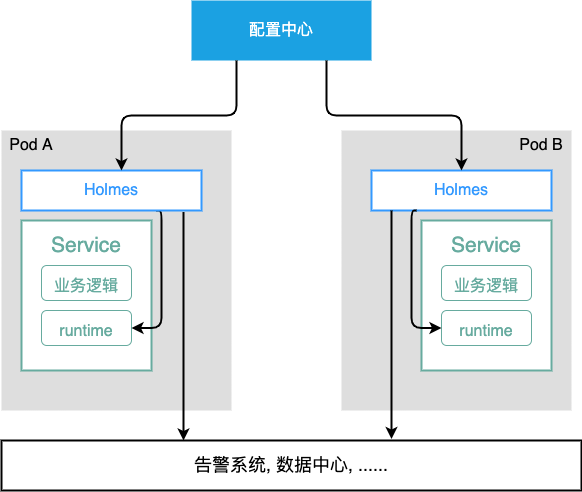

## 前言

对于系统的性能尖刺问题，我们通常使用Go官方内置的`pprof`包进行分析，但是难点是对于一闪而过的“尖刺”，
开发人员很难及时地保存现场：当你收到告警信息，从被窝中爬起来，打开电脑，链接VPN，系统说不定都已经重启三四趟了。
[mosn/holmes](https://github.com/mosn/holmes)是一个基于golang实现的，轻量级性能监控系统，当应用的性能指标
发生了异常波动时，`holmes`会在第一时间保留现场，让你第二天上班可以一边从容地喝着枸杞茶，一边追查问题的根因。

本文将介绍如何使用 `holmes`对您的应用进行监控，并简单分析了`holmes`的实现原理。


## Quick Start

使用`holmes`使用方式十分简单，只需要在您的系统初始化逻辑内添加以下代码：
```go
    // 配置规则
    h, _ := holmes.New(
        holmes.WithCollectInterval("5s"), // 指标采集时间间隔
        holmes.WithDumpPath("/tmp"),      // profile保存路径
    
        holmes.WithCPUDump(10, 25, 80, 2 * time.Minute),  // 配置CPU的性能监控规则
        holmes.WithMemDump(30, 25, 80, 2 * time.Minute),// 配置Heap Memory 性能监控规则
        holmes.WithGCHeapDump(10, 20, 40, 2 * time.Minute), // 配置基于GC周期的Heap Memory 性能监控规则
        holmes.WithGoroutineDump(500, 25, 20000, 100*1000, 2 * time.Minute),    //配置Goroutine数量的监控规则
    )

    // enable all
    h.EnableCPUDump().
    EnableGoroutineDump().
	EnableMemDump().
	EnableGCHeapDump().Start()

```
类似于`holmes.WithGoroutineDump(min, diff, abs,max,2 * time.Minute)`的`API`含义为: 
* 当goroutine指标满足以下条件时，将会触发dump操作。
  `current_goroutine_num` > `10` && `current_goroutine_num` < `100*1000` && 
  `current_goroutine_num` > `125%` * `previous_average_goroutine_num` ||`current_goroutine_num` > `2000`.
* 当goroutine数大于`max`时，`holmes`会跳过本次dump操作，因为当`goroutine`数过大时，`goroutine dump`操作成本很高。
* `2 * time.Minute` 是两次dump操作之间最小时间间隔，避免频繁profiling对性能产生的影响。


更多使用案例点击[这里](https://github.com/mosn/holmes/tree/master/example)。

## Profile Types

`holmes`支持以下五种Profile类型，用户可以按需配置。
* mem: 内存分配     
* cpu: cpu使用率      
* thread: 线程数    
* goroutine: 协程数
* gcHeap: 基于GC周期监控的内存分配


## 指标采集

`mem`, `cpu`, `thread`, `goroutine`这四种类型是根据用户配置的`CollectInterval`,每隔一段时间采集一次应用当前的性能指标，
而`gcHeap`时基于`GC`周期采集性能指标。本小节会分析一下两种指标。

### 根据`CollectInterval`周期采集

`holmes`每隔一段时间采集应用各项指标，并使用一个固定大小的[循环链表](https://github.com/mosn/holmes/blob/master/ring.go)来存储它们。
[!ring](./ring.png)

### 根据`GC`周期采集

在一些场景下，我们无法通过定时的`memory dump`保留到现场, 比如应用在一个`CollectInterval`周期内分配了大量内存，
又快速回收了它们，此时`holmes`在周期前后的采集到内存使用率没有产生过大波动，与实际情况不符。为了解决这种情况，holmes开发了基于GC周期的
`Profile`类型，它会在堆内存使用率飙高的前后两个GC周期内各`dump`一次`profile`，然后开发人员可以使用`pprof --base`命令去对比
两个时刻堆内存之间的差异。 [具体实现介绍](https://uncledou.site/2022/go-pprof-heap/)。

根据`GC`周期采集到的数据也会放在循环列表中。

## 规则判断
本小节介绍`holmes`是如何根据规则判断系统出现异常的。

### 阈值含义

每个`Profile`都可以配置`min`,`diff`,`abs`,`coolDown`四个指标，含义如下
* 当前指标小于`min`时，不视为异常。
* 当前指标大于`(100+diff)`*`100%`*历史指标，说明系统此时产生了波动，视为异常。
* 当前指标大于`abs`(绝对值)，视为异常。

`cpu`和`goroutine`这两个`profile`类型提供`max`参数配置，基于以下考虑。
* `cpu` 的`profiling`操作大约会有[5%的性能损耗](https://medium.com/google-cloud/continuous-profiling-of-go-programs-96d4416af77b)，
  所以当在`cpu`过高时，不应当进行`profiling`操作，否则会拖垮系统。
* 当`goroutine`数过大时，`goroutine dump`操作[成本很高](https://github.com/golang/go/issues/33250)，会进行STW操作，从而拖垮系统。
  
### Warming up

当`holmes`启动时，会根据`CollectInterval`周期采集十次各项指标，在这期间内采集到的指标只会存入循环链表中，不会进行规则判断。

## 扩展功能
除了基本的监控之外，`holmes`还提供了一些扩展功能。

### 事件上报

您可以通过实现`Reporter` 来实现以下功能：
* 发送告警信息，当`holmes`触发`Dump`操作时。
* 将`Profiles`上传到其他地方，以防实例被销毁，从而导致profile丢失，或进行分析。

```go
        type ReporterImpl struct{}
        func (r *ReporterImple) Report(pType string, buf []byte, reason string, eventID string) error{
            // do something	
        }
        ......
        r := &ReporterImpl{} // a implement of holmes.ProfileReporter Interface.
    	h, _ := holmes.New(
            holmes.WithProfileReporter(reporter),
            holmes.WithDumpPath("/tmp"),
            holmes.WithLogger(holmes.NewFileLog("/tmp/holmes.log", mlog.INFO)),
            holmes.WithBinaryDump(),
            holmes.WithMemoryLimit(100*1024*1024), // 100MB
            holmes.WithGCHeapDump(10, 20, 40, time.Minute),
)
  
```

### 动态配置

您可以通过`Set`方法在应用运行时更新holmes的配置。它的使用十分简单，和初始化时的`New`方法一样。

有些配置时不支持动态更改的，比如Core数，如果在系统运行期间更改这个参数，会导致CPU使用率产生巨大
波动，从而触发Dump操作。

```go
    h.Set(
        WithCollectInterval("2s"),
        WithGoroutineDump(10, 10, 50, 90, time.Minute))
```

### 配置中心支持

利用`Set`方法，您可以轻松地对接自己公司的配置中心，比如，将`holmes`作为数据面，配置中心作为控制面。
并对接告警系统(邮件/短信等)，搭建一套简单的监控系统。

具体架构如下:


## 总结
本文简单地介绍了`Holmes`的使用方法与原理。希望`holmes`能在您提高应用的稳定性时帮助到你。


## 参考
[Holmes](https://github.com/mosn/holmes)
[无人值守的自动 dump(一)](https://xargin.com/autodumper-for-go/)
[无人值守的自动 dump(一)](https://xargin.com/autodumper-for-go-ii/)
[go 语言 pprof heap profile 实现机制](https://uncledou.site/2022/go-pprof-heap/)