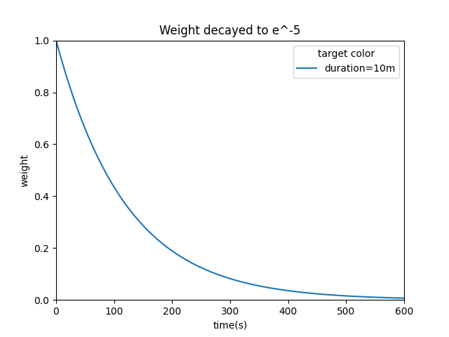
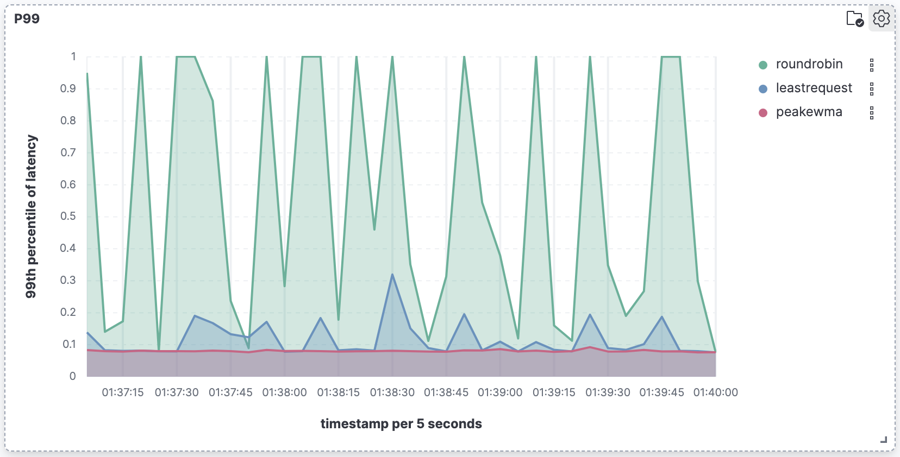

## 前言

这篇文章主要是介绍mosn在v1.5.0中新引入的基于延迟的负载均衡算法（[#2253](https://github.com/mosn/mosn/pull/2253)）。首先会对分布式系统中延迟出现的原因进行剖析，之后介绍mosn都通过哪些方法来降低延迟，最后构建来与生产环境性能分布相近的测试用例来对算法进行验证。

在开始聊基于延迟的负载均衡算法之前，先介绍下什么是负载均衡

### 什么是负载均衡

Wikipedia中 [**Load Balancing (Computing)**](https://en.wikipedia.org/wiki/Load_balancing_(computing)) 词条是这样介绍负载均衡的：

> 负载均衡是将一组任务分配到一组资源（计算单元）上的过程，目的是使它们的整体处理更有效率。负载均衡可以优化响应时间，避免负载不均匀导致一些计算节点过载而其他计算节点处于空闲状态

负载均衡在大型分布式系统中是关键的组成部分。负载均衡解决了分布式系统中最重要的两个问题：可伸缩性（scalability）和韧性（resilience）。

- **可伸缩性**：应用程序部署在多个相同的副本中。当计算资源不足时可以通过部署额外的副本来增加计算资源，而当计算资源大量冗余时可以通过减少副本来节省成本。通过负载均衡可以将请求负载分布到不同的副本中。

- **韧性**：分布式系统的故障是部分的。应用程序通过冗余副本的方式，保证在部分组件故障时仍能正常地提供服务。负载均衡通过感知节点的故障，调整流量的分配，将流量更多的分配到那些能够正常提供服务的节点上。

## 走得更快

负载均衡使得现代软件系统具备了可扩展性和韧性。但在分布式系统中还存在不容忽视的问题：**延迟**。

### 延迟来自哪里

现代软件系统通常是多层级结构大型分布式系统，即使是只服务单个终端用户的请求，它背后也有可能经过了上百次的数据访问，这种情况在微服务架构中更是尤为普遍。

<figure><figcaption align = "center">微服务架构（引用自<a href="https://www.manning.com/books/microservices-patterns">Microservices Pattern</a>）</figcaption></figure>

单台性能稳定的服务器中延迟通常由以下几个方面造成：

- 计算任务本身的复杂度
- 内容的传输过程中的延迟
- 请求排队等待的延迟
- 后台任务活动所导的资源竞争

这些服务器之间的延迟将会叠加，任何显著的延迟增加都会影响终端用户的体验。此外，任何来自单个节点的延迟峰值也会直接影响到终端用户体验。最后，越来越多地使用公有云部署应用程序，进一步加剧了响应时间的不可预测性，因为在这些环境中存在共享资源（CPU、内存和IO）的争用，应用程序机几乎不可避免地遇到性能影响，并且这种影响是随时发生的。

### 如何减少延迟

有研究表明，在大型互联网应用中，延迟往往具有长尾特点，P999比中位数高出几个数量级。如果在应用架构的每层都能够减少这些尾部延迟，那么对终端用户整体的尾部延迟将会显著降低。

在服务网格中，所有接收和发送的流量都会经过边车代理，通过边车代理可以轻松地控制网格的流量，而无需对服务进行任何修改。如果边车代理在对应用层流量进行转发时，总是通过负载均衡时选择响应时间较短的服务器，那么将会显著降低对终端用户的尾部延迟。

基于此，我们准备开始为mosn引入基于延迟的负载均衡算法，并进行适当调整来保证能够在大多数使用场景下显著减少延迟。

### 性能问题是局部的

前面提到了，每个节点的性能受到多种因素的影响，这些影响因素是动态的，难以准确预测每个节点的性能，因此我们无法精确地选择最好的节点，但是可以避免较差的节点。

在云环境中，服务器的性能常常是难以预测的，但是我们可以通过对大量的数据进行分析，发现服务器性能的分布大多数情况下是符合正态分布的。因此，尽管有一部分的服务器在性能方面表现比较差，它们的数量通常都是少数的（3sigma），而绝大部分服务器节点的表现是正常的。

除了服务器之间的差异，还存在由基础设施导致的动态延迟，这种延迟可能是由于网络拥塞、故障或不断增长的流量所导致。这种延迟通常具有持续性和局部性。持续性则表示延迟会长时间存在，不会在短时间内消失；而局部性指的是延迟往往只出现在某些特定服务器上，而不会在全局发生。

### PeakEWMA

面对这些问题，我们使用PeakEWMA（Peak Exponentially Weighted Moving Average）计算响应时间指标，并根据这个指标来对节点进行负载均衡。

EWMA是一种动态权重调整算法，各数值的加权影响力随时间而指数式衰退，越近期的数据加权影响力越重，但较旧的数据也给予一定的加权值。

它以相对较高的权重考虑了最近响应时间的影响，因此更具有针对性和时效性。加权的程度以常数 𝛼 决定， 𝛼 数值介于 0 至 1，它用来控制数据加权影响力衰退的速率。

作为一种统计学指标，EWMA的计算过程不需要大量的采样点以及时间窗口的设定，有效地避免了计算资源的浪费，更适合在mosn这样的边车代理中使用。

由于响应时间是历史指标，当服务器出现性能问题导致长时间未返回时，负载均衡算法会错误地认为这台服务器仍是最优的，而不断地向其发送请求而导致长尾延迟增高。我们使用活跃连接数作为实时变化的指标对响应时间进行加权，表示等待所有活跃的连接都返回所需要的最大时间。

### P2C（Power of Two Choice）

在大规模集群中，如果使用遍历所有服务器选择最好的服务器的方法，虽然可以找到最轻负载的服务器来处理请求，但这种方法通常需要大量的计算资源和时间，因此无法处理大规模的请求。因此，我们使用P2C（Power of Two Choice）来选择最优节点。相比之下，P2C算法可以在常数时间内选择两个服务器进行比较，并选择其中负载更轻的服务器来处理请求。P2C基于概率分配，即不直接基于权重分配，而是根据每个服务器优于其他服务器的概率值来决定请求的分配。

此外，在多个负载均衡器的情况下，不同负载均衡器可能会有不同的节点视图，这可能导致某些负载均衡器选择的最优节点总是最差的节点。这是因为负载均衡器选择最优节点时基于自己的视图信息，而节点视图随着时间的变化可能会发生变化，因此不同的负载均衡器选择的最优节点也可能不同。P2C算法通过对随机选择的两个节点进行比较，可以使节点间的负载均衡更加均匀，即使节点视图发生变化，也能提供稳定的负载均衡效果。

> *在mosn的v1.5.0版本中，只有节点权重相同时会使用P2C，当权重不同时会使用EDF进行加权选择。后续会提供可配置的选项。*

### 模拟流量验证

我们构建了与生产环境性能分布相近的测试用例来对算法进行验证。

首先我们使用正态分布生成了10台服务器的基准性能，其中数学期望为50ms，标准差为10ms。接下来，我们将这些基准性能作为数学期望，并以标准差为5ms的正态分布随机生成了请求延迟，以模拟真实世界的情况。此外，我们还在其中一台服务器注入了概率为0.1的故障，故障发生时会产生1000ms的延迟，以测试系统的容错性。

为了模拟请求倾斜时请求排队等待的延迟，我们限制了每台服务器的最大并发数为8，当同时处理的最大请求数超过了最大并发数时，将会排队等待。这样能够更加真实地模拟出系统的运行情况。

最后，我们使用了Round Robin、Least Request和PeakEWMA三种算法，分别以16并发同时发送请求，得到的P99如下

Round Robin算法虽然平衡，但是始终会选择到注入了故障的服务器，导致P99始终在1000ms上下波动；Least Request算法虽然避开了故障服务器，但是其P99值依然表现出较大的波动。

与此相比，PeakEWMA算法在保持稳定的同时，P99值始终低于Round Robin和Least Request算法。这恰当地体现了mosn在性能优化方面的成功，mosn确实做到了走得更快。

## 期待走得更稳

虽然mosn在服务网格中解决了让应用跑得更快的问题，但是分布式系统中的故障却时刻存在。我们期望通过mosn的负载均衡算法，可以让我们的服务走得更稳。

### 快速失败的挑战

根据经验，故障时的响应时间往往远远小于正常值，比如网络分区导致的连接超时，而没有实际处理请求。我们称这种错误时响应时间远远小于正常值的情况为快速失败。

在服务器出现快速失败时，从负载均衡的角度看，就会错误地认为该服务器是最优的选择。尽管可以通过断路器来避免向该服务器发送长期请求，但断路器本身也是一种快速失败，错误的视图依然会传播。此外，断路器的阈值设置也存在挑战。此外，断路器需要足够的错误样本才能触发，而我们期望尽可能避免错误的发生。

因此，我们在后续版本中将会对负载均衡算法进行调整，让负载均衡算法能够感知错误的发生，并在触发断路器前就避免将请求转发到故障的服务器中。