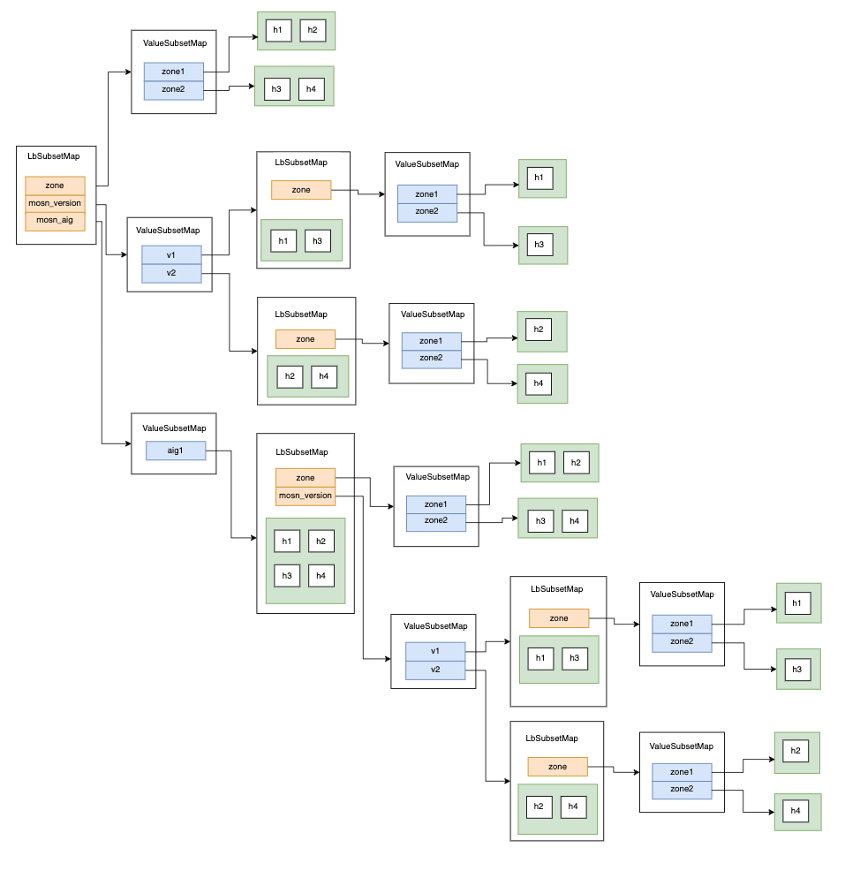
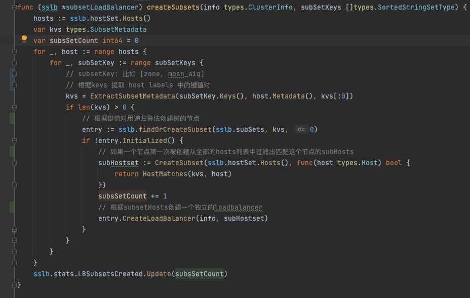
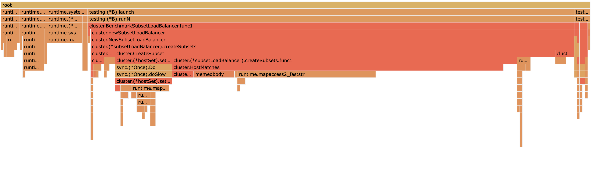
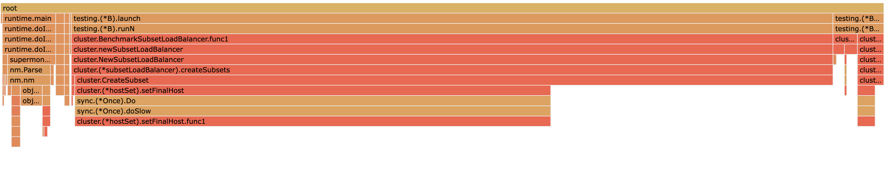
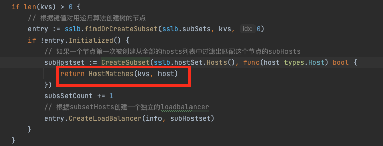
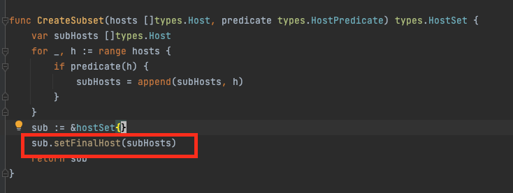
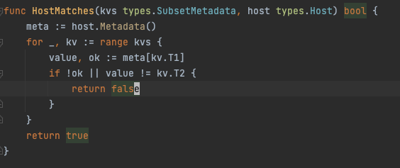
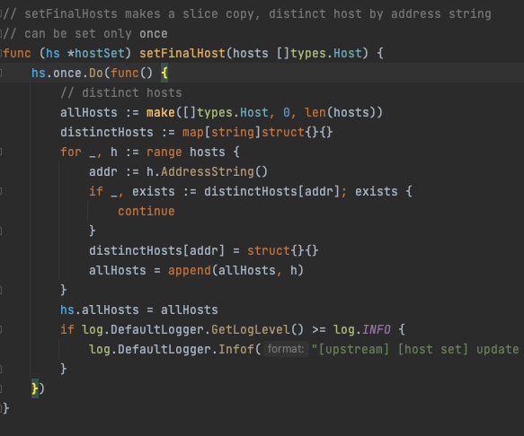
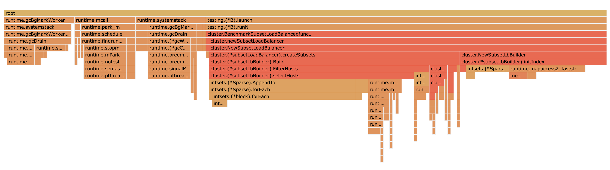

# 前言

​        MOSN 使用了 subset 算法作为其标签匹配路由负载均衡的方式，本文主要介绍 Subset 的原理，同时在超大规模集群下MOSN的 subset 所遇到的一些性能瓶颈与优化算法。


# Subset 基本原理

​        在一个集群里，通常机器会有不同的标签，如何将一个请求路由到指定标签的一组机器呢？MOSN 把一个服务下的机器按照机标签组合进行预先分组成多个子集，在请求的时候，根据请求中的metadata信息可以快速查询到这个请求应该匹配到哪个子集。

当前有4个节点

```json
[
   {
      "hostname":"h1",
      "metadata":{
         "zone":"zone1",
         "mosn_version":"version1",
         "mosn_aig":"aig1"
      }
   },
   {
      "hostname":"h2",
      "metadata":{
         "zone":"zone1",
         "mosn_version":"version2",
         "mosn_aig":"aig1"
      }
   },
   {
      "hostname":"h1",
      "metadata":{
         "zone":"zone2",
         "mosn_version":"version1",
         "mosn_aig":"aig1"
      }
   },
   {
      "hostname":"h4",
      "metadata":{
         "zone":"zone2",
         "mosn_version":"version2",
         "mosn_aig":"aig1"
      }
   }
]
```

标签匹配规则会根据 `zone` 、`mosn_aig` 、`mosn_version` 这 3 个字段进行匹配路由，根据这3个key排序后进行组合得到以下匹配路径

```
[zone]
[mosn_version]
[mosn_version, zone]
[mosn_aig]
[mosn_aig, zone]
[mosn_aig, mosn_version]
[mosn_aig, mosn_version, zone]
```

相对应的匹配树如下



假设需要访问 `{zone: zone1, mosn_aig: aig1}` ,   那么经过排序后查找顺序为 `mosn_aig:aig1 -> zone:zone1` , 查找到 `[h1, h2]` 

以上就是subset的基本原理


# Subset 构建

那么如何构建上述的匹配树呢？首先输入参数有两个

- 带标签的机器列表hosts，比如 `[h1, h2, h3, h4]` 

- 用于匹配的subSetKeys,  比如

  ```
  [zone]
  [mosn_version]
  [mosn_version, zone]
  [mosn_aig]
  [mosn_aig, zone]
  [mosn_aig, mosn_version]
  [mosn_aig, mosn_version, zone]
  ```

我们阅读源码看一下MOSN的subsetLoadbalancer是如何构建这棵树



MOSN遍历每一个 Host的labels 和 SubsetKey 递归去创建一棵树

对于树的每一个节点，都会遍历一次hosts列表过滤出匹配这个节点的kvs的subHosts，每个节点创建一个子 loadbalancer

# 构建 profile

在生产的超大集群，我们发现MOSN在接收到注册中心的机器列表推送的时候，出现了较高的cpu毛刺，短暂的内存出现了上涨，gc频率也大幅度增加。

通过对生产的profile，我们发现 subsetLoadbalancer 的 createSubsets 在cpu和alloc的火焰图中都占比较高。

下面我们开始编写benchmark优化这一部分的性能

我们的输入参数为：

- subsetKeys

```go
func benchSubsetConfig() *v2.LBSubsetConfig {
	return &v2.LBSubsetConfig{
		SubsetSelectors: [][]string{
			{"zone", "physics"},
			{"zone"},
			{"physics"},
			{"zone", "physics", "mosn_aig"},
			{"zone", "physics", "mosn_version"},
			{"zone", "physics", "mosn_aig", "mosn_version"},
			{"zone", "mosn_aig"},
			{"zone", "mosn_version"},
			{"zone", "mosn_aig", "mosn_version"},
			{"physics", "mosn_aig"},
			{"physics", "mosn_version"},
			{"physics", "mosn_aig", "mosn_version"},
			{"mosn_aig"},
			{"mosn_version"},
			{"mosn_aig", "mosn_version"},
		}}
}
```


- 8000个 hosts

每个 hosts 都有4个label, 每个label 3 种value

```go
func BenchmarkSubsetLoadBalancer(b *testing.B) {
	ps := createHostset(benchHostConfigs(8000, 3))
	subsetConfig := benchSubsetConfig()
	b.Run("subsetLoadBalancer", func(b *testing.B) {
		for i := 0; i < b.N; i++ {
			newSubsetLoadBalancer(types.RoundRobin, ps, newClusterStats("BenchmarkSubsetLoadBalancer"), NewLBSubsetInfo(subsetConfig))
		}
	})
}
```

**cpu** 




**alloc_space** 



从上面的火焰图可以看到HostMatches和setFinalHost 占较多的cpu_time 和 alloc_space







我们首先看下`HostMatches` 



他的作用是判断一个host是不是完全匹配给定的键值对，用于判断这个host有没有匹配这个匹配树节点

开销主要在于执行次数过多： 树节点数 * len(hosts) 。 在集群变大时，这边的运行开销会大幅度上升。


下面我们来看一下  `setFinalHost` 



他的主要逻辑是按IP进行去重，同时会附带copy。

如果我们在subsetLoadbalancer的顶层进行去重，那么他的任意subset都不需要再次去重的，因此这边可以改成不去重


# 构建优化

HostMatches的那么多次匹配中，实际上有很多的重复操作，对host label中某个kv判断equals，在构建过程中重复了相当多的次数，优化的思路可以基于避免这部分重复的开销，预先构建倒排索引出发。

1. 输入参数

subsetKeys

```javascript
[
    {"zone", "physics"},
    {"zone"},
    {"physics", "mosn_aig", "mosn_version"},
    {"zone", "physics", "mosn_version"}]
    ...
]
```

hosts

```javascript

[
   {
      "hostname":"h1",
      "metadata":{
         "zone":"zone1",
         "mosn_version":"version_none",
         "mosn_aig":"aig_none",
         "physics":"m1"
      }
   },
   {
      "hostname":"h2",
      "metadata":{
         "zone":"zone1",
         "mosn_version":"version_none",
         "mosn_aig":"aig_none"
      }
   },
   {
      "hostname":"h3",
      "metadata":{
         "zone":"zone2",
         "mosn_version":"version_none",
         "mosn_aig":"aig_none",
         "physics":"m1"
      }
   }
]

```


2. 遍历一次 hosts 针对每个kv我们用bitmap构建倒排索引

```javascript
{
    "zone": {
      "zone1": bitmap(110)
      "zone2": bitmap(001)
    },
    "physics": {
      "m1": bitmap(101)
    },
    "mosn_aig": {
      "aig_none": bitmap(111)
    },
    "mosn_version": {
      "version_none": bitmap(111)
    }
}
```


3. 根据subsetKeys和倒排索引中的kvs，构建出匹配树，因为索引中是去重的与hosts数目无关，这个操作开销占比很低
4. 对于树的每个节点，利用倒排索引中的bitmap做交集快速得到匹配全部kv的hosts的索引bitmap
5. 使用Bitmap中存储的index从hosts中取出对应subHosts构建子loadbalancer，同时此处不需要使用setFinalHosts进行去重


基于上述思路过程开发新的subset preIndex 构建算法，代码参考 https://github.com/mosn/mosn/pull/2010


添加benchmark进行测试

```go
func BenchmarkSubsetLoadBalancer(b *testing.B) {
	ps := createHostset(benchHostConfigs(8000, 3))
	subsetConfig := benchSubsetConfig()
	b.Run("subsetLoadBalancer", func(b *testing.B) {
		for i := 0; i < b.N; i++ {
			newSubsetLoadBalancer(types.RoundRobin, ps, newClusterStats("BenchmarkSubsetLoadBalancer"), NewLBSubsetInfo(subsetConfig))
		}
	})
	b.Run("subsetLoadBalancerPreIndex", func(b *testing.B) {
		for i := 0; i < b.N; i++ {
			newSubsetLoadBalancerPreIndex(types.RoundRobin, ps, newClusterStats("BenchmarkSubsetLoadBalancer"), NewLBSubsetInfo(subsetConfig))
		}
	})
}

```

```bash
 dzdx@B-QBDRMD6M-0201  ~/Documents/mosn-open/pkg/upstream/cluster   perf/subsetlb ±✚  go test -bench=^BenchmarkSubsetLoadBalancer . -run=^$ -benchmem 
2022-04-14 18:55:42,662 [INFO] [network] [ register pool factory] register protocol: mock factory
goos: darwin
goarch: amd64
pkg: mosn.io/mosn/pkg/upstream/cluster
BenchmarkSubsetLoadBalancer/subsetLoadBalancer-12                      9         118816550 ns/op        10105291 B/op       7217 allocs/op
BenchmarkSubsetLoadBalancer/subsetLoadBalancerPreIndex-12            246           5452478 ns/op         2427298 B/op      11463 allocs/op
PASS
ok      mosn.io/mosn/pkg/upstream/cluster       4.993s
```



可以看到相对于之前的构建方式，构建速度快了20倍，alloc_space 减小了75%， alloc次数少量上升，因为需要额外构建一次倒排索引。


下面观察一下gc：

```
default:
gc 7 @0.247s 5%: 0.006+16+0.017 ms clock, 0.027+0/15/32+0.070 ms cpu, 48->49->34 MB, 50 MB goal, 4 P

preIndex:
gc 7 @0.229s 7%: 0.005+17+0.017 ms clock, 0.021+3.6/17/33+0.069 ms cpu, 44->46->33 MB, 45 MB goal, 4 P
```

相对之前的构建方式，运行期间的内存更小，cpu回收的内存也变少，gc并行扫描的时长小幅上涨，STW时间变短。


测试一下在不同hosts数目下的优化程度，可以看到在hosts数目较多（>100) ， 新的构建算法都会大幅度优于旧的构建算法

| hosts | cpu (before) | cpu (after) | alloc (before) | alloc (after) |
| ----- | ------------ | ----------- | -------------- | ------------- |
| 20    | 0.23ms       | 0.35ms      | 65KB           | 189KB         |
| 100   | 0.93ms       | 0.38ms      | 154KB          | 214KB         |
| 500   | 8.1ms        | 0.56ms      | 632KB          | 322KB         |
| 2000  | 27ms         | 1.3ms       | 2.4MB          | 738KB         |
| 8000  | 102ms        | 5.1ms       | 10MB           | 2.4MB         |


# 总结

通过预先构建 bitmap 倒排索引加速subset构建，cpu有超过10倍的提升，alloc_space也降低了数倍，gc的扫描时长小幅增加，STW时长小幅减少

