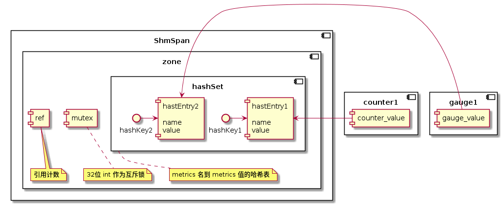

本文记录了对 MOSN 的源码研究 - MOSN 的共享内存模型。

本文的内容基于 MOSN v0.9.0，commit id [b2a239f5](https://github.com/mosn/mosn/tree/b2a239f5)。

## 机制

MOSN 用共享内存来存储 metrics 信息。MOSN 用 mmap 将文件映射到内存，在内存数组之上封装了一层关于 metrics 的存取逻辑，实现了 [go-metrics](https://github.com/rcrowley/go-metrics) 
包的关于 metrics 的接口，通过这种方式组装出了一种基于共享内存的 metrics 实现供 MOSN 使用。

## 创建共享内存：Mmap

操作共享内存的方法主要在 `pkg/shm/shm.go` 文件下：

```go
func Alloc(name string, size int) (*ShmSpan, error) {
	...
	return NewShmSpan(name, data), nil
}

func Free(span *ShmSpan) error {
	Clear(span.name)
	return syscall.Munmap(span.origin)
}

func Clear(name string) error {
	return os.Remove(path(name))
}
```

都是围绕着 `ShmSpan` 结构体的几个操作方法。再来看 `ShmSpan` 结构体：

```go
type ShmSpan struct {
	origin []byte // mmap 返回的数组
	name   string // span 名, 创建时指定

	data   uintptr // 保存 mmap 内存段的首指针
	offset int // span 已经使用的字节长度
	size   int // span 大小
}
```

`Alloc` 方法按照给定的 `name` 参数，在配置文件的目录下创建文件，并执行 `sync.Mmap`，其文件尺寸即 `size` 参数大小。Mmap 过后，将信息保存在 ShmSpan结构内返回。

代码逻辑比较简单，大家可以自行阅读：[https://github.com/mosn/mosn/blob/b2a239f5/pkg/shm/shm.go#L28](https://github.com/mosn/mosn/blob/b2a239f5/pkg/shm/shm.go#L28)

由此看出，一个 ShmSpan 可以看做是一个共享内存块。

下面我们将会分析共享内存块在 MOSN 里的使用场景：metrics。

## 操作共享内存：配置

在分析如何通过共享内存存取 metrics 之前，首先看这相关的功能是如何配置的。


## 操作共享内存：metrics

metrics 相关的逻辑在 `pkg/metrics` 包下。

上文说的 ShmSpan 是保存共享内存信息的结构体，而要理解 MOSN metrics 对共享内存的使用，还要先理解 MOSN 封装的几个结构体：`zone`、`hashSet` 和 `hashEntry`。

这几个结构体与 `ShmSpan` 的关系大致是这样的：



`ShmSpan` 是共享内存块，而 `zone`、`hashSet` 和 `hashEntry` 对 `ShmSpan` 进行了划分：

- `hashSet` 封装出了 metrics name 映射到 metrics value 的哈希表
- `hashEntry` 是哈希表的值，也是 metrics 值的保存的共享内存空间
- `zone` 对 `ShmSpan` 进行了划分，划分出了一个 `int32` 值作为互斥锁；一个 `int32` 值作为 `zone` 的引用计数；也划分出了一片空间保存 `hashSet`

以上步骤做好后，创建一个 metrics 就可以通过创建对应的哈希 key value，拿到对应的共享内存地址，存取 metrics 信息。

下面是源码步骤，大家可以自行跟踪调试：

[https://github.com/mosn/mosn/blob/b2a239f5/pkg/metrics/shm/zone.go#L81](https://github.com/mosn/mosn/blob/b2a239f5/pkg/metrics/shm/zone.go#L81)

```go
func newSharedMetrics(name string, size int) (*zone, error) {
	alignedSize := align(size, pageSize)

    // 申请 ShmSpan
	span, err := shm.Alloc(name, alignedSize)
	if err != nil {
		return nil, err
	}
	// 1. mutex and ref
	// 从 span 里取 4 个字节做互斥锁
	mutex, err := span.Alloc(4)
	if err != nil {
		return nil, err
	}

    // 从 span 里取 4 个字节做引用计数
	ref, err := span.Alloc(4)
	if err != nil {
		return nil, err
	}

	zone := &zone{
		span:  span,
		mutex: (*uint32)(unsafe.Pointer(mutex)),
		ref:   (*uint32)(unsafe.Pointer(ref)),
	}

	// 2. hashSet
	// 划分哈希表过程

	// assuming that 100 entries with 50 slots, so the ratio of occupied memory is
	// entries:slots  = 100 x 128 : 50 x 4 = 64 : 1
	// so assuming slots memory size is N, total allocated memory size is M, then we have:
	// M - 1024 < 65N + 28 <= M

	slotsNum := (alignedSize - 28) / (65 * 4)
	slotsSize := slotsNum * 4
	entryNum := slotsNum * 2
	entrySize := slotsSize * 64
	
	hashSegSize := entrySize + 20 + slotsSize
	hashSegment, err := span.Alloc(hashSegSize)
	if err != nil {
		return nil, err
	}

	// if zones's ref > 0, no need to initialize hashset's value
	set, err := newHashSet(hashSegment, hashSegSize, entryNum, slotsNum, atomic.LoadUint32(zone.ref) == 0)
	if err != nil {
		return nil, err
	}
	zone.set = set

	// add ref
	atomic.AddUint32(zone.ref, 1)

	return zone, nil
}

```


## 总结

本文通过分析 MOSN 源码，简述了 MOSN 的共享内存模型，分析了 MOSN 创建共享内存、配置 metrics 和 metrics 对共享内存块的使用。

---

参考资料:

- [MOSN 源码](https://github.com/mosn/mosn)
