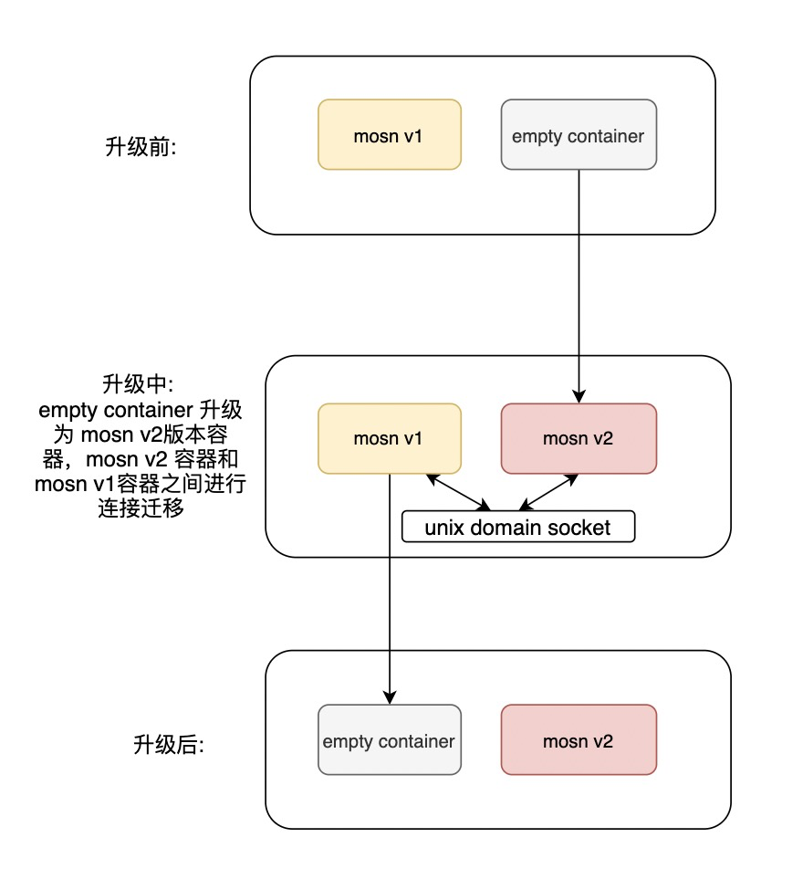
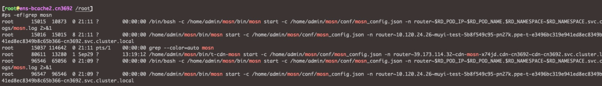

## 前言
MOSN 作为 Sidecar 容器部署时，对于 MOSN 容器自身的升级，可以采用的一种形式是先将业务切流，再升级版本。这种形式用户POD需要销毁、重新调度、重建，带来较大开销的同时，也可能影响业务的稳定性。

为此 MOSN 提供了对业务无感的热升级方式，具体的原理可移步[这里查阅](/docs/concept/smooth-upgrade/)。

本文将介绍如何利用 [OpenKruise](http://openkruise.io/) 对 Kubernetes 的扩展 SidecarSet，来具体操作 MOSN 容器的原地热升级。

## 环境准备

在 k8s 中安装 OpenKruise, 安装步骤见 [ OpenKruise 官方文档](http://openkruise.io/docs/installation) 

## 测试步骤
### 打包 MOSN 镜像
本文利用当前 MOSN 社区提供的构建镜像的方式来准备测试用的 MOSN 镜像，在构建镜像之前需要做如下调整：

- 修改```etc/supervisor/supervisord.conf```, 因为当前 supervisor 配置使用```/dev/shm/```目录，同一 POD 内不同容器之间会冲突，会导致新容器启动失败

```bigquery
[unix_http_server]
-file=/dev/shm/supervisor.sock
+file=/var/run/supervisor_mosn.sock
```

- 修改 MOSN 配置文件```configs/mosn_config.json```, 添加配置：

```bigquery
{
    "uds_dir": "/home/admin/mosn/logs",
    "inherit_old_mosnconfig": true,
    ...
}
```

其中```udx_dir```为 MOSN ```reconfig.sock```存储目录，该目录需要挂载为共享卷，使得热升级过程中两个容器之间可以相互访问。

如果从pilot获取动态下发的配置，则需要添加```inherit_old_mosnconfig```配置项，新的 MOSN 进程启动之后继承老的 MOSN 进程监听的fd，避免端口冲突导致进程启动失败。

- 构建镜像，并上传至可访问的镜像仓库

```bigquery
make image
docker tag [imageid] [repo:tag]
docker push [repo:tag]
```

### 创建SidecarSet资源
- 注意
  - image 修改为自己使用版本
  - volume 挂载目录和配置文件中```uds_dir```目录保持一致

```bigquery
$ kubectl apply -f sidecarset.yaml 
$ cat sidecarset.yaml
apiVersion: apps.kruise.io/v1alpha1
kind: SidecarSet
metadata:
  name: mosn
spec:
  containers:
  - image: tinyqian/mosn:v1
    imagePullPolicy: IfNotPresent
    name: mosn
    podInjectPolicy: BeforeAppContainer
    resources: {}
    shareVolumePolicy:
      type: enabled
    terminationMessagePath: /dev/termination-log
    terminationMessagePolicy: File
    upgradeStrategy:
      hotUpgradeEmptyImage: openkruise/hotupgrade-sample:empty
      upgradeType: HotUpgrade
    volumeMounts:
    - mountPath: /home/admin/mosn/logs
      name: mosn-log
    lifecycle:
      postStar:
        exec:
          command:
          - /bin/sh
          - -c
          - sleep 30

  injectionStrategy: {}
  namespace: default
  selector:
    matchLabels:
      mesh.apsara-edge.com/mosn-injected: "true"
  updateStrategy:
    maxUnavailable: 1
    partition: 0
    type: RollingUpdate
  volumes:
  - emptyDir: {}
    name: mosn-log
```

### 部署测试应用
```bigquery
apiVersion: extensions/v1beta1
kind: Deployment
metadata:
  labels:
    mesh.apsara-edge.com/mosn-injected: "true"
  name: test-app
spec:
  selector:
    matchLabels:
      mesh.apsara-edge.com/mosn-injected: "true"
  replicas: 1
  template:
    metadata:
      labels:
        mesh.apsara-edge.com/mosn-injected: "true"
    spec:
      containers:
        - name: test-app
          image: nginx:1.20
```

部署应用之后，查看 POD
```bigquery
$ kubectl get pods -n ppe-t-e3496bc319e941ed8ec8349b8c65b366-cn3691    -o wide
NAME                             READY   STATUS                     RESTARTS   AGE
test-app-5fd64d788c-g9wg9        3/3     Running                    0          2m56s
```
可以看到 POD 一共创建了三个容器，一个是业务容器，一个是 MOSN 容器，一个是 empty容器。

### 测试升级镜像版本
部署成功后，可以测试升级 MOSN 容器的镜像版本，更新前面创建的 sidecarset 资源的 image 版本。
```bigquery
$ kubectl edit sidecarset mosn
application.core.oam.dev/mosn edited
```
升级过程中可以看到 RESTARTS 字段变化，POD内容器有重启，但是POD没有重建
```bigquery
NAME                             READY   STATUS                     RESTARTS   AGE
test-app-5fd64d788c-g9wg9        3/3     Running                    2          10m
```
实际的升级过程为：

1. empty 容器升级为 MOSN v2 版本容器
   
2. MOSN v2 版本容器和v1版本容器之间进行连接迁移
   
3. MOSN v1 版本容器退出，变更为 empty 容器



查看升级过程中的进程可以发现，在v1版本的容器没有退出之前，新老容器中的进程是并存的



同时，升级的过程中你可以不断地发送通过 MOSN 代理的测试请求，可以验证升级过程中 MOSN 一直处于可用状态，对业务是无损的。
# 总结
通过上述步骤，可以实现用户 POD 和 sidecar 容器的部署，同时实现 sidecar 容器的原地热升级，做到 sidecar 容器升级业务无感。
需要注意的是 SidecarSet 支持image版本升级，修改其他字段将会导致容器无法升级。

# 参考
[OpenKruise SidecarSet 介绍](https://openkruise.io/zh/docs/user-manuals/sidecarset/)

[OpenKruise 安装指南](http://openkruise.io/zh/docs/installation)