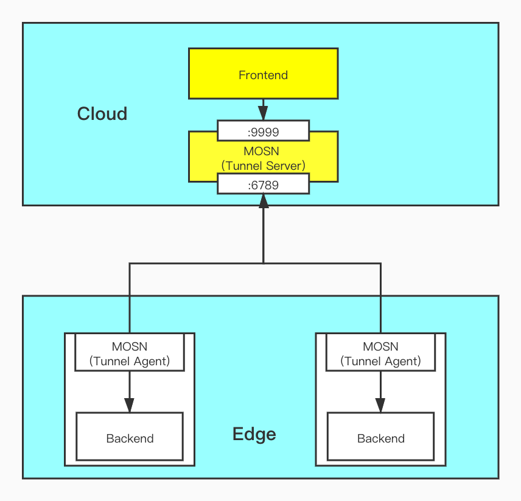
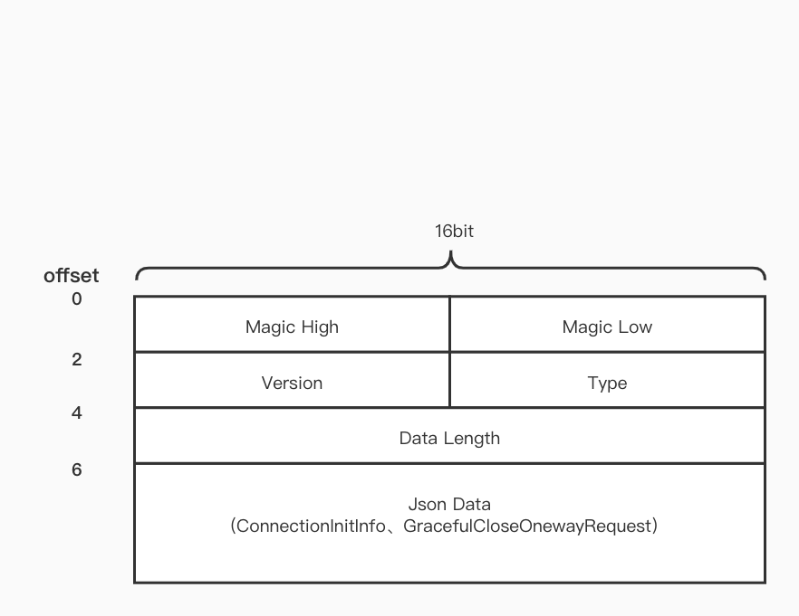
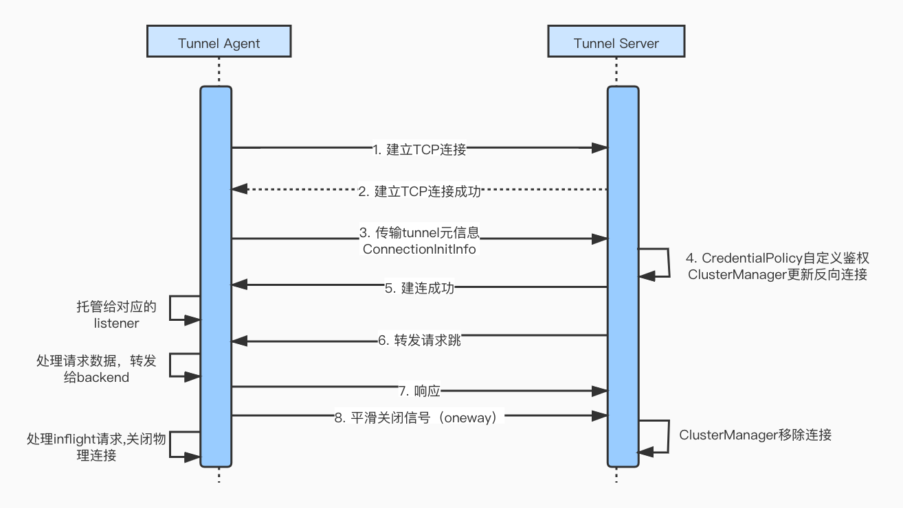
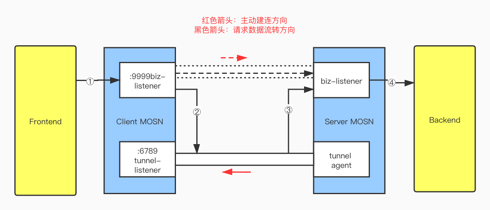

```
---
title: "MOSN 反向通道详解"
linkTitle: "MOSN 反向通道详解"
date: 2022-02-17
author: "[CodingSinger](https://github.com/CodingSinger)"
description: "本文描述 MOSN 反向通道"
aliases: "/zh/blog/posts/mosn-tunnel"
---
```

MOSN（Modular Open Smart Network）是一款主要使用 Go 语言开发的云原生网络代理平台，由蚂蚁集团开源并经过双11大促几十万容器的生产级验证，具备高性能、易扩展的特点。 MOSN 可以和 Istio 集成构建 Service Mesh，也可以作为独立的四、七层负载均衡，API Gateway、云原生 Ingress 等使用。

### MOSN的反向通道实现

在云边协同的网络场景，通常都是单向网络，即只允许边缘节点访问云端节点，而云端节点无法直接访问边缘节点。

云边隧道旨在解决云端无法直接访问边缘节点的问题，其本质是一个反向通道。通过在边缘节点侧进行反向建连的方式与云端节点之间构建一条专用的全双工连接，以供云端节点发起通讯。

目前业界的许多知名云边协同框架，例如SuperEdge、Yurttunnel等对于云边通信的实现方案都是基于反向通道。

本文将着重介绍MOSN之上的反向通道运作流程和原理。

总体架构如下所示(图中箭头表示建连反向)：



整个运作流程简单概括：

1. 边缘侧的mosn实例（后文统称为tunnel agent）在启动时tunnel agent相关服务协程。
2. 通过指定的静态配置或者动态服务发现方式拿到需要反向建连的公有云侧的mosn server地址列表（后文统称tunnel server），并且建立反向连接。
3. 云侧的Frontend与tunnel server侧的转发端口进行数据交互，这部分数据会被托管到之前建立的反向连接进行发送。
4. 边缘节点接受到请求之后，再将请求转发给实际的后端目标节点，回包过程则远路返回。

### 反向通道启动过程

MOSN Agent通过ExtendConfig特性，在MOSN启动时加载和完成初始化Tunnel Agent的工作。

ExtendConfig中定义AgentBootstrapConfig结构如下：

```
type AgentBootstrapConfig struct {
	Enable bool `json:"enable"`
	// The number of connections established between the agent and each server
	ConnectionNum int `json:"connection_num"`
	// The cluster of remote server
	Cluster string `json:"cluster"`
	// After the connection is established, the data transmission is processed by this listener
	HostingListener string `json:"hosting_listener"`
	// Static remote server list
	StaticServerList []string `json:"server_list"`

	// DynamicServerListConfig is used to specify dynamic server configuration
	DynamicServerListConfig struct {
		DynamicServerLister string `json:"dynamic_server_lister"`
	}

	// ConnectRetryTimes
	ConnectRetryTimes int `json:"connect_retry_times"`
	// ReconnectBaseDuration
	ReconnectBaseDurationMs int `json:"reconnect_base_duration_ms"`

	// ConnectTimeoutDurationMs specifies the timeout for establishing a connection and initializing the agent
	ConnectTimeoutDurationMs int    `json:"connect_timeout_duration_ms"`
	CredentialPolicy         string `json:"credential_policy"`
	// GracefulCloseMaxWaitDurationMs specifies the maximum waiting time to close conn gracefully
	GracefulCloseMaxWaitDurationMs int `json:"graceful_close_max_wait_duration_ms"`

	TLSContext *v2.TLSConfig `json:"tls_context"`
}
```

ConnectionNum：tunnel agent和每个tunnel server建立的物理连接数量。

HostingListener：指定agent建立连接之后托管的mosn listener，即tunnel server发来的请求会由该listener托管处理。

DynamicServerListConfig：动态tunnel server的服务发现相关配置，可通过自定义的服务发现组件提供动态的地址服务。

CredentialPolicy： 自定义的连接级别的鉴权策略配置。

TLSContext：MOSN TLS配置，提供TCP之上通信的保密性和可靠性。

针对每个远端的tunnel server实例，agent对应一个AgentPeer对象，启动时除了主动建立ConnectionNum个反向通信连接，还会额外建立一条旁路连接，这条旁路连接主要是用来发送一些管控参数，例如平滑关闭连接、调整连接比重。

```
func (a *AgentPeer) Start() {
	connList := make([]*AgentClientConnection, 0, a.conf.ConnectionNumPerAddress)
	for i := 0; i < a.conf.ConnectionNumPerAddress; i++ {
	  // 初始化和建立反向连接
		conn := NewAgentCoreConnection(*a.conf, a.listener)
		err := conn.initConnection()
		if err == nil {
			connList = append(connList, conn)
		}
	}
	a.connections = connList
	// 建立一个旁路控制连接
	a.initAside()
}
```

`initConnection`方法进行具体的初始化完整的反向连接，采取指数退避的方式保证在最大重试次数之内建连成功。

```
func (a *connection) initConnection() error {
	var err error
	backoffConnectDuration := a.reconnectBaseDuration

	for i := 0; i < a.connectRetryTimes || a.connectRetryTimes == -1; i++ {
		if a.close.Load() {
			return fmt.Errorf("connection closed, don't attempt to connect, address: %v", a.address)
		}
		// 1. 初始化物理连接和传输反向连接元数据
		err = a.init()
		if err == nil {
			break
		}
		log.DefaultLogger.Errorf("[agent] failed to connect remote server, try again after %v seconds, address: %v, err: %+v", backoffConnectDuration, a.address, err)
		time.Sleep(backoffConnectDuration)
		backoffConnectDuration *= 2
	}
	if err != nil {
		return err
	}
	// 2. 托管listener
	utils.GoWithRecover(func() {
		ch := make(chan api.Connection, 1)
		a.listener.GetListenerCallbacks().OnAccept(a.rawc, a.listener.UseOriginalDst(), nil, ch, a.readBuffer.Bytes(), []api.ConnectionEventListener{a})
	}, nil)
	return nil
}
```

该方法主要步骤：

1. `a.init()`方法会调用initAgentCoreConnection`方法初始化物理连接并完成建连交互过程。tunnel server通过agent传输的元数据信息，进行管理反向连接。具体的交互过程和协议后文会细讲。
2. 建连成功之后，tunnel agent托管raw conn给指定的listener。之后该raw conn的生命周期由该listener全权管理，并且完全复用该listener的能力。

其定义了初始化反向连接的交互流程，具体代码细节可以看pkg/filter/network/tunnel/connection.go:250，本文不展开技术细节。

### 交互过程

目前MOSN的反向通道只支持了raw conn的实现，因此定义了一套简单明了的网络通信协议。



主要包括：

* 协议魔数：2 byte
* 协议版本：1 byte
* 主体结构类型：1 byte，包括初始化、平滑关闭等。
* 主体数据长度：2 byte
* json序列化的主体数据

MOSN反向通道完整的生命周期交互过程：



建连过程中由tunnel agent主动发起，并且在TCP连接建立成功（TLS握手成功）之后，将反向建连的关键信息ConnectionInitInfo序列化并传输给对端tunnel server，该结构体定义了反向通道的元数据信息。

```
// ConnectionInitInfo is the basic information of agent host,
// it is sent immediately after the physical connection is established
type ConnectionInitInfo struct {
	ClusterName      string                 `json:"cluster_name"`
	Weight           int64                  `json:"weight"`
	HostName         string                 `json:"host_name"`
	CredentialPolicy string                 `json:"credential_policy"`
	Credential       string                 `json:"credential"`
	Extra            map[string]interface{} `json:"extra"`
}
```

tunnel server接受该元数据信息之后，主要工作包括：

1. 如果有设置自定义鉴权方式，则进行连接鉴权。
1. clusterManager将该连接加入到指定的ClusterSnapshot并回写建连结果。

此时建连过程才算完成。

```
func (t *tunnelFilter) handleConnectionInit(info *ConnectionInitInfo) api.FilterStatus {
	// Auth the connection
	conn := t.readCallbacks.Connection()
	if info.CredentialPolicy != "" {
		// 1. 自定义鉴权操作，篇幅原因省略
	}
	if !t.clusterManager.ClusterExist(info.ClusterName) {
		writeConnectResponse(ConnectClusterNotExist, conn)
		return api.Stop
	}
	// Set the flag that has been initialized, subsequent data processing skips this filter
	err := writeConnectResponse(ConnectSuccess, conn)
	if err != nil {
		return api.Stop
	}
	conn.AddConnectionEventListener(NewHostRemover(conn.RemoteAddr().String(), info.ClusterName))
	tunnelHostMutex.Lock()
	defer tunnelHostMutex.Unlock()
	snapshot := t.clusterManager.GetClusterSnapshot(context.Background(), info.ClusterName)
	// 2. host加入到指定的cluster
	_ = t.clusterManager.AppendClusterTypesHosts(info.ClusterName, []types.Host{NewHost(v2.Host{
		HostConfig: v2.HostConfig{
			Address:    conn.RemoteAddr().String(),
			Hostname:   info.HostName,
			Weight:     uint32(info.Weight),
			TLSDisable: false,
		}}, snapshot.ClusterInfo(), CreateAgentBackendConnection(conn))})
	t.connInitialized = true
	return api.Stop
}

```

然后是通信过程，为了便于理解，以下图请求单向流转示意图举例，



在传统的MOSN sidecar应用场景中，Frontend发送的请求首先经过Client-MOSN，然后通过路由模块，主动创建连接(虚线部分)并流转到对端，经由Server-MOSN biz-listener处理转交给Backend。

而在云边场景的反向通道实现中，Client MOSN(tunnel server)在接受到对端tunnel agent发起创建反向通道的请求后，即将该物理连接加入路由到对端MOSN的cluster snapshot中。从而Frontend的请求流量能由该反向通道流转到对端MOSN，而因为tunnel agent侧把该连接托管给了biz-listener，则读写处理都由biz-listener进行处理，biz-listener将处理完的请求再转发给真正的Backend服务，


总结和规划：

本文主要介绍了MOSN反向通道的实现原理和设计思路，MOSN作为高性能的云原生网络代理，希望反向通道的能力能更加有效地支持其作为云边协同场景中承接东西向流量的职责。

当然，后续我们也会继续做一系列的拓展支持，包括但不限于：

1. 反向通道支持gRPC实现，gRPC作为云原生时代最通用的服务通讯框架，本身内置了各种强大的治理能力。
1. 结合更多云原生场景，内置更加通用的tunnel server动态服务发现能力组件。
1. 更多的配套自动化运维和部署工具。

