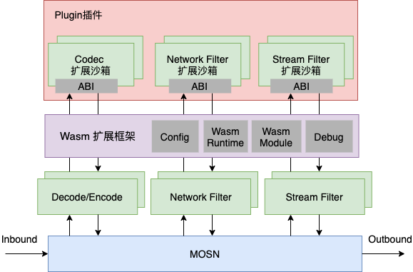
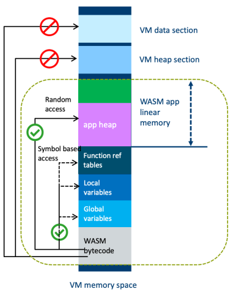
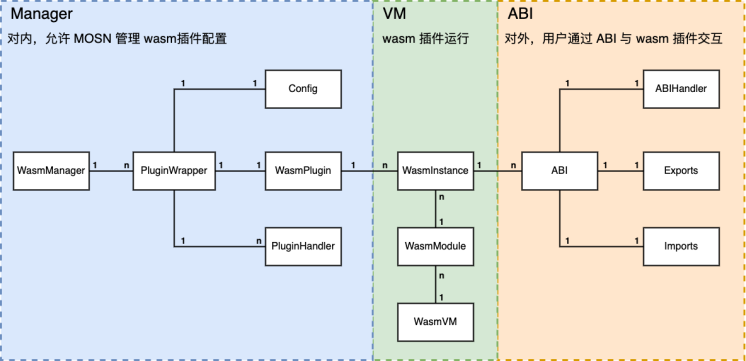
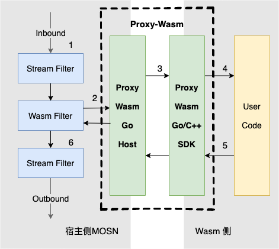
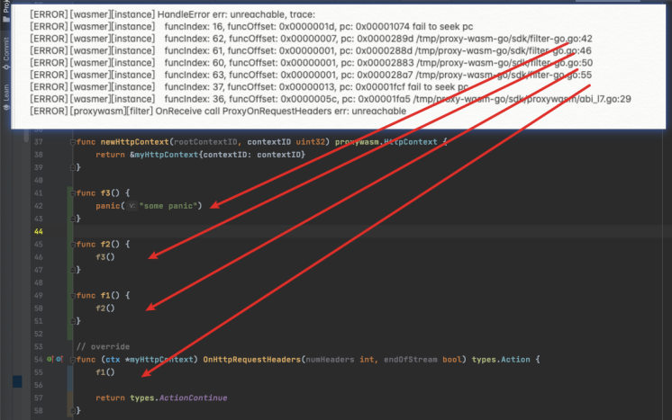

作为金融级服务网格中的流量代理组件，MOSN 在承载蚂蚁数十万服务容器之间流量的同时，也承载着诸多例如限流、鉴权、路由等中间件基础能力。这些能力以不同的扩展形式与 MOSN 运行于同一进程内。非隔离的运行方式在保障性能的同时，却也给 MOSN 带来了不可预知的安全风险。

针对上述问题，我们采用 WebAssembly(Wasm) 技术，给 MOSN 实现了一个安全隔离的沙箱环境，让扩展程序能够运行在隔离沙箱之中，并对其资源、能力进行严格限制，使程序故障止步于沙箱，从而实现安全隔离的目标。本文将着重叙述 MOSN 中的 Wasm 扩展框架，并介绍我们在 Proxy-Wasm 这一代理扩展规范上的工作。


## 总体设计



上图为 MOSN Wasm 扩展框架的整体示意图。如图所示，对于 MOSN 的任意扩展点(Codec、NetworkFilter、StreamFilter 等)，用户均能够通过 Wasm 扩展框架，以隔离沙箱的形式运行自定义的扩展代码。而 MOSN 与 Wasm 扩展代码之间的交互，是通过 Proxy-Wasm 标准 ABI 来完成的。


### 隔离沙箱
当我们在讨论 Wasm 时，都明白 Wasm 能够提供一个安全隔离的沙箱环境，但并不是每个人都了解 Wasm 实现隔离沙箱的技术原理。这时又要搬出计算机科学中的至理名言: “计算机科学领域的任何问题都可以通过增加一个间接的中间层来解决”。Wasm 实际上也是通过引用一个“中间层”来实现的安全隔离。简单来说，Wasm 通过一个运行时(Runtime)来运行 Wasm 沙箱扩展，每个 Wasm 沙箱都有其独立的线性内存空间和一组导入/导出模块。



一方面，每个 Wasm 沙箱都有其独立的线性内存空间，其内存模型如上图所示。Wasm 代码只能通过简单的 load/store 等指令访问线性内存空间的有限部分，并通过符号(下标)的方式来间接访问函数、全局变量等，杜绝了类似 C 语言中访问任意内存地址的骚操作。同时，用于间接调用函数的符号表对于 Wasm 代码而言是只读的，从而保证 Wasm 代码的执行是受控的。此外，Wasm 沙箱的整个线性内存空间由宿主机(Wasm Runtime)分配及管理，通过严格的内存管理保证沙箱的隔离性。

另一方面，Wasm 也规定了代码中任何可能产生外部影响的操作只能通过导入/导出模块来实现。以 C 语言为例，我们可以直接通过系统调用来访问系统的环境变量、文件、网络等资源。而在 Wasm 的世界中，并不存在系统调用相关的指令，任何对外部资源的访问必须通过导入模块来间接实现。以文件读写为例，在 Wasm 中要想进行文件读写，需要宿主机提供实现文件读写功能的导入函数，Wasm 代码调用该导入函数，由宿主机间接进行文件读写，再将操作结果返回给 Wasm 扩展。在上述过程中，实际的文件读写操作由宿主机完成，宿主机对这一过程有绝对的控制权，包括但不限于只允许读写指定文件、限制读写内容、完全禁止读写等。


### 扩展框架
MOSN 以 插件(Plugin) 的形式对 Wasm 扩展进行统一管理，插件是指一组 Wasm 沙箱实例及其相应配置的集合。用户通过配置来加载、更新以及卸载 Wasm 插件，并通过配置来描述沙箱实例的运行规格(使用的执行引擎、Wasm 文件路径、实例数量等)。下面展示了一个典型的 Wasm 插件配置:

```json
{
  "plugin_name": "global_plugin_id",    // 1. 插件名
  "instance_num": 4,                    // 2. 沙箱实例个数
  "vm_config": {
    "engine": "wasmer",                 // 3. 使用的虚拟机(Runtime)
    "path": "/foo/bar.wasm",            // 4. wasm 文件路径
    "url": "http://xxx/bar.wasm"
  }
}
```

当 MOSN 加载上述插件配置时，会按照以下流程生成插件对应的 Wasm 沙箱实例:


在后续运行的过程中，用户通过 Wasm 扩展框架获取指定插件的沙箱实例， 然后通过沙箱实例暴露的 API 与扩展程序进行交互。本文的下一小节将对此交互过程进行详细描述。在 MOSN 中，Wasm 扩展框架与具体用途无关，在 MOSN 已有的任何一处扩展点，均可以直接使用 Wasm 框架来获取安全隔离的插件执行能力。


如下图所示，Wasm 扩展框架主要分为 Manager、VM 和 ABI 三个子模块。其中

- Manager 模块负责对 Wasm 插件的配置进行统一管理，提供插件的增删查改功能，负责将用户提供的配置渲染成最终的 Wasm 沙箱实例
- VM 模块提供对 Wasm Runtime(虚拟机) 的统一封装，负责 .wasm 文件的编译、执行，以及 Wasm 沙箱实例的资源管理
- ABI 模块则提供对外的使用接口，可以看作是 MOSN 与 Wasm 扩展代码之间交互的胶水层



本文不再对框架内的具体子模块进行介绍，感兴趣的读者可以阅读开源 [PR](https://github.com/mosn/mosn/pull/1589) 的文档了解细节。


由于当前市面上几乎不存在使用 Go 语言直接编写的 Wasm Runtime，因此 MOSN 只能通过 CGO 调用的方式来间接地调用由 C++/Rust 编写的 Wasm 执行引擎。我们从 SDK 完善程度、性能、项目活跃度等角度综合考虑，经过一系列横向对比之后，选择了 Wasmer 作为 MOSN 默认的执行引擎。


### Proxy-Wasm ABI 规范
本小节将介绍 MOSN 具体是如何跟 Wasm 扩展程序进行交互的。先说结论: MOSN 跟 Wasm 扩展代码之间的交互采用的是社区规范: Proxy-Wasm


[Proxy-Wasm](https://github.com/proxy-wasm/spec) 是开源社区针对「网络代理场景」设计的一套 ABI 规范，属于当前的事实规范。当前支持该规范的网络代理软件包括 Envoy、MOSN 和 ATS(Apache Traffic Server)，支持该规范的 Wasm 扩展 SDK 包括 C++、Rust 和 Go。采用该规范的好处在于能让 MOSN 复用社区既有的 Wasm 扩展 (包括 Go 实现以及 C++/Rust 实现)，也能让本为 MOSN 开发的 Wasm 扩展运行在 Envoy 等网络代理产品上。


Proxy-Wasm 规范定义了宿主机与 Wasm 扩展程序之间的交互细节，包括 API 列表、函数调用规范以及数据传输规范这几个方面。其中，API 列表包含了 L4/L7、property、metrics、日志等方面的扩展点，涵盖了网络代理场景下所需的大部分交互点，且可以划分为宿主侧扩展和 Wasm 侧扩展点。这里简单展示规范中的部分内容，完整内容请参考 spec。
```go
// Functions implemented in the Wasm module
// 由 Wasm 侧实现的扩展点
// L7:
proxy_on_http_request_headers
	params:
		i32 (uint32_t) context_id
		i32 (size_t) num_headers
		i32 (bool) end_of_stream
	returns:
		i32 (proxy_action_t) next_action

// L4:
proxy_on_downstream_data
	params:
		i32 (uint32_t) context_id
		i32 (size_t) data_size
		i32 (bool) end_of_stream
	returns:
		i32 (proxy_action_t) next_action


// Functions implemented in the host environment
// 由宿主侧实现的扩展点
// 日志
proxy_log
	params:
		i32 (proxy_log_level_t) log_level
		i32 (const char*) message_data
		i32 (size_t) message_size
	returns:
		i32 (proxy_result_t) call_result

// 数据
proxy_get_map
	params:
		i32 (proxy_map_type_t) map_type
		i32 (const char**) return_map_data
		i32 (size_t*) return_map_size
	returns:
		i32 (proxy_result_t) call_result


// MapData Format
// Map 数据传输规范
mapsize | key1size | value1size | key2size | value2size | ... | key1 | \0 | value1 | \0 | ...
```


规范的实现需要宿主侧和 Wasm 侧两边配合才能正常工作。对于 Wasm 侧，社区已经有 C++、Rust 和 Go 三种语言实现的 SDK，用户可以直接使用这些 SDK 来编写与宿主无关的 Wasm 扩展程序。而对于宿主侧，社区只提供了 C++ 和 Rust 的宿主侧实现。为此，我们在项目中使用 Go 语言对 Proxy-Wasm 规范的宿主侧进行了实现，并将其贡献给开源社区，使之成为社区推荐的 [Go-Host](https://github.com/mosn/proxy-wasm-go-host) 实现。需要强调的是，宿主侧实现并不依赖具体的网络代理程序，理论上任何直接通过 Host 程序与 Wasm 扩展进行交互。


我们以 HTTP 场景为例，介绍在 MOSN 中是如何通过 Proxy-Wasm 规范来与 Wasm 扩展程序进行交互，处理 HTTP 请求的。




1. MOSN 收到 HTTP 请求时，将请求解码成 Header、Body、Trailer 三元组结构，按照配置依次执行 StreamFilters
1. 执行到 Wasm StreamFilter 时，MOSN 将请求三元组传递给 Proxy-Wasm 宿主侧实现 proxy-wasm-go-host
1. 宿主侧 go-host 将 MOSN 请求三元组编码成规范指定的格式，并调用规范中的 proxy_on_request_headers 等接口，将请求信息传递至 Wasm 侧
1. Wasm 侧 SDK 将请求数据从规范格式转换为便于用户使用的格式，随后调用用户编写的扩展代码
1. 用户代码返回，Wasm 侧将返回结果按规范格式传递回 MOSN 侧
1. MOSN 继续执行后续 StreamFilter


## 工程实践
### Quick Start
本小节主要演示如何在 MOSN 中进行配置并运行 Wasm 扩展插件流程。演示所需的源文件参考 example。


在演示中，我们通过配置让 Wasm 扩展插件来处理 MOSN 接收的 HTTP 请求，MOSN 的监听端口为 2045。在 Wasm 处理请求的源码中，我们通过 Proxy-Wasm 规范中的 proxy_dispatch_http_call 接口向外部 HTTP 服务器发起请求，Wasm 源码内指定外部 HTTP 服务器的监听端口为 2046。演示场景的流程如下图所示:


该演示流程主要分为以下步骤:

- 将扩展程序编译成 .wasm 文件
- 启动 MOSN 并加载 Wasm 插件
- 启动外部 HTTP 服务器
- 请求验证


#### 1. 编译 Wasm 扩展程序
我们在示例工程中提供了 C 和 Go 两种语言实现的 Wasm 扩展源码，对 Proxy-Wasm 规范的采用使得我们能够利用多种语言 (C++/Rust/Go) 来编写 Wasm 扩展代码。出于编译的便利性，这里使用 Go 源码实现进行演示。
进入 example/wasm/httpCall 目录，执行命令:
```bash
make
```
上述操作会将目录下的 filter-go.go 源码文件编译成 filter-go.wasm 文件


#### 2. 启动 MOSN
示例工程提供了一份加载 filter-go.wasm 扩展文件的配置，通过以下命令即可启动:
```bash
./mosn start -c config.json
```
上述命令中使用的 MOSN 可执行程序可以通过以下命令由源码构建:
```bash
# step 1: 
# 创建源码路径
mkdir -p $GOPATH/src/mosn.io
cd $GOPATH/src/mosn.io

# step 2: 
# 下载 MOSN 代码仓库
git clone https://github.com/mosn/mosn.git 

# step 3: 
# 编译，以下命令最终将产生 mosn 可执行文件
sudo make build-local
mv build/bundles/v0.21.0/binary/mosn mosn
```


#### 3. 启动外部 HTTP 服务器
该示例工程中，Wasm 扩展源码会通过 MOSN 向外部 HTTP 服务器发起请求，请求的 URL 为
> [http://127.0.0.1:2046/](http://127.0.0.1:2046/)

为此，示例工程也提供了一段 HTTP 服务器代码，当其收到 HTTP 请求时，均会返回响应头: from: external http server，返回响应体: response body from external http server
执行以下命令将启动上述 HTTP 服务器:
```bash
go run server.go
```


#### 4. 请求验证
上述操作准备就绪后，便可通过 Curl 来进行请求验证了
```bash
curl -v http://127.0.0.1:2045/
```
执行上述命令后，MOSN 终端将能够观察到以下日志:
```bash
[INFO] response header from http://127.0.0.1:2046/: From: external http server
[INFO] response header from http://127.0.0.1:2046/: Date: Wed, 17 Mar 2021 12:12:38 GMT
[INFO] response header from http://127.0.0.1:2046/: Content-Length: 39
[INFO] response header from http://127.0.0.1:2046/: Content-Type: text/plain; charset=utf-8
[INFO] response body from http://127.0.0.1:2046/: response body from external http server
```

### 性能测试
本小节对 Wasm 框架的性能进行测试
#### 测试环境: 

- OS: macOS Catalina 10.15.4
- CPU: Intel(R) Core(TM) i7-7660U CPU @ 2.50GHz 4Core
- MEM: 16 GB 2133 MHz LPDDR3
- Go Version: go1.14.13 darwin/amd64


#### 测试场景:
拓扑: client  --http1.1-->  MOSN
操作: MOSN 收到 H1 请求后，往请求头中添加一个 Header 随后返回 200


#### 测试数据:
「native」表示添加 Header 的操作使用 MOSN 原生的 Stream Filter 完成；

「wasm」表示添加 Header 的操作使用 Wasm 扩展完成


- 固定 QPS 模式，将 QPS 固定为 2000 进行压测
> 压测命令: sofaload --h1 -c 100 -t 4 --qps=2000 -D 30 [http://127.0.0.1:2045/](http://127.0.0.1:2045/)

|  | qps | avg | P75 | P90 | P99 |
| --- | --- | --- | --- | --- | --- |
| native | 2000 | 698us | 856us | 1.09ms | 1.87ms |
| wasm | 2000 | 763us | 940us | 1.21ms | 2.35ms |
|  |  | -9.3% |  |  |  |

- 压测模式，不限制压测 QPS，将流量打到最大
> 压测命令: sofaload --h1 -c 100 -t 4 -n 1000000 [http://127.0.0.1:2045/](http://127.0.0.1:2045/)

|  | qps | avg | P75 | P90 | P99 |
| --- | --- | --- | --- | --- | --- |
| native | 36013 | 2.78ms  | 3.80ms | 5.44ms | 10.39ms |
| wasm | 26542 | 3.77ms | 5.14ms | 7.42ms | 14.00ms |
|  | -26% | 


### 异常调试

对于实际的工程项目而言，光能运行是不够的，必须具备一定的问题排查和定位能力，才能在遇到程序故障时，解析异常源码的调用堆栈，快速定位第一现场，从而提高开发及调试的效率。

由于 Wasm 本身的定位是与编程语言无关的字节码规范，不同语言的源代码 (C++/Go/JavaScript 等) 均能够编译为统一的 Wasm 字节码，因此如何屏蔽具体编程语言的细节模型，制定语言无关的调试信息规范，是社区需要解决的难题之一。
针对这一问题，在当前的工程实践中，JavaScript 语言采用的是 Source Map 格式，而 C++、Rust 和 Go 语言采用的是 Dwarf 格式的调试信息。对具体调试信息格式的介绍并不在本文的范围之内，读者可自行参考外部文章。这里需要强调的是，对于 Wasm 而言，还需要对调试信息的格式进行一定的扩展，才能满足实际的应用需要。与其他编程语言不同的是，.wasm 文件是能够被转换成 .wat 格式，并手动编辑内容的，编译好的 .wasm 文件仍然有修改段内容的可能。为了适应这种场景，Wasm 调试规范对 Dwarf 格式中的位置信息编码进行了调整，指令的偏移值被设置成基于 Code 段的偏移:
> With WebAssembly, the .debug_line section maps Code section-relative instruction offsets to source locations.

为此，我们在解析指令偏移时，需要偏移数值进行调整，减去 Code 段的偏移量，才能得到 Wasm 指令的实际偏移值，进而利用 .debug_line 段定位到准确的源码行。下图展示了利用 MOSN 输出的错误日志定位 Wasm 故障源码行的示例。




## 总结

对于蚂蚁而言，安全可信永远是我们追求的目标，而面对越来越多的扩展场景，MOSN 需要一个安全可靠的隔离环境，以避免扩展代码给 MOSN 运行造成的安全风险。为此，我们采用 WebAssembly 技术，为 MOSN 实现了一个基于 Wasm 隔离沙箱的插件扩展框架。MOSN 采用网络代理社区中的 Proxy-Wasm 规范，实现了语言无关、宿主无关的网络代理扩展能力。同时，我们也向开源社区贡献了 Proxy-Wasm-Go-Host 实现，积极融入开源社区。

需要注意的是，当前 WebAssembly 技术仍处于发展阶段，Go 语言自身对 WebAssenbly 生态的支持仍有巨大的提升空间。我们在实践的过程中，也总是面临 Go 语言在 Wasm 生态中不够给力的情况。由于 Go 官方编译器还不支持将 Go 源码程序编译成 WASI 系统接口 (GOOS=wasi) 的 .wasm 文件，我们不得不借助 TinyGo 来完成 Go 扩展程序的编译，而这也导致我们需要面对 TinyGo 在语言特性支持程度、性能、稳定性等方面不足的痛点。与之相比，C++/Rust 对 Wasm 生态的支持程度就要完善得多。

总而言之，WebAssembly 技术的出现仍然为我们提供了一种启发和希望，促使我们进一步思考如何在云原生时代更好地践行安全可信这一信条。
