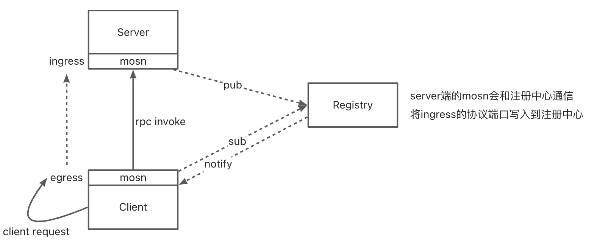

## 1. 前言

MOSN（Modular Open Smart Network）是一款主要使用 Go 语言开发的云原生网络代理平台，由蚂蚁集团开源并经过双11大促几十万容器的生产级验证。
MOSN 为服务提供多协议、模块化、智能化、安全的代理能力，融合了大量云原生通用组件，同时也可以集成 Envoy 作为网络库，具备高性能、易扩展的特点。MOSN 可以和 Istio 集成构建 Service Mesh，也可以作为独立的四、七层负载均衡，API Gateway、云原生 Ingress 等使用。

MOSN 作为数据面，整体 NET/IO、Protocol、Stream、Proxy 四个层次组成，其中
- NET/IO 用于底层的字节流传输
- Protocol 用于协议的 decode/encode
- Stream 用于封装请求和响应，在一个 conn 上做连接复用
- Proxy 做 downstream 和 upstream 之间 stream 的转发

那么 MOSN 是如何工作的呢？下图展示的是使用 Sidecar 方式部署运行 MOSN 的示意图，您可以在配置文件中设置 MOSN 的上游和下游协议，协议可以在 HTTP、HTTP2.0、以及SOFA RPC 等中选择。

以上内容来自官网 https://mosn.io/

## 2. RPC 场景下 MOSN 的工作机制
RPC 场景下 MOSN 的工作机制示意图如下


我们简单理解一下上面这张图的意义：
1. Server 端 MOSN 会将自身 ingress 的协议端口写入到注册中心
2. Client 端 MOSN 会从注册中心订阅地址列表，第一次订阅也会返回全量地址列表，端口号是 Server 端 ingress 绑定的端口号
3. 注册中心会实时推送地址列表变更到 Client 端（全量）
4. Client 端发起rpc 调用时，请求会被 SDK 打到本地 Client 端 MOSN 的 egress 端口上
5. Client 端 MOSN 将 RPC 请求通过网络转发，将流量通过负载均衡转发到某一台 Server 端 MOSN 的 ingress 端口处理
6. 最终到了 Server 端 ingress listener，会转发给本地 Server 应用
7. 最终会根据原来的 TCP 链路返回

## 3. 全局视野下的 MOSN 工作流程


为了方便大家理解，我将以上时序图内容进行拆分，我们一一攻破。

### 3.1 建立连接
MOSN 在启动期间，会暴露本地 egress 端口接收 Client 的请求。MOSN 会开启 2 个协程，分别死循环去对 TCP 进行读取和写处理。MOSN 会通过读协程获取到请求字节流，进入 MOSN 的协议层处理。

```
// 代码路径 mosn.io/mosn/pkg/network/connection.go
func (c *connection) Start(lctx context.Context) {
	// udp downstream connection do not use read/write loop
	if c.network == "udp" && c.rawConnection.RemoteAddr() == nil {
		return
	}
	c.startOnce.Do(func() {
    // UseNetpollMode = false
		if UseNetpollMode {
			c.attachEventLoop(lctx)
		} else {
      // 启动读/写循环
			c.startRWLoop(lctx)
		}
	})
}

func (c *connection) startRWLoop(lctx context.Context) {
  // 标记读循环已经启动
	c.internalLoopStarted = true

	utils.GoWithRecover(func() {
    // 开始读操作
		c.startReadLoop()
	}, func(r interface{}) {
		c.Close(api.NoFlush, api.LocalClose)
	})
  // 省略。。。
}
```
### 3.2 Protocol 处理
Protocol 作为多协议引擎层，对数据包进行检测，并使用对应协议做 decode/encode 处理。MOSN 会循环解码，一旦收到完整的报文就会创建与其关联的 xstream，用于保持 tcp 连接用于后续响应。
```
// 代码路径 mosn.io/mosn/pkg/stream/xprotocol/conn.go
func (sc *streamConn) Dispatch(buf types.IoBuffer) {
	// decode frames
	for {
		// 协议 decode，比如 dubbo、bolt 协议等
		frame, err := sc.protocol.Decode(streamCtx, buf)

		if frame != nil {
      // 创建和请求 frame 关联的 xstream，用于保持 tcp 连接用于后续响应
			sc.handleFrame(streamCtx, xframe)
		}
	}
}

func (sc *streamConn) handleFrame(ctx context.Context, frame api.XFrame) {
	switch frame.GetStreamType() {
	case api.Request:
    // 创建和请求 frame 关联的 xstream，用于保持 tcp 连接用于后续响应，之后进入 proxy 层
		sc.handleRequest(ctx, frame, false)
	}
}

func (sc *streamConn) handleRequest(ctx context.Context, frame api.XFrame, oneway bool) {
	// 创建和请求 frame 关联的 xstream
	serverStream := sc.newServerStream(ctx, frame)
  // 进入 proxy 层并创建 downstream
	serverStream.receiver = sc.serverCallbacks.NewStreamDetect(serverStream.ctx, sender, span)
	serverStream.receiver.OnReceive(serverStream.ctx, frame.GetHeader(), frame.GetData(), nil)
}
```
### 3.3 Proxy 层处理
proxy 层负责 filter 请求/响应链、路由匹配、负载均衡最终将请求转发到集群的某台机器上。
#### 3.3.1 downStream 部分
```
// 代码路径 mosn.io/mosn/pkg/proxy/downstream.go
func (s *downStream) OnReceive(ctx context.Context, headers types.HeaderMap, data types.IoBuffer, trailers types.HeaderMap) {
	s.downstreamReqHeaders = headers
  // filter 请求/响应链、路由匹配、负载均衡
  phase = s.receive(s.context, id, phase)
}

func (s *downStream) receive(ctx context.Context, id uint32, phase types.Phase) types.Phase {
	for i := 0; i <= int(types.End-types.InitPhase); i++ {
		s.phase = phase

		switch phase {

		// downstream filter 相关逻辑
		case types.DownFilter:
			s.printPhaseInfo(phase, id)
			s.tracks.StartTrack(track.StreamFilterBeforeRoute)

			s.streamFilterChain.RunReceiverFilter(s.context, api.BeforeRoute,
				s.downstreamReqHeaders, s.downstreamReqDataBuf, s.downstreamReqTrailers, s.receiverFilterStatusHandler)
			s.tracks.EndTrack(track.StreamFilterBeforeRoute)

			if p, err := s.processError(id); err != nil {
				return p
			}
			phase++

		// route 相关逻辑
		case types.MatchRoute:
			s.printPhaseInfo(phase, id)

			s.tracks.StartTrack(track.MatchRoute)
			s.matchRoute()
			s.tracks.EndTrack(track.MatchRoute)

			if p, err := s.processError(id); err != nil {
				return p
			}
			phase++
			
		// 在集群中选择一个机器、包含cluster和loadblance
		case types.ChooseHost:
			s.printPhaseInfo(phase, id)

			s.tracks.StartTrack(track.LoadBalanceChooseHost)
      // 这里很重要，在选中一个机器之后，这里upstreamRequest对象有两个作用
      // 1. 这里通过持有downstream保持着对客户端app的tcp引用，用来接收请求
      // 2. 转发服务端tcp引用，转发客户端app请求以及响应服务端response时的通知
			s.chooseHost(s.downstreamReqDataBuf == nil && s.downstreamReqTrailers == nil)
			s.tracks.EndTrack(track.LoadBalanceChooseHost)

			if p, err := s.processError(id); err != nil {
				return p
			}
			phase++
		}
	}
}
```
#### 3.3.2 upStream 部分
至此已经选中一台服务端的机器，开始准备转发。
```
// 代码路径 mosn.io/mosn/pkg/proxy/upstream.go
func (r *upstreamRequest) appendHeaders(endStream bool) {

	if r.downStream.oneway {
		_, streamSender, failReason = r.connPool.NewStream(r.downStream.context, nil)
	} else {
    // 会使用 ChooseHost 中选中的机器 host 创建 sender，xstream 是客户端的流对象
		_, streamSender, failReason = r.connPool.NewStream(r.downStream.context, r)
	}
}
```
接下来会到达 conn.go 的 handleFrame 的 handleResponse 方法，此时 handleResponse 方法继续调用 downStream 的 receiveData 方法接收数据。
```
//代码路径 mosn.io/mosn/pkg/stream/xprotocol/conn.go
func (sc *streamConn) handleFrame(ctx context.Context, frame api.XFrame) {
	switch frame.GetStreamType() {
	case api.Response:
    // 调用 downStream 的 receiveData 方法接收数据
    // 因为 mosn 在转发之前修改了请求id，因此会重新 encode 请求
		sc.handleResponse(ctx, frame)
	}
}
```
一旦准备好转发就会通过 upstreamRequest 选择的下游主机直接发送 write 请求，请求的协程此时会被阻塞。
```
// 代码路径 mosn.io/mosn/pkg/stream/xprotocol/stream.go
func (s *xStream) endStream() {
	defer func() {
		if s.direction == stream.ServerStream {
			s.DestroyStream()
		}
	}()

	if log.Proxy.GetLogLevel() >= log.DEBUG {
		log.Proxy.Debugf(s.ctx, "[stream] [xprotocol] connection %d endStream, direction = %d, requestId = %v", s.sc.netConn.ID(), s.direction, s.id)
	}

	if s.frame != nil {
		// replace requestID
		s.frame.SetRequestId(s.id)
    // 因为 mosn 在转发之前修改了请求 id，因此会重新 encode 请求
		buf, err := s.sc.protocol.Encode(s.ctx, s.frame)
		if err != nil {
			log.Proxy.Errorf(s.ctx, "[stream] [xprotocol] encode error:%s, requestId = %v", err.Error(), s.id)
			s.ResetStream(types.StreamLocalReset)
			return
		}

		tracks := track.TrackBufferByContext(s.ctx).Tracks

		tracks.StartTrack(track.NetworkDataWrite)
    // 一旦准备好转发就会通过upstreamRequest选择的下游主机直接发送 write 请求，请求的协程此时会被阻塞
		err = s.sc.netConn.Write(buf)
		tracks.EndTrack(track.NetworkDataWrite)
		}
	}
}
```
### 3.4 准备将响应写回客户端
接下来客户端 xstream 将通过读协程接收响应的字节流，proxy.go 的 OnData 方法作为 proxy 层的数据接收点。
```
// 代码位置 mosn.io/mosn/pkg/proxy/proxy.go
func (p *proxy) OnData(buf buffer.IoBuffer) api.FilterStatus {
  // 这里会做两件事
  // 1. 调用 protocol 层进行decode
  // 2. 完成后通知upstreamRequest对象，唤醒downstream阻塞的协程
	p.serverStreamConn.Dispatch(buf)

	return api.Stop
}

// 代码位置 mosn.io/mosn/pkg/proxy/upstream.go
func (r *upstreamRequest) OnReceive(ctx context.Context, headers types.HeaderMap, data types.IoBuffer, trailers types.HeaderMap) {
  // 结束当前stream
	r.endStream()

  // 唤醒
	r.downStream.sendNotify()
}
```
downstream 被唤醒处理收到的响应，重新替换回正确的请求ID，并调用 protocol 层重新编码成字节流写回客户端，最后销毁请求相关的资源，流程执行完毕。
```
// 比如我的 demo 是 dubbo 协议
func encodeFrame(ctx context.Context, frame *Frame) (types.IoBuffer, error) {

	// 1. fast-path, use existed raw data
	if frame.rawData != nil {
		// 1.1 replace requestId
		binary.BigEndian.PutUint64(frame.rawData[IdIdx:], frame.Id)

		// hack: increase the buffer count to avoid premature recycle
		frame.data.Count(1)
		return frame.data, nil
	}

	// alloc encode buffer
	frameLen := int(HeaderLen + frame.DataLen)
	buf := buffer.GetIoBuffer(frameLen)
	// encode header
	buf.WriteByte(frame.Magic[0])
	buf.WriteByte(frame.Magic[1])
	buf.WriteByte(frame.Flag)
	buf.WriteByte(frame.Status)
	buf.WriteUint64(frame.Id)
	buf.WriteUint32(frame.DataLen)
	// encode payload
	buf.Write(frame.payload)
	return buf, nil
}
```
## 4. 总结
本文以工作中非常常见的一个思路为出发点，详细描述了 MOSN 内部网络转发的详细流程，可以帮助小伙伴加深对 MOSN 的理解。MOSN 是一款非常优秀的开源产品，
MOSN 支持多种网络协议（如HTTP/2, gRPC, Dubbo等）并且能够很容易地增加对新协议的支持；MOSN 提供了丰富的流量治理功能，例如限流、熔断、重试、
负载均衡等；MOSN 在性能方面进行了大量优化，比如内存零拷贝、自适应缓冲区、连接池、协程池等，这些都有助于提升其在高并发环境下的表现。除此之外 
MOSN 在连接管理方面，MOSN 设计了多协议连接池；在内存管理方面，MOSN 在 sync.Pool 之上封装了一层资源对的注册管理模块，可以方便的扩展各种类型的
对象进行复用和管理。总的来说，MOSN 的设计体现了可扩展性、高性能、安全性、以及对现代云环境的适应性等多方面的考虑。对于开发者来说，深入研究MOSN的
代码和架构，无疑可以学到很多关于高性能网络编程和云原生技术的知识。

- MOSN 官网：[https://mosn.io/](https://mosn.io/)
- MOSN Github：[https://github.com/mosn/mosn](https://github.com/mosn/mosn)