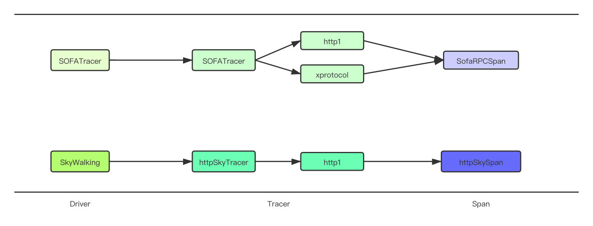

本文是关于 MOSN trace 配置的说明。

## MOSN 的 tracing 框架
MOSN 的 tracing 框架由 Driver、Tracer 和 Span 三个部分组成。

Driver 是 Tracer 的容器，管理注册的 Tracer 实例，Tracer 是 tracing 的入口，根据请求信息创建一个 Span，Span 存储当前跨度的链路信息。



目前 MOSN tracing 有 SOFATracer 和 SkyWalking 两种实现。SOFATracer 支持 http1 和 xprotocol 协议的链路追踪，将 trace 数据写入本地日志文件中。SkyWalking 支持 http1 协议的链路追踪，使用原生的 Go 语言探针 [go2sky](https://github.com/SkyAPM/go2sky) 将 trace 数据通过 gRPC 上报到 SkyWalking 后端服务。

## 配置项说明
`tracing` 相关配置项如下所示。

```json
{
  "tracing": {
    "enable": true,
    "driver": "",
    "config": {
      
    }
  }
}
```

### enable

bool类型，表示启用或禁用trace。

### driver

目前支持 `SOFATracer` 和 `SkyWalking`。

### config
不同driver的自定义配置。config里面的配置项由每个driver自己设计。比如 SkyWalking 的配置项可以参考 [SkyWalking配置](skywalking/)