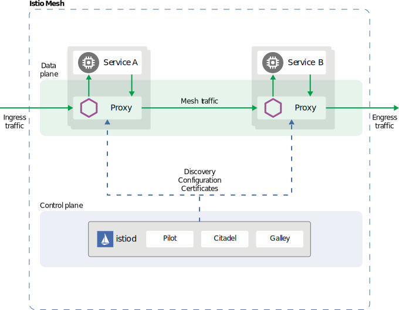

{}    
MOSN 已通过 Istio 1.5.2 的 `BookInfo` 测试，关于最新版 Istio 的支持情况可关注 [MOSN Istio WG](https://github.com/mosn/community/blob/master/wg-istio.md)。
{}  

本文介绍的内容将包括 : 

- MOSN 与 Istio 的关系
- 准备工作
- 部署 Istio 与 MOSN
- Bookinfo 实验

## MOSN 与 Istio 的关系

我们曾在 [MOSN 介绍](../../overview)中介绍过，MOSN 是一款采用 Go 语言开发的 Service Mesh 数据平面代理。

下图是 Istio 整体框架下，MOSN 的工作示意图。

<div align=center></div>

## 准备工作

本文以 macOS 为例，其他环境可以安装对应版本的软件。

#### 安装 hyperkit

先安装 [docker-for-mac](https://store.docker.com/editions/community/docker-ce-desktop-mac)，之后[安装驱动](https://github.com/kubernetes/minikube/blob/master/docs/drivers.md)

#### 安装 docker

下载软件包安装，或者使用如下的命令安装。

```bash
$ brew cask install docker
```

#### 安装驱动

```bash
$ curl -LO https://storage.googleapis.com/minikube/releases/latest/docker-machine-driver-hyperkit \
&& chmod +x docker-machine-driver-hyperkit \
&& sudo mv docker-machine-driver-hyperkit /usr/local/bin/ \
&& sudo chown root:wheel /usr/local/bin/docker-machine-driver-hyperkit \
&& sudo chmod u+s /usr/local/bin/docker-machine-driver-hyperkit
```

#### 安装 Minikube（也可以购买商业 Kubernetes 集群）

推荐使用 Minikube v0.28 以上来体验，请参考 [minikube doc](https://github.com/kubernetes/minikube)。

```bash
$ brew cask install minikube
```

#### 启动 Minikube

注意，pilot 至少需要 2G 内存，所以在启动的时候，可以通过加参数的方法给 minikube 添加分配的资源，如果你机器的资源不够，推荐使用商业版本的 Kubernetes 集群。

```bash
$ minikube start --memory=8192 --cpus=4 --kubernetes-version=v1.15.0 --vm-driver=hyperkit
```

创建 istio 命名空间

```bash
$ kubectl create namespace istio-system
```

#### 安装 kubectl 命令行工具

kubectl 是用于针对 Kubernetes 集群运行命令的命令行接口，安装参考 [kubectl doc](https://kubernetes.io/docs/tasks/tools/install-kubectl)。

```bash
$ brew install kubernetes-cli
```

## 部署Istio与MOSN

### 安装 Istio

您可以在 [Istio release](https://github.com/istio/istio/releases/tag/1.5.2) 页面下载与您操作系统匹配的压缩文件，该文件中包含：安装文件、示例和 istioctl 命令行工具。使用如下命令来下载 Istio（本文示例使用的是 Istio 1.5.2）：

```bash
$ export ISTIO_VERSION=1.5.2 && curl -L https://istio.io/downloadIstio | sh -
```

下载的 Istio 包名为 `istio-1.5.2`，包含：

- `install/kubernetes`：包含 Kubernetes 相关的 YAML 安装文件;
- `examples/`：包含示例应用程序;
- `bin/`：包含 istioctl 的客户端文件;

切换到 Istio 包所在目录：

```bash
$ cd istio-$ISTIO_VERSION/
```

使用如下命令将 istioctl 客户端路径加入 $PATH 中：

```bash
$ export PATH=$PATH:$(pwd)/bin
```

截止目前，我们已经可以通过 istioctl 命令行工具来灵活的自定义 Istio 控制平面和数据平面配置参数。

### 设置 MOSN 作为 Istio 的 Sidecar

通过 istioctl 命令的参数指定 MOSN 作为 Istio 中的数据面：

```bash
$ istioctl manifest apply  --set .values.global.proxy.image="mosnio/proxyv2:1.5.2-mosn"   --set meshConfig.defaultConfig.binaryPath="/usr/local/bin/mosn"
```

### 修改 prometheus deployment

当前版本的部署的 istio 自带的 `prometheus`，有2个小问题需要手动调整下。

```bash
$ kubectl edit deployments -n istio-system prometheus
```

1. 将容器 `istio-proxy` 的镜像改为 `mosnio/proxyv2:1.5.2-mosn`
2. 将容器 `istio-proxy` 启动参数中的 `--binaryPath` 的值改为 `/usr/local/bin/mosn`

### 验证安装

检查 Istio 相关 pod 服务是否部署成功：

```bash
$ kubectl get pod -n istio-system
NAME                                    READY   STATUS    RESTARTS   AGE
istio-ingressgateway-6f68796974-mtp2q   1/1     Running   0          6h10m
istiod-768488f855-c7bf6                 1/1     Running   0          6h35m
prometheus-6cd5bb8f99-8szvt             2/2     Running   0          13m
```

如果服务状态 STATUS 为 Running，则表示 Istio 已经成功安装，后面就可以部署 Bookinfo 示例了。

我们可以登录到 `istio-ingressgateway-6f68796974-mtp2q` pod 上查看该网关已经成功使用MOSN作为 `ingress-gateway`：

```bash
$ kubectl -n istio-system exec -it istio-ingressgateway-6f68796974-mtp2q -- bash
root@istio-ingressgateway-6f68796974-mtp2q:/# ps aux | grep mosn
root        21  0.1  0.3 129588 26080 ?        Sl   10:47   0:38 /usr/local/bin/mosn start --config /etc/istio/proxy/envoy-rev0.json --service-cluster istio-ingressgateway --service-node router~172.17.0.5~istio-ingressgateway-6f68796974-mtp2q.istio-system~istio-system.svc.cluster.local
root        57  0.0  0.0  11468  1012 pts/0    S+   16:58   0:00 grep --color=auto mosn
```

## Bookinfo 示例

MOSN 已通过 Istio 1.5.2 的 `BookInfo` 测试，相关支持动态请关注 [MOSN Istio WG](https://github.com/mosn/community/blob/master/wg-istio.md)。

可以通过 [MOSN with Istio](https://katacoda.com/mosn/courses/istio/mosn-with-istio) 的教程来进行 Bookinfo 示例的演示操作，另外在该教程中您也可以找到更多关于使用 MOSN 和 Istio 的说明。

### BookInfo 实验

`BookInfo` 是一个类似豆瓣的图书应用，它包含四个基础服务：

-  Product Page：主页，由 python 开发，展示所有图书信息，它会调用 Reviews 和 Details 服务
-  Reviews：评论，由 java 开发，展示图书评论，会调用 Ratings 服务
-  Ratings：评分服务，由 nodejs 开发
-  Details：图书详情，由 ruby 开发

<div align=center></div>

#### 部署 `BookInfo` 应用并注入 MOSN

> 详细过程可以参考 [BookInfo doc](https://istio.io/docs/examples/bookinfo/)

通过 kube-inject 的方式实现Sidecar注入：

```bash
$ istioctl kube-inject -f samples/bookinfo/platform/kube/bookinfo.yaml > bookinfo.yaml && sed -i "s/\/usr\/local\/bin\/envoy/\/usr\/local\/bin\/mosn/g" ./bookinfo.yaml
```

部署注入 Sidecar 后的 Bookinfo 应用：

```bash
$ kubectl apply -f bookinfo.yaml
```

验证部署是否成功：

```bash
$ kubectl get services
NAME          TYPE        CLUSTER-IP      EXTERNAL-IP   PORT(S)    AGE
details       ClusterIP   10.107.154.89   <none>        9080/TCP   65m
kubernetes    ClusterIP   10.96.0.1       <none>        443/TCP    10h
productpage   ClusterIP   10.101.154.61   <none>        9080/TCP   65m
ratings       ClusterIP   10.103.70.21    <none>        9080/TCP   65m
reviews       ClusterIP   10.96.56.145    <none>        9080/TCP   65m
```

等待所有的 pod 等成功运行起来：

```bash
$ kubectl get pods
NAME                              READY   STATUS    RESTARTS   AGE
details-v1-547d75b975-zrhtf       2/2     Running   0          66m
productpage-v1-84b8bbd5bb-pc2hc   2/2     Running   0          66m
ratings-v1-b78b5cb7-hvtwv         2/2     Running   0          66m
reviews-v1-576d4b46f4-84cw9       2/2     Running   0          66m
reviews-v2-68b67dcd98-d286b       2/2     Running   0          66m
reviews-v3-784c6444b-blbgr        2/2     Running   0          66m
```

当上述状态为 Running 后，可通过如下方式确认 Bookinfo 应用是否正常运行：

```bash
kubectl exec -it $(kubectl get pod -l app=ratings -o jsonpath='{.items[0].metadata.name}') -c ratings -- curl productpage:9080/productpage | grep -o "<title>.*</title>"
```

同样我们可以查看此时 `BookInfo` 应用的每一个 pod 都运行了 2 个容器，一个容器是 `BookInfo` 自身业务容器，另一个容器是Istio注入的 sidecar MOSN 容器。

```bash
$ kubectl exec -it productpage-v1-84b8bbd5bb-pc2hc -c istio-proxy -- bash
istio-proxy@productpage-v1-84b8bbd5bb-pc2hc:/$ ps aux | grep mosn
istio-p+     1  0.1  0.5 153964 41372 ?        Ssl  16:59   0:04 /usr/local/bin/pilot-agent proxy sidecar --domain default.svc.cluster.local --configPath /etc/istio/proxy --binaryPath /usr/local/bin/mosn --serviceCluster productpage.default --drainDuration 45s --parentShutdownDuration 1m0s --discoveryAddress istiod.istio-system.svc:15012 --zipkinAddress zipkin.istio-system:9411 --proxyLogLevel=warning --proxyComponentLogLevel=misc:error --connectTimeout 10s --proxyAdminPort 15000 --concurrency 2 --controlPlaneAuthPolicy NONE --dnsRefreshRate 300s --statusPort 15020 --trust-domain=cluster.local --controlPlaneBootstrap=false
istio-p+    18  0.1  0.3 129584 25904 ?        Sl   16:59   0:05 /usr/local/bin/mosn start --config /etc/istio/proxy/envoy-rev0.json --service-cluster productpage.default --service-node sidecar~172.17.0.14~productpage-v1-84b8bbd5bb-pc2hc.default~default.svc.cluster.local
istio-p+    59  0.0  0.0  11464  1156 pts/0    S+   17:54   0:00 grep --color=auto mosn
```

#### 访问 BookInfo 服务

开启 gateway 模式。

```bash
$ kubectl apply -f samples/bookinfo/networking/bookinfo-gateway.yaml
$ kubectl get gateway        // 查看 gateway 是否运行起来
NAME               AGE
bookinfo-gateway   24m
```

设置 `GATEWAY_URL` 参考[文档](https://istio.io/docs/tasks/traffic-management/ingress/ingress-control/#determining-the-ingress-ip-and-ports)

```bash
$ export INGRESS_PORT=$(kubectl -n istio-system get service istio-ingressgateway -o jsonpath='{.spec.ports[?(@.name=="http2")].nodePort}')
$ export SECURE_INGRESS_PORT=$(kubectl -n istio-system get service istio-ingressgateway -o jsonpath='{.spec.ports[?(@.name=="https")].nodePort}')
$ export INGRESS_HOST=$(minikube ip)
$ export GATEWAY_URL=$INGRESS_HOST:$INGRESS_PORT
```

验证 gateway 是否生效，输出 `200` 表示成功。

```bash
$ curl -o /dev/null -s -w "%{http_code}\n"  http://$GATEWAY_URL/productpage
200
```

**观察页面情况**

访问 `http://$GATEWAY_URL/productpage` (注意： `$GATEWAY_URL` 需要替换成你设置的地址)，正常的话通过刷新会看到如下所示 `BookInfo` 的界面，其中 Book Reviews 有三个版本，刷新后依次会看到(可以查看 samples/bookinfo/platform/kube/bookinfo.yaml 中的配置发现为什么是这三个版本)版本一的界面。


版本二的界面。


版本三的界面。


#### 验证 MOSN 按 version 路由能力

首先为 `BookInfo` 的 service 创建一系列的 destination rules。

```bash
$ kubectl apply -f samples/bookinfo/networking/destination-rule-all.yaml
```

指定 reviews 服务只访问 v1 版本。

```bash
$ kubectl apply -f samples/bookinfo/networking/virtual-service-all-v1.yaml
```

访问 `http://$GATEWAY_URL/productpage` 发现 reviews 固定在如下版本一的页面不再变化。


#### 验证 MOSN 按 weight 路由能力

我们通过下面操作将 v1 和 v3 版本各分配 50% 的流量。

```bash
$ kubectl apply -f samples/bookinfo/networking/virtual-service-reviews-50-v3.yaml
```

访问 `http://$GATEWAY_URL/productpage` 这次 v1 和 v3 各有 1/2 几率出现。

#### 验证 MOSN 按照特定 header 路由能力

`BookInfo` 系统右上角有一个登陆的入口，登陆以后请求会带上 end-user 这个自定义，值是 user name，Mosn 支持根据这个 header 的值来做路由。比如，我们尝试将 jason 这个用户路由到 v2 版本，其他的路由到 v1 版本（用户名和密码均是：jason，为什么是这个用户可以查看对应的 yaml 文件）。

```bash
$ kubectl apply -f samples/bookinfo/networking/virtual-service-reviews-test-v2.yaml
```

访问 `http://$GATEWAY_URL/productpage` 时：

以 jason 身份登陆，会看到 v2 版本。


以其他身份登录，始终在 v1 版本。


### 卸载 BookInfo

可以使用下面的命令来完成应用的删除和清理工作：

删除路由规则，并销毁应用的 Pod。

```bash
$ sh samples/bookinfo/platform/kube/cleanup.sh
```

确认 `BookInfo` 应用已经关停：

```bash
$ kubectl get virtualservices   #-- there should be no virtual services
$ kubectl get destinationrules  #-- there should be no destination rules
$ kubectl get gateway           #-- there should be no gateway
$ kubectl get pods              #-- the Bookinfo pods should be deleted
```

## 卸载 Istio

执行如下命令，删除 Istio 相关 CRD 以及 pod 等资源：

```bash
istioctl manifest generate --set .values.global.proxy.image="mosnio/proxyv2:1.5.2-mosn" --set meshConfig.defaultConfig.binaryPath="/usr/local/bin/mosn" | kubectl delete -f -
```

确认 Istio 是否成功卸载：

```bash
$ kubectl get namespace istio-system
```
