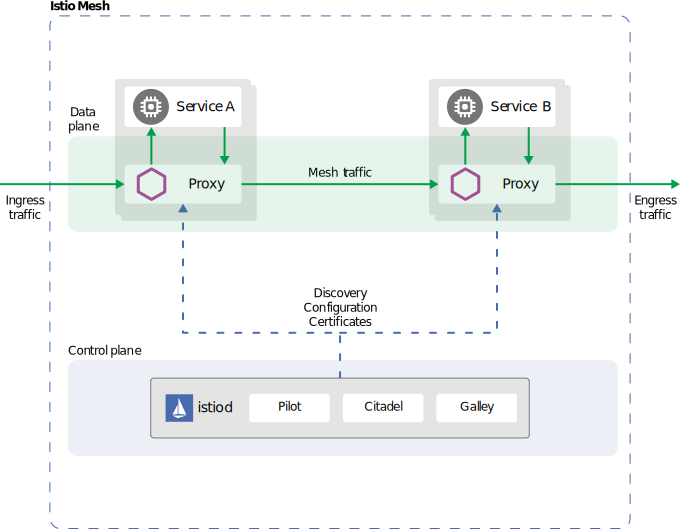
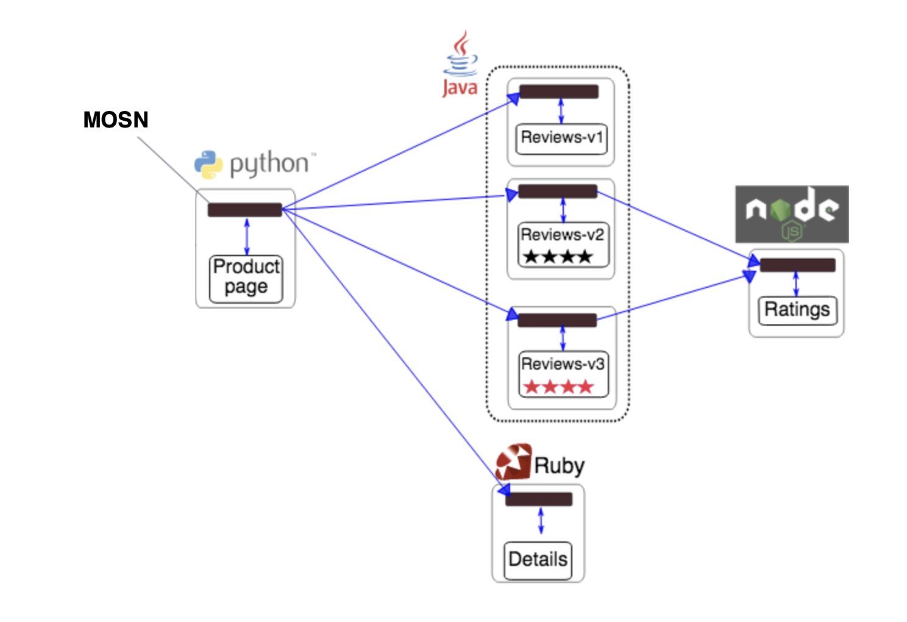

{}
MOSN 从 v1.0.0 版本开始 已通过 Istio 1.10.6 的 `Bookinfo` 测试，关于最新版 Istio 的支持情况可关注 [MOSN Istio WG](https://github.com/mosn/community/blob/master/wg-istio.md)。
{}

本文介绍的内容将包括 :

- MOSN 与 Istio 的关系
- MOSN 与 Istio 的 proxyv2 镜像 build 方法
- 部署 Istio 与 MOSN
- Bookinfo 实验

## MOSN 与 Istio 的关系

我们曾在 [MOSN 介绍](../../overview) 中介绍过，MOSN 是一款采用 Go 语言开发的 Service Mesh 数据平面代理。

下图是 Istio 整体框架下，MOSN 的工作示意图。

<div align=center></div>

## MOSN 与 Istio 的 proxyv2 镜像 build 方法

本文的完整构建镜像方法均是基于 MacOS 和 Istio 1.10.6 版本进行的构建，在其他操作系统 Istio 版本上可能存在部分细节差异，需要进行调整。
除了完整构建方式外，如果仅有 MOSN 代码发生变化，还可以使用仅更新 MOSN 的方式构建镜像。
通常情况下，您不需要额外构建镜像，可直接用我们提供的镜像 `mosnio/proxyv2:${MOSN-VERSION}-${ISTIO_VERSION}`，如`docker pull mosnio/proxyv2:1.0.0-1.10.6`

完整的镜像构建（基于 MacOS 和 Istio 1.10.6）
==========
1、下载完整的 istio 源代码，并且切换到对应的版本

```
git clone git@github.com:istio/istio.git
cd istio
git checkout 1.10.6
```

2、由于目前 Istio 默认会加载 wasm，我们需要将相关逻辑注释掉，再重新编译镜像，避免一些不必要的错误。详细的改动可见 [istio-diff](./istio-diff)

3、编译 MOSN 二进制，MOSN 提供了镜像编译的方式可直接编译 linux 的二进制；同时由于在 MacOS 上构建的过程中，Istio 还会下载一个 MacOS 版本，因此还需要编译一个 MacOS 的二进制

4、将编译好的二进制，使用 tar 方式进行打包，并且打包路径需要是`usr/local/bin`

```bash
cd ${MOSN Project Path}
mkdir -p usr/local/bin
make build # build mosn binary on linux
cp build/bundles/${MOSN VERSION}/binary/mosn usr/local/bin
tar -zcvf mosn.tar.gz usr/local/bin/mosn
cp mosn.tar.gz mosn-centos.tar.gz # copy a renamed tar.gz file

make build-local # build mosn binary on macos
cp build/bundles/${MOSN VERSION}/binary/mosn usr/local/bin
tar -zcvf mosn-macos.tar.gz usr/local/bin/mosn
```

5、将生成的`mosn-macos.tar.gz` `mosn-centos.tar.gz` `mosn.tar.gz` 上传到一个编译环境可访问的存储服务中，可用 Go 语言简单快速在本地环境搭建一个

```Go
func main() {
  address := "" // an address can be reached when proxyv2 image build. for example, 0.0.0.0:8080
  filespath := "" // where the .tar.gz files stored.
  http.ListenAndServe(address, http.FileServer(http.Dir(filespath)))
}
```

6、指定参数，开始编译 proxyv2 镜像

```bash
address=$1 # your download service address
export ISTIO_ENVOY_VERSION=$2 # MOSN Version, can be any value.
export ISTIO_ENVOY_RELEASE_URL=http://$address/mosn.tar.gz
export ISTIO_ENVOY_CENTOS_RELEASE_URL=http://$address/mosn-centos.tar.gz
export ISTIO_ENVOY_MACOS_RELEASE_URL=http://http://$address/mosn-macos.tar.gz
export ISTIO_ENVOY_MACOS_RELEASE_NAME=mosn-$2 # can be any value
export SIDECAR=mosn

make clean # clean the cache
make docker.proxyv2 \
 SIDECAR=$SIDECAR \
 ISTIO_ENVOY_VERSION=$ISTIO_ENVOY_VERSION \
 ISTIO_ENVOY_RELEASE_URL=$ISTIO_ENVOY_RELEASE_URL \
 ISTIO_ENVOY_CENTOS_RELEASE_URL=$ISTIO_ENVOY_CENTOS_RELEASE_URL \
 ISTIO_ENVOY_MACOS_RELEASE_URL=$ISTIO_ENVOY_MACOS_RELEASE_URL \
 ISTIO_ENVOY_MACOS_RELEASE_NAME=$ISTIO_ENVOY_MACOS_RELEASE_NAME
```

7、编译完成以后，可以将镜像打上新的 Tag 并且上传（如个人测试 dockerhub 的地址），确保 istio 使用时可访问即可


单独更新 MOSN 版本
==========


1、重新编译 MOSN 二进制

```bash
cd ${MOSN Project Path}
make build # build mosn binary on linux
```
2、直接基于现有 MOSN 的 proxyv2 镜像更新二进制

```Dockerfile
FROM mosnio/proxyv2:v1.0.0-1.10.6
COPY build/bundles/${MOSN VERSION}/binary/mosn /usr/local/bin/mosn
```

```bash
docker build --no-cache --rm -t ${your image tag}
```

3、将新镜像上传，确保 istio 使用时可访问即可


## 部署 Istio 与 MOSN

### 安装 kubectl 命令行工具

kubectl 是用于针对 Kubernetes 集群运行命令的命令行接口，安装参考 [kubectl doc](https://kubernetes.io/docs/tasks/tools/install-kubectl)。

### 安装 Kubernetes 平台

安装 Istio，首先需要根据实际需求选择安装平台，可参考 Istio 官方文档推荐的方式 [Platform Setup](https://istio.io/latest/docs/setup/platform-setup/)。
后文中，我们假定选择的是`minikube`的安装方式，方便进行介绍。

### 安装 Istio，使用 MOSN 作为数据面

1、下载对应的 Istio Release 版本，可以在 [Istio release](https://github.com/istio/istio/releases/tag/1.10.6) 页面下载与您操作系统匹配的压缩文件，或者使用官方提供的下载方式

```bash
VERSION=1.10.6 # istio version
export ISTIO_VERSION=$VERSION && curl -L https://istio.io/downloadIstio | sh -
```

2、下载完成以后（或者解压完成），切换到对应的目录，同时可以设置对应的`istioctl`命令行工具到环境变量，方便配置自定义 Istio 控制平面和数据平面配置参数。

```bash
cd istio-$ISTIO_VERSION/
export PATH=$PATH:$(pwd)/bin
```

3、创建 istio 命名空间，并且设置 MOSN proxyv2 镜像为数据面镜像

```bash
kubectl create namespace istio-system
istioctl manifest apply --set .values.global.proxy.image=${MOSN IMAGE} --set meshConfig.defaultConfig.binaryPath="/usr/local/bin/mosn"
```

4、验证 Istio 相关 POD 服务是否部署成功

```bash
kubectl get pod -n istio-system

NAME                                    READY   STATUS    RESTARTS   AGE
istio-ingressgateway-6b7fb88874-rgmrj   1/1     Running   0          102s
istiod-65c9767c55-vjppv                 1/1     Running   0          109s
```

如果 pod 显示所有容器 READY，并且 STATUS 为 Running，则表示 Istio 安装成功


## Bookinfo 实验

MOSN 已经通过 Istio 1.10.6 的 `Bookinfo` 测试，可以通过 [MOSN with Istio](https://katacoda.com/mosn/courses/istio/mosn-with-istio) 的教程来进行 Bookinfo 示例的演示操作，另外在该教程中您也可以找到更多关于使用 MOSN 和 Istio 的说明。
更多的使用场景可以参考 Istio 官方 [Example](https://istio.io/latest/docs/examples/)。
MOSN 目前并没有支持 Istio 的所有场景，如果您在运行实验过程中有遇到不支持的情况，请给我们提出 [issue](https://github.com/mosn/mosn/issues)，欢迎贡献代码。

### Bookinfo 介绍

`Bookinfo` 是一个类似豆瓣的图书应用，它包含四个基础服务：

-  Product Page：主页，由 python 开发，展示所有图书信息，它会调用 Reviews 和 Details 服务
-  Reviews：评论，由 java 开发，展示图书评论，会调用 Ratings 服务
-  Ratings：评分服务，由 nodejs 开发
-  Details：图书详情，由 ruby 开发

<div align=center></div>

#### 部署 `Bookinfo` 应用并注入 MOSN

> 详细过程可以参考 [Bookinfo doc](https://istio.io/docs/examples/bookinfo/)

通过 kube-inject 的方式实现 Sidecar 注入：

```bash
istioctl kube-inject -f samples/bookinfo/platform/kube/bookinfo.yaml > bookinfo.yaml
# sed -i '' is the MacOS command, if you are in linux, use sed -i instead.
sed -i '' "s/\/usr\/local\/bin\/envoy/\/usr\/local\/bin\/mosn/g" ./bookinfo.yaml
```

部署注入 Sidecar 后的 Bookinfo 应用：

```bash
$ kubectl apply -f bookinfo.yaml
```

验证部署是否成功：

```bash
$ kubectl get services
NAME          TYPE        CLUSTER-IP        EXTERNAL-IP   PORT(S)    AGE
details       ClusterIP   192.168.248.118   <none>        9080/TCP   5m7s
kubernetes    ClusterIP   192.168.0.1       <none>        443/TCP    25h
productpage   ClusterIP   192.168.204.255   <none>        9080/TCP   5m6s
ratings       ClusterIP   192.168.227.164   <none>        9080/TCP   5m7s
reviews       ClusterIP   192.168.181.16    <none>        9080/TCP   5m6s
```

等待所有的 pod 等成功运行起来：

```bash
$ kubectl get pods
NAME                              READY   STATUS    RESTARTS   AGE
details-v1-77497b4899-67gfn       2/2     Running   0          98s
productpage-v1-68d9cf459d-mv7rh   2/2     Running   0          97s
ratings-v1-65f97fc6c5-npcrz       2/2     Running   0          98s
reviews-v1-6bf4444fcc-9cfrw       2/2     Running   0          97s
reviews-v2-54d95c5444-5jtxp       2/2     Running   0          97s
reviews-v3-dffc77d75-jd8cr        2/2     Running   0          97s
```

当上述状态为 Running 后，可通过如下方式确认 Bookinfo 应用是否正常运行：

```bash
kubectl exec -it $(kubectl get pod -l app=ratings -o jsonpath='{.items[0].metadata.name}') -c ratings -- curl productpage:9080/productpage | grep -o "<title>.*</title>"
```

#### 访问 Bookinfo 服务

开启 gateway 模式。

```bash
$ kubectl apply -f samples/bookinfo/networking/bookinfo-gateway.yaml
$ kubectl get gateway
NAME               AGE
bookinfo-gateway   6s
```

设置 `GATEWAY_URL` 参考[文档](https://istio.io/docs/tasks/traffic-management/ingress/ingress-control/#determining-the-ingress-ip-and-ports)

```bash
$ export INGRESS_PORT=$(kubectl -n istio-system get service istio-ingressgateway -o jsonpath='{.spec.ports[?(@.name=="http2")].nodePort}')
$ export INGRESS_HOST=$(minikube ip)
$ export GATEWAY_URL=$INGRESS_HOST:$INGRESS_PORT
```

验证 gateway 是否生效，输出 `200` 表示成功。

```bash
$ curl -o /dev/null -s -w "%{http_code}\n"  http://$GATEWAY_URL/productpage
200
```

**观察页面情况**

访问 `http://$GATEWAY_URL/productpage` （注意： `$GATEWAY_URL` 需要替换成你设置的地址），正常的话通过刷新会看到如下所示 `Bookinfo` 的界面，其中 Book Reviews 有三个版本，刷新后依次会看到（可以查看 samples/bookinfo/platform/kube/bookinfo.yaml 中的配置发现为什么是这三个版本）版本一的界面。


版本二的界面。


版本三的界面。


#### 验证 MOSN 按 version 路由能力

首先为 `Bookinfo` 的 service 创建一系列的 destination rules。

```bash
$ kubectl apply -f samples/bookinfo/networking/destination-rule-all.yaml
```

指定 reviews 服务只访问 v1 版本。

```bash
$ kubectl apply -f samples/bookinfo/networking/virtual-service-all-v1.yaml
```

访问 `http://$GATEWAY_URL/productpage` 发现 reviews 固定在如下版本一的页面不再变化。


#### 验证 MOSN 按 weight 路由能力

我们通过下面操作将 v1 和 v3 版本各分配 50% 的流量。

```bash
$ kubectl apply -f samples/bookinfo/networking/virtual-service-reviews-50-v3.yaml
```

访问 `http://$GATEWAY_URL/productpage` 这次 v1 和 v3 各有 1/2 几率出现。

#### 验证 MOSN 按照特定 header 路由能力

`Bookinfo` 系统右上角有一个登陆的入口，登陆以后请求会带上 end-user 这个自定义，值是 user name，Mosn 支持根据这个 header 的值来做路由。比如，我们尝试将 jason 这个用户路由到 v2 版本，其他的路由到 v1 版本（用户名和密码均是：jason，为什么是这个用户可以查看对应的 yaml 文件）。

```bash
$ kubectl apply -f samples/bookinfo/networking/virtual-service-reviews-test-v2.yaml
```

访问 `http://$GATEWAY_URL/productpage` 时：

以 jason 身份登陆，会看到 v2 版本。


以其他身份登录，始终在 v1 版本。


### 卸载 Bookinfo

可以使用下面的命令来完成应用的删除和清理工作：

删除路由规则，并销毁应用的 Pod。

```bash
$ sh samples/bookinfo/platform/kube/cleanup.sh
```

确认 `Bookinfo` 应用已经关停：

```bash
$ kubectl get virtualservices   #-- there should be no virtual services
$ kubectl get destinationrules  #-- there should be no destination rules
$ kubectl get gateway           #-- there should be no gateway
$ kubectl get pods              #-- the Bookinfo pods should be deleted
```

## 卸载 Istio

执行如下命令，删除 Istio 相关 CRD 以及 pod 等资源：

```bash
$ istioctl manifest generate | kubectl delete -f -
```

确认 Istio 是否成功卸载：

```bash
$ kubectl get namespace istio-system
```
